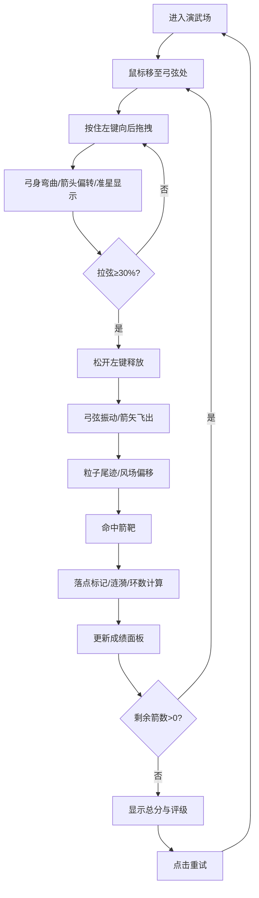

## 1. 产品概述

古代弓箭手射箭训练游戏是一款基于Canvas的交互式Web应用，旨在模拟古代演武场射箭训练场景。通过鼠标拖拽拉弦、瞄准释放的操作方式，结合真实的风向风速物理模拟，为用户提供沉浸式的射箭体验，并获得实时的环数反馈与综合评分。

- **核心目标**：解决传统射箭教学无法模拟环境因素（风向、风速、距离）对箭矢轨迹影响的问题，提供拉弓力度、瞄准角度与环数之间的趣味竞技反馈
- **目标用户**：射箭爱好者、历史文化爱好者、普通休闲游戏用户
- **产品价值**：低成本的虚拟射箭训练体验，寓教于乐的物理模拟教学

## 2. 核心功能

### 2.1 功能模块

1. **演武场场景渲染**：土黄色夯土地面、深红宫墙背景、远景山脉云朵、灰白色箭靶阵列、弓箭手剪影
2. **拉弓瞄准系统**：鼠标拖拽拉弦、拉力百分比显示、弓箭弯曲动画、红色十字准星瞄准
3. **箭矢物理系统**：初速度与拉力关联、风向风速偏移影响、动态粒子尾迹、命中检测
4. **评分反馈系统**：环数计算（10-1环）、落点标记、涟漪特效、靶面震动、历史最高分记录
5. **游戏流程控制**：10箭一局机制、总分评级（神射手/熟练弓手/新手/脱靶）、重试按钮

### 2.2 功能详情

| 模块名称 | 子功能 | 功能描述 |
|---------|--------|---------|
| 演武场场景 | 背景渲染 | 土黄地面#C4A882、宫墙#8B2500、淡蓝山脉、飘动云朵 |
| 演武场场景 | 箭靶绘制 | 靶心直径40px，红/白/黑渐变，最外圈10px |
| 演武场场景 | 弓箭手剪影 | 高160px，深棕色弓身#5C3A21，灰色弓弦#CCCCCC |
| 拉弓瞄准 | 拉弦交互 | 鼠标从弓弦处向后拖拽，最小30%可发射 |
| 拉弓瞄准 | 瞄准系统 | 箭头随鼠标偏转，红色十字准星（直径6px）显示在靶上 |
| 拉弓瞄准 | 动画效果 | 弓身弯曲与拉力成正比，释放时弓弦振动5帧振幅2px |
| 箭矢物理 | 初速度 | 拉满100%对应20单位/帧 |
| 箭矢物理 | 风场模拟 | 每局随机风向(-30°~30°)，风速0-5级(0-8px/帧) |
| 箭矢物理 | 粒子尾迹 | 每帧3个半透明灰色圆点，直径2-4px，渐变消失 |
| 评分反馈 | 环数计算 | 靶心10环，向外每圈减1环 |
| 评分反馈 | 命中特效 | 白色落点标记(4px)、涟漪扩散(0.5秒最大30px)、靶面震动(3px衰减3帧) |
| 评分反馈 | UI面板 | 本轮成绩、风速风向角度、历史最高分 |
| 游戏流程 | 局数管理 | 10支箭/局，左上角显示局数与剩余箭数 |
| 游戏流程 | 评级系统 | 50+神射手、30-49熟练弓手、10-29新手、0-9脱靶 |
| 游戏流程 | 重试机制 | 结束后显示总分评级和重试按钮 |

## 3. 核心流程

### 3.1 用户操作流程

用户进入游戏页面后，看到演武场场景和站立的弓箭手。鼠标移动到弓弦位置并按住左键，开始向后拖拽拉弦，此时弓身逐渐弯曲，箭头随鼠标位置调整瞄准角度，靶面上显示红色十字准星。拉弦距离达到30%以上后松开左键，箭矢释放，弓弦振动，箭矢带着粒子尾迹飞行，受风向风速影响轨迹发生偏移。箭矢命中箭靶后显示落点、涟漪特效和环数，底部面板更新成绩。重复10次后显示总分和评级，点击重试按钮开始新一局。

## 4. 用户界面设计

### 4.1 设计风格

- **主色调**：土黄#C4A882（地面）、宫墙红#8B2500（背景墙）、墨黑#1A1A1A（文字）
- **辅助色**：靶心红#FF0000、弓身棕#5C3A21、弓弦灰#CCCCCC、涟漪橙#FF4500
- **字体**：衬线古风字体（楷体/KaiTi、SimSun）
- **组件风格**：圆角8px，半透明木质纹理叠加
- **整体氛围**：庄严肃穆的古代演武场风格，略带朦胧远景营造纵深感

### 4.2 页面布局

| 区域 | 位置 | UI元素 | 设计说明 |
|-----|------|--------|---------|
| 左上角信息区 | top-left(16px,16px) | 当前局数、剩余箭数 | 白色衬线字体18px，半透明面板背景 |
| 右上角风况区 | top-right(16px,16px) | 风向箭头、风速文字、等级条 | 风向用→↗↑↖←符号指示，等级条100×6px，底色#333填充#FF4500 |
| 中央靶场区 | 画面中央60%区域 | 远景山脉、飘动云朵、箭靶阵列、弓箭手 | 云朵半透明白色圆角矩形，透明度0.15，速度0.3px/帧水平平移 |
| 底部成绩面板 | bottom(0,0)全宽 | 本轮环数、风速风向、历史最高分、下一发提示 | 圆角8px木质纹理，衬线字体，布局自适应 |
| 结束弹窗 | 屏幕中央 | 总分、评级文字、重试按钮 | 半透明遮罩+木质面板，大字号评级文字突出显示 |

### 4.3 响应式适配

- **大屏(≥1024px)**：箭靶全尺寸显示，底部成绩面板横向三栏布局
- **中屏(768-1023px)**：箭靶90%尺寸，面板保持横向
- **小屏(<768px)**：箭靶缩小为80%，控制区域移至底部横向排列，信息区字号缩小至14px

### 4.4 动画与交互细节

- **拉弦阶段**：弓臂从直线渐变为半圆，弯曲幅度与拉力(0-100%)成正比
- **释放瞬间**：弓弦振动动画持续5帧，振幅2px正弦衰减
- **箭矢飞行**：每帧生成3个尾迹粒子（直径2→4px，颜色#CCCCCC→#EEEEEE，透明度0.8→0）
- **命中特效**：落点白点(4px)+涟漪扩散(0→30px, 透明度0.6→0, 0.5秒)+靶面震动(3px位移衰减3帧)
- **云朵动画**：缓慢水平循环移动，0.3px/帧
