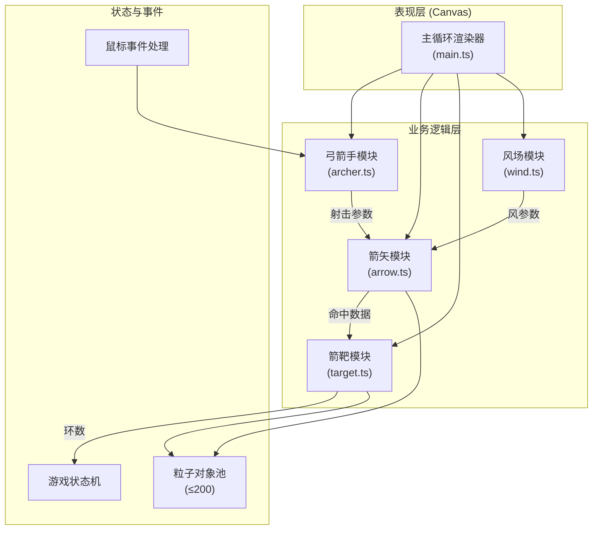

## 1. 架构设计

采用纯前端Canvas渲染架构，无后端服务。模块化设计遵循单一职责原则，将游戏逻辑与渲染逻辑分离，便于维护和扩展。



## 2. 技术说明

- **前端框架**：原生 TypeScript + HTML5 Canvas API（不使用React/Vue，保持轻量）
- **构建工具**：Vite 5.x（热更新、快速构建）
- **类型系统**：TypeScript 5.x，严格模式，target ES2020
- **渲染方式**：Canvas 2D 上下文逐帧绘制（requestAnimationFrame驱动，目标60FPS）
- **状态管理**：模块内部私有状态 + 主模块协调
- **性能优化**：对象池管理粒子（上限200个），避免GC卡顿；输入延迟优化（事件队列即时响应）

## 3. 模块职责与接口定义

### 3.1 文件组织结构

```
auto230/
├── index.html              # 入口页面，全屏canvas容器
├── package.json            # 依赖与脚本
├── vite.config.js          # Vite配置
├── tsconfig.json           # TypeScript配置
└── src/
    ├── main.ts             # 主入口：Canvas初始化、主循环、事件分发、UI更新
    ├── archer.ts           # 弓箭手：拉弦/瞄准状态、弓身弯曲计算
    ├── arrow.ts            # 箭矢：轨迹计算、粒子尾迹、命中检测
    ├── target.ts           # 箭靶：绘制、涟漪特效、环数计算
    └── wind.ts             # 风场：随机生成、参数查询
```

### 3.2 模块接口定义

#### archer.ts
```typescript
interface ArcherState {
  pullDistance: number;      // 拉弦距离 0-100%
  aimAngle: number;          // 瞄准角度（弧度）
  arrowsRemaining: number;   // 剩余箭数
  isDrawing: boolean;        // 是否正在拉弦
  bowBendAmount: number;     // 弓身弯曲量 0-1
  handPosition: { x: number; y: number };  // 右手（弓弦处）坐标
}

interface ShootParams {
  initialSpeed: number;      // 初速度 单位/帧（6-20）
  angle: number;             // 发射角度（弧度）
  startX: number;            // 起点X
  startY: number;            // 起点Y
}

class Archer {
  constructor(canvasWidth: number, canvasHeight: number);
  startPull(mouseX: number, mouseY: number): void;
  updatePull(mouseX: number, mouseY: number): void;
  release(): ShootParams | null;  // 拉弦≥30%返回射击参数
  resetRound(): void;              // 重置一局
  draw(ctx: CanvasRenderingContext2D): void;
  getState(): ArcherState;
}
```

#### arrow.ts
```typescript
interface WindParams {
  angle: number;     // 风向角度（度）-30~30
  level: number;     // 风速等级 0-5
  offsetPerFrame: number;  // 水平偏移系数 0-8
}

interface TrailParticle {
  x: number; y: number;
  radius: number;     // 2-4px
  alpha: number;      // 0.8→0
  color: string;      // #CCCCCC→#EEEEEE
  life: number;       // 剩余生命帧
}

interface HitResult {
  hit: boolean;
  score: number;      // 环数 0-10，0脱靶
  hitX: number;
  hitY: number;
}

class Arrow {
  constructor();
  launch(params: ShootParams, wind: WindParams): void;
  update(): boolean;  // 返回是否仍在飞行
  draw(ctx: CanvasRenderingContext2D): void;
  checkHit(targetX: number, targetY: number, targetRadius: number): HitResult;
  isFlying(): boolean;
}
```

#### target.ts
```typescript
interface TargetConfig {
  x: number; y: number;
  bullseyeRadius: number;   // 靶心半径 20px（直径40px）
  ringWidth: number;        // 每环宽度 由半径/10计算
  outerRingBorder: number;  // 最外圈额外10px边框
}

interface RippleEffect {
  x: number; y: number;
  radius: number;    // 0→30px
  alpha: number;     // 0.6→0
  life: number;      // 0.5秒≈30帧
}

interface ScoreMarker {
  x: number; y: number;
  score: number;
  life: number;      // 标记持久显示
}

class Target {
  constructor(x: number, y: number);
  draw(ctx: CanvasRenderingContext2D): void;
  registerHit(hitX: number, hitY: number): number;  // 返回环数
  triggerRipple(x: number, y: number): void;
  triggerShake(): void;
  updateEffects(): void;
}
```

#### wind.ts
```typescript
class Wind {
  constructor();
  regenerate(): void;            // 每局重新随机
  getParams(): WindParams;
  getWindArrowSymbol(): string;  // →↗↑↖←
  drawWindIndicator(ctx: CanvasRenderingContext2D, x: number, y: number): void;
}
```

### 3.3 主模块 main.ts 核心流程

```typescript
// 游戏阶段枚举
enum GamePhase { IDLE, DRAWING, FLYING, RESULT, GAMEOVER }

// 主循环伪代码
function gameLoop(timestamp: number): void {
  // 1. 清屏
  ctx.clearRect(0, 0, width, height);
  
  // 2. 绘制背景层：地面、宫墙、山脉、云朵
  drawBackground();
  
  // 3. 更新云朵位置
  updateClouds(dt);
  
  // 4. 更新模块状态
  if (phase === FLYING) {
    const stillFlying = arrow.update();
    if (!stillFlying) {
      const hit = arrow.checkHit(target.x, target.y, target.totalRadius);
      if (hit.hit) {
        const score = target.registerHit(hit.hitX, hit.hitY);
        target.triggerRipple(hit.hitX, hit.hitY);
        target.triggerShake();
        updateScorePanel(score);
      }
      phase = checkGameOver() ? GAMEOVER : IDLE;
    }
  }
  target.updateEffects();
  
  // 5. 绘制箭靶（含震动偏移）
  target.draw(ctx);
  
  // 6. 绘制弓箭手（含弓身弯曲/准星）
  archer.draw(ctx);
  
  // 7. 绘制飞行中的箭矢+粒子
  if (phase === FLYING) arrow.draw(ctx);
  
  // 8. 绘制UI覆盖层（信息区、成绩面板、结束弹窗）
  drawUI();
  
  requestAnimationFrame(gameLoop);
}
```

## 4. 性能与输入约束

| 指标 | 约束 | 实现策略 |
|-----|------|---------|
| FPS | 稳定60 | requestAnimationFrame，避免每帧创建对象 |
| 粒子总数 | ≤200 | 对象池复用，箭矢尾迹3个/帧上限生命15帧=45，涟漪同时最多3个；超量丢弃旧粒子 |
| 输入延迟 | <50ms | 鼠标事件直接更新状态（非队列），在下一帧立即渲染 |
| 内存占用 | <50MB | 无图片资源，全部矢量绘制，粒子池固定大小 |
| 响应时间 | <16ms/帧 | 模块更新耗时统计，超预算时降低粒子生成频率 |

## 5. 视觉常量定义

```typescript
const COLORS = {
  GROUND: '#C4A882',
  WALL: '#8B2500',
  INK: '#1A1A1A',
  BULLSEYE_RED: '#FF0000',
  RING_WHITE: '#FFFFFF',
  RING_BLACK: '#333333',
  BOW_BROWN: '#5C3A21',
  STRING_GRAY: '#CCCCCC',
  CROSSHAIR: '#FF0000',
  HIT_MARKER: '#FFFFFF',
  RIPPLE: 'rgba(255,255,255,0.6)',
  WIND_BAR_BG: '#333333',
  WIND_BAR_FILL: '#FF4500',
  TRAIL_START: '#CCCCCC',
  TRAIL_END: '#EEEEEE',
  CLOUD: 'rgba(255,255,255,0.15)',
  MOUNTAIN: 'rgba(135,206,235,0.3)',
};

const SIZES = {
  BULLSEYE_DIAMETER: 40,
  OUTER_RING_BORDER: 10,
  ARCHER_HEIGHT: 160,
  CROSSHAIR_SIZE: 6,
  HIT_MARKER_SIZE: 4,
  RIPPLE_MAX_RADIUS: 30,
  RIPPLE_DURATION: 30,  // 帧 ≈ 0.5s
  SHAKE_MAX_OFFSET: 3,
  SHAKE_DURATION: 3,    // 帧
  VIBRATION_FRAMES: 5,
  VIBRATION_AMPLITUDE: 2,
  WIND_BAR_WIDTH: 100,
  WIND_BAR_HEIGHT: 6,
  UI_CORNER_RADIUS: 8,
  CLOUD_SPEED: 0.3,
  PANEL_FONT_SIZE: 18,
  MIN_PULL_PERCENT: 30,
  MAX_SPEED: 20,
  MIN_SPEED: 6,
  ARROWS_PER_ROUND: 10,
};
```
