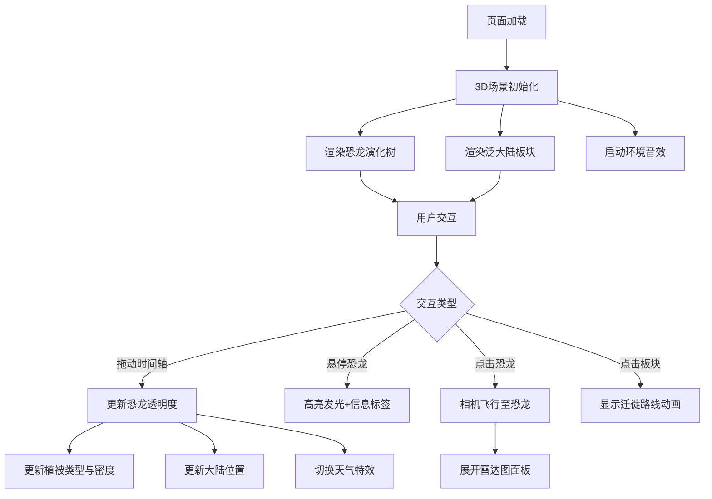

## 1. 产品概述
交互式3D恐龙演化树与迁徙轨迹模拟Web应用，面向古生物学家和博物馆策展人，用于直观展示中生代（三叠纪、侏罗纪、白垩纪）九种代表性恐龙的体型演化、物种迁徙与环境互动，解决静态模型无法展示气候与板块漂移导致的动态变化问题。

## 2. 核心功能

### 2.1 功能模块
1. **主场景页面**：3D恐龙演化树、地质年代时间轴、泛大陆迁徙轨迹、恐龙详情雷达图、环境音效与视觉特效

### 2.2 页面详情
| 页面名称 | 模块名称 | 功能描述 |
|----------|----------|----------|
| 主场景 | 恐龙演化树 | 页面中央3D树状结构，九个分支末端各站一只低多边形恐龙模型（800-1200面），悬停分支高亮发光并显示名称和年代标签，点击后相机平滑飞行到恐龙前方15单位处（2秒） |
| 主场景 | 地质年代时间轴 | 底部水平时间滑块，范围2.5亿年前至6500万年前，标注三叠纪/侏罗纪/白垩纪，拖动时恐龙透明度渐变（未出现0.1/出现1.0），背景植被从蕨类→苏铁→开花植物过渡，植被密度递增 |
| 主场景 | 迁徙轨迹模拟 | 3D地图上绘制7个泛大陆板块（劳亚#4A7C3F、冈瓦纳#8B5E3C等），热点圆点（半径5单位，红→黄渐变表示密度），点击板块弹出贝塞尔曲线迁徙路线（橙色移动光点#FFA500，白色半透明轨迹0.3） |
| 主场景 | 恐龙详情雷达图 | 右侧半透明面板（400×500px，背景#2E1A0E），五维雷达图（骨密度、咬合力、奔跑速度、体型指数、羽毛覆盖率，0-100），文字档案（学名、年代、长度、体重），加载动画0.8秒缓出扩散 |
| 主场景 | 环境音效与视觉特效 | Web Audio API白噪声+低频虫鸣背景音，年代切换雷声/恐龙叫声，三叠纪沙尘粒子、侏罗纪雾效、白垩纪雨粒子 |

## 3. 核心流程

用户进入页面→加载3D场景（相机初始(0,30,50)俯视）→拖动底部时间轴→观察恐龙透明度/植被/大陆位置变化→悬停恐龙分支→查看名称年代→点击恐龙→相机飞行至面前→右侧展开雷达图面板→点击板块→查看迁徙路线→交互循环

## 4. 用户界面设计

### 4.1 设计风格
- 主色调：深墨绿色（#1A2E1A）模拟原始森林底调
- 辅助色：化石象牙白（#E8D5B7）、青铜色（#A68B5B）、深褐（#5C4A3A）、古棕（#2E1A0E）
- 字体：衬线体（serif），标题24px加粗象牙白，刻度14px象牙白
- 布局：左侧恐龙树65%，右侧详情35%，竖向分隔线#5C4A3A宽2px
- 图标风格：低多边形恐龙+简略板块轮廓

### 4.2 页面设计概述
| 页面名称 | 模块名称 | UI元素 |
|----------|----------|--------|
| 主场景 | 顶部导航栏 | 高度60px，半透明rgba(26,46,26,0.8)，标题"古生代恐龙演化录"，当前地质年代名称，衬线体24px加粗象牙白 |
| 主场景 | 3D恐龙树区域 | 占65%画面，恐龙Y轴自转0.1弧度/秒，悬停暂停+信息框(200×60px,#2E1A0E背景,#A68B5B圆角8px边框)，相机FOV 55° |
| 主场景 | 时间轴滑块 | 轨道高8px#5C4A3A，滑块圆形直径24px#A68B5B象牙白外圈，刻度14px#E8D5B7 |
| 主场景 | 详情面板 | 400×500px，背景#2E1A0E，古化石纹装饰边角，五维雷达图+文字档案 |
| 主场景 | 天气特效 | 三叠纪：黄色粒子15个随机飘移；侏罗纪：白色半透明平面雾；白垩纪：蓝色细长粒子下落30个/秒 |

### 4.3 响应式适配
- 桌面优先设计，宽度<768px时右侧详情面板变为底部抽屉（高度自适应），恐龙树缩放至居中
- 所有交互反馈0.3秒过渡动画（color、opacity、transform缓动）

### 4.4 3D场景指导
- 环境：深墨绿色大气雾效，模拟原始丛林氛围
- 光照：柔和环境光+定向光模拟日光，暖色调
- 相机：初始位置(0,30,50)俯视，FOV 55°，点击恐龙时平滑飞行
- 交互：OrbitControls拖拽旋转缩放，悬停高亮，点击选中
- 性能预算：45+ FPS（i5-8代/8G/集显），透明度变化<100ms，雷达图动画<1.2秒
