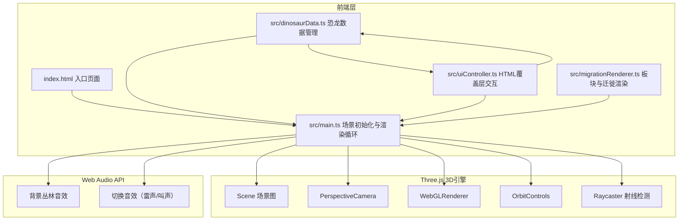

## 1. 架构设计



## 2. 技术说明
- 前端：TypeScript + Three.js + Vite（原生JS，不使用React/Vue框架）
- 构建工具：Vite，入口index.html，开发端口3000
- 3D引擎：Three.js（场景管理、几何体、材质、光照、射线检测）
- 音频：Web Audio API（白噪声生成、低频震荡、音效触发）
- 初始化工具：Vite + TypeScript模板手动配置

## 3. 文件结构

```
项目根目录/
├── package.json          # 依赖：three, typescript, vite, @types/three
├── vite.config.js        # 构建配置，入口index.html，端口3000
├── tsconfig.json         # 严格模式，target ES2020，moduleResolution bundler
├── index.html            # 入口页面，深墨绿色主背景#1A2E1A
├── src/
│   ├── main.ts           # Three.js场景初始化与渲染循环
│   ├── dinosaurData.ts   # 9种恐龙数据定义
│   ├── uiController.ts   # HTML覆盖层交互逻辑
│   └── migrationRenderer.ts # 泛大陆板块与迁徙线条
```

### 3.1 模块间调用关系与数据流

```
dinosaurData.ts ──(恐龙数据)──> main.ts ──(3D场景)──> 渲染输出
       │                              ↑
       ├──(恐龙参数)──> uiController.ts ──(交互事件)──> main.ts
       │                              │
       └──(坐标/年代)──> migrationRenderer.ts ──(板块/路径)──> main.ts
```

- **dinosaurData.ts**：定义9种恐龙的体型参数、地质年代、经纬度坐标、羽毛属性。输出数据给main.ts（3D建模）、uiController.ts（雷达图）和migrationRenderer.ts（迁徙路径）
- **main.ts**：初始化Three.js场景、相机、渲染器、灯光、OrbitControls。接收恐龙数据生成3D模型和演化树结构。管理渲染循环、射线检测、动画帧。调用uiController和migrationRenderer
- **uiController.ts**：监听时间轴滑块变化和恐龙点击事件。调用dinosaurData更新选中恐龙。驱动雷达图Canvas渲染。控制面板展开/收起动画
- **migrationRenderer.ts**：创建泛大陆7个板块简略轮廓几何体。绘制贝塞尔曲线迁徙路径。接受时间轴变化动态调整大陆位置和迁徙路径透明度

## 4. 数据模型

### 4.1 恐龙数据模型

```typescript
interface Dinosaur {
  id: string;
  name: string;              // 中文名
  scientificName: string;    // 学名
  era: 'Triassic' | 'Jurassic' | 'Cretaceous';
  startMYA: number;          // 起始年代（百万年前）
  endMYA: number;            // 灭绝年代（百万年前）
  length: number;            // 体长（米）
  weight: number;            // 体重（吨）
  boneDensity: number;       // 骨密度 0-100
  biteForce: number;         // 咬合力 0-100
  runningSpeed: number;      // 奔跑速度 0-100
  bodyIndex: number;         // 体型指数 0-100
  featherCoverage: number;   // 羽毛覆盖率 0-100
  latitude: number;          // 栖息地纬度
  longitude: number;         // 栖息地经度
  plateId: string;           // 所属板块ID
  color: string;             // 模型主色
  scale: number;             // 模型缩放比例
}
```

### 4.2 板块数据模型

```typescript
interface Plate {
  id: string;
  name: string;
  color: string;
  vertices: [number, number][];  // 板块轮廓顶点
  dinosaurs: string[];           // 板块上的恐龙ID列表
  position: { x: number; z: number }; // 板块3D位置
}
```

### 4.3 九种恐龙数据

| 恐龙 | 时期 | 年代范围(百万年前) | 体长(m) | 体重(吨) | 骨密度 | 咬合力 | 奔跑速度 | 体型指数 | 羽毛覆盖 |
|------|------|---------------------|---------|----------|--------|--------|----------|----------|----------|
| 始盗龙 | 三叠纪 | 231-228 | 1.0 | 0.01 | 25 | 15 | 70 | 10 | 80 |
| 腔骨龙 | 三叠纪 | 216-196 | 3.0 | 0.03 | 30 | 25 | 75 | 15 | 60 |
| 板龙 | 三叠纪 | 214-204 | 10.0 | 4.0 | 45 | 30 | 25 | 50 | 20 |
| 异特龙 | 侏罗纪 | 155-150 | 8.5 | 1.5 | 55 | 60 | 55 | 45 | 25 |
| 腕龙 | 侏罗纪 | 154-153 | 26.0 | 56.0 | 70 | 20 | 10 | 95 | 5 |
| 棘龙 | 白垩纪 | 112-93 | 15.0 | 7.0 | 50 | 55 | 30 | 70 | 10 |
| 霸王龙 | 白垩纪 | 68-66 | 12.3 | 8.4 | 80 | 100 | 40 | 85 | 5 |
| 三角龙 | 白垩纪 | 68-66 | 9.0 | 6.0 | 75 | 40 | 25 | 65 | 0 |
| 禽龙 | 白垩纪 | 126-113 | 10.0 | 3.5 | 55 | 35 | 30 | 50 | 15 |

## 5. 性能优化策略

- 低多边形模型（800-1200面），使用BufferGeometry减少内存
- 粒子系统使用Points + BufferGeometry，控制粒子数量上限
- 透明度变化使用material.opacity直接设置，避免重建材质
- 迁徙路径使用Line + BufferGeometry预分配
- 植被使用InstancedMesh批量渲染同类型植被
- 渲染器开启antialias，像素比限制在Math.min(devicePixelRatio, 2)
- 使用requestAnimationFrame驱动渲染循环
