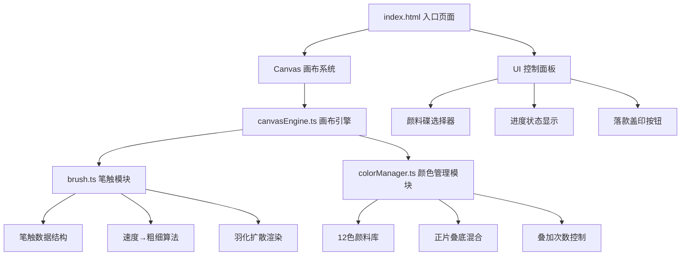

## 1. 架构设计



## 2. 技术描述

- **前端框架**：原生 TypeScript + 原生 JavaScript（无UI框架）
- **构建工具**：Vite 5.x
- **渲染引擎**：HTML5 Canvas 2D Context
- **开发语言**：TypeScript（严格模式，target ES2020）
- **样式方案**：原生 CSS + CSS Variables 主题系统

## 3. 项目结构定义

```
auto237/
├── package.json          # 项目依赖与脚本配置
├── index.html            # 入口HTML页面
├── vite.config.js        # Vite构建配置
├── tsconfig.json         # TypeScript编译配置
└── src/
    ├── main.ts           # 应用入口（初始化与挂载）
    ├── canvasEngine.ts   # Canvas核心引擎
    ├── brush.ts          # 笔触算法模块
    └── colorManager.ts   # 颜色管理模块
```

## 4. 核心模块说明

### 4.1 brush.ts 笔触模块

**数据结构**：
```typescript
interface BrushStroke {
  points: Array<{ x: number; y: number; pressure: number; timestamp: number }>
  color: string
  baseOpacity: number
  thickness: { min: number; max: number }
  featherRadius: number
  blendMode: GlobalCompositeOperation
}
```

**核心算法**：
- 速度计算：根据相邻点距离与时间差计算移动速度
- 粗细映射：速度→粗细映射函数（速度慢→粗，速度快→细）
- 透明度映射：速度→透明度映射（速度慢→浓，速度快→淡）
- 羽化扩散：高斯模糊算法实现笔触边缘羽化效果
- 纤维偏移：基于噪声函数的纸纤维纹理随机偏移（±1px）
- 渗透动画：抬笔后0.5秒透明度渐变动画（0.7→0.5→0.8）

### 4.2 colorManager.ts 颜色管理模块

**颜料库**：12种矿物颜料定义（含中文名、HEX值、叠加属性）

**混合逻辑**：
- 正片叠底（Multiply）：新颜色 × 旧颜色
- 叠加上限：5次，每次饱和度+0.15，明度-0.05
- 第5次后：颜色饱和锁定，不再变化

**颜色格式转换**：
- HEX ↔ RGB ↔ HSL 双向转换
- 饱和度/明度调节函数
- 颜色淡色生成函数（用于点蕊）

### 4.3 canvasEngine.ts 画布引擎

**分层画布策略**：
- 底层画布：绢帛纹理背景（静态）
- 绘制层：所有笔触与颜料叠加（动态）
- 装饰层：镇纸、画轴等UI元素（静态）
- 特效层：光晕、涟漪等临时动画（动态）

**事件系统**：
- mousedown/mouseup/mousemove：桌面端绘制
- touchstart/touchend/touchmove：移动端绘制
- pointer events：统一指针事件处理
- 长按计时器：0.3秒触发点蕊模式

**动画系统**：
- requestAnimationFrame 循环：≥30fps渲染
- 笔触渗透动画队列
- 点蕊光晕动画
- 印章震动+涟漪动画

### 4.4 进度追踪系统

四阶段进度计算：
1. **勾线阶段**（默认25%）：检测首次绘制线条
2. **晕染阶段**（累计50%）：检测颜色叠加≥2层
3. **点蕊阶段**（累计75%）：花蕊数量≥1
4. **盖印阶段**（累计100%）：点击落款盖印

进度条颜色渐变：灰→对应阶段主题色

## 5. 性能优化策略

1. **分层Canvas**：静态层缓存，动态层最小化重绘区域
2. **离屏渲染**：笔触羽化效果预渲染到离屏canvas
3. **脏矩形**：只重绘变化区域，减少全屏刷新
4. **节流防抖**：mousemove/touchmove事件节流（16ms间隔）
5. **对象池**：重复利用笔触点对象，减少GC压力
6. **CSS Will-change**：关键DOM元素开启GPU加速

## 6. 类型定义（共享）

```typescript
interface Point { x: number; y: number }
interface RGB { r: number; g: number; b: number }
interface HSL { h: number; s: number; l: number }
interface Paint {
  id: string
  name: string
  hex: string
  category: 'line' | 'wash' | 'stamen' | 'seal'
}
type Phase = 'outline' | 'wash' | 'stamen' | 'seal'
```
