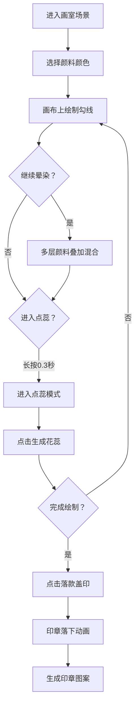

## 1. 产品概述

本产品是一款在浏览器中模拟古代宫廷画家在绢帛上绘制工笔花鸟画全流程的交互式游戏应用，解决了传统工笔画教学中无法真实模拟毛笔笔触变化、颜料渗透扩散及多层晕染叠加效果的问题，同时提供绘制步骤与品质评分的趣味沉浸式体验。

- 目标用户：工笔画爱好者、艺术教育学习者、传统文化体验者
- 市场价值：填补数字化工笔画体验空白，提供可交互、可复现的传统艺术学习与娱乐平台

## 2. 核心功能

### 2.1 功能模块

1. **古风画室场景**：营造古典绘画环境氛围，包含画室背景、画案、绢帛画布、镇纸、笔洗、颜料碟
2. **智能笔触系统**：模拟毛笔勾线效果，根据绘制速度动态调整笔触粗细与透明度
3. **颜料选择与混合系统**：12种矿物颜料选择，支持多层晕染正片叠底混合效果
4. **点蕊交互系统**：长按进入点蕊模式，生成自然花蕊图案与光晕动画
5. **落款盖印系统**：印章落下动画与画布印章图案生成
6. **进度反馈系统**：实时显示笔触参数、颜料名称、绘制进度条与花蕊数量

### 2.2 页面详情

| 页面名称 | 模块名称 | 功能描述 |
|-----------|-------------|---------------------|
| 主界面 | 画室背景 | 淡米色宣纸纹理墙、深木色地板、悬挂未完成画轴装饰 |
| 主界面 | 红木画案 | 中央画布承载区，左角落款盖印按钮 |
| 主界面 | 绢帛画布 | 700x500px丝线纹理画布，支持所有绘制交互 |
| 主界面 | 镇纸笔洗 | 左上方镇纸装饰、右侧青花瓷笔洗视觉元素 |
| 主界面 | 颜料碟面板 | 12色矿物颜料选择，选中高亮脉动动画 |
| 主界面 | 信息展示区 | 笔触宽度显示、颜色名称、进度条、花蕊计数 |

## 3. 核心流程

用户进入应用 → 浏览画室场景 → 选择颜料 → 勾线绘制（速度控制笔触）→ 多层晕染（正片叠底混合）→ 长按进入点蕊模式 → 点击生成花蕊 → 完成绘制 → 点击落款盖印 → 印章动画生成

## 4. 用户界面设计

### 4.1 设计风格
- **主色调**：暖黄色系（背景#F5E6C8，画布#FFF8DC，画案#4A2C2A）
- **点缀色**：矿物颜料鲜艳色彩、青花瓷白底蓝纹、朱砂红印章
- **整体风格**：素雅古朴的中式古典美学，辅以色彩鲜艳的矿物颜料形成视觉平衡
- **按钮样式**：方形木制印章按钮、圆形颜料碟（选中带光圈脉动）
- **字体风格**：古典宋体风格，中文书法气息
- **布局方式**：居中画布布局，画案承载，左右两侧工具与装饰

### 4.2 页面设计概述

| 页面名称 | 模块名称 | UI元素 |
|-----------|-------------|-------------|
| 主界面 | 画室背景 | 宣纸纹理墙面、深木地板、泛黄画轴悬挂装饰、层次阴影 |
| 主界面 | 画案画布 | 红木质感画案、半透明绢帛丝线网格纹理、深色金属镇纸 |
| 主界面 | 笔洗颜料 | 椭圆青花瓷笔洗（清水液面反光）、两行六列圆形颜料碟 |
| 主界面 | 信息面板 | 左上角笔触宽度+颜色名、右下角进度条+花蕊数 |
| 主界面 | 动画系统 | 笔触渗透、颜料晕染、点蕊光晕、印章震动涟漪 |

### 4.3 响应式设计
- **桌面端**（≥768px）：画布700x500px，颜料碟两行六列
- **平板端**（<768px）：画布500x350px，颜料碟两行八列，所有交互逻辑保持一致
- **触控支持**：移动端适配触控笔与手指绘制，长按识别点蕊模式

### 4.4 性能要求
- 绘制帧率稳定≥30fps
- 笔触响应延迟≤80ms
- Canvas渲染优化，分层画布减少重绘
