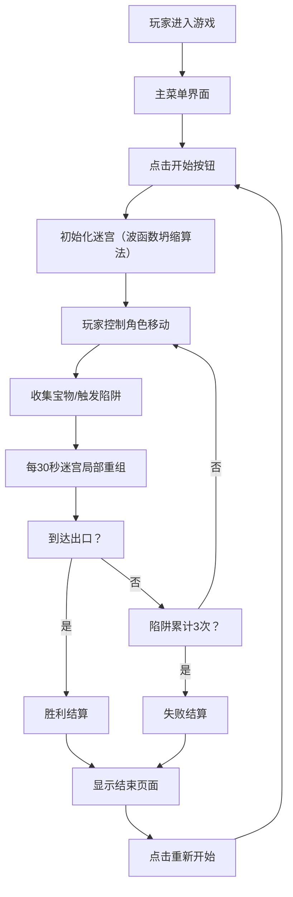

## 1. 产品概述

迷宫寻宝生存游戏是一款基于Web的休闲益智游戏，玩家需要在不断变化的迷宫中探索、收集宝物并躲避陷阱。游戏融合了策略、反应和探索元素，通过迷宫定期重组增加挑战性和可玩性。

- 主要目的：提供一款具有挑战性和趣味性的迷宫探险游戏
- 目标用户：休闲游戏爱好者、益智游戏玩家
- 核心价值：动态变化的迷宫带来持续的新鲜感和挑战

## 2. 核心功能

### 2.1 功能模块

1. **主菜单页面**：游戏标题、开始按钮、历史最高分显示
2. **游戏页面**：迷宫画布、HUD信息面板、游戏主循环
3. **结束页面**：胜利/失败提示、得分展示、重新开始按钮

### 2.2 页面详情

| 页面名称 | 模块名称 | 功能描述 |
|---------|---------|---------|
| 主菜单 | 标题区域 | 游戏名称展示、暗黑奇幻风格装饰 |
| 主菜单 | 开始按钮 | 点击进入游戏 |
| 主菜单 | 最高分显示 | 展示localStorage中存储的历史最高分 |
| 游戏页面 | 迷宫画布 | 10x10网格迷宫，墙壁和路径的渲染 |
| 游戏页面 | 玩家角色 | WASD控制移动，平滑过渡动画 |
| 游戏页面 | 宝物系统 | 5个金色菱形宝物，收集获得分数 |
| 游戏页面 | 陷阱系统 | 3个红色骷髅陷阱，触发后减速并闪烁警告 |
| 游戏页面 | HUD面板 | 生存时间、宝物收集数、FPS帧率 |
| 游戏页面 | 迷宫重组 | 每30秒局部3x3区域重组，带动画过渡 |
| 结束页面 | 结果展示 | 胜利/失败状态、最终得分、Game Over动画 |
| 结束页面 | 重新开始 | 按钮点击重新开始游戏 |

## 3. 核心流程

## 4. 用户界面设计

### 4.1 设计风格

- **主题**：暗黑奇幻风格
- **主色调**：深灰色背景 #1a1a2e
- **墙壁色**：棕色 #3d2b1f
- **路径色**：浅米色 #f5e6cc
- **角色色**：亮蓝色 #00d4ff
- **宝物色**：金色 #ffd700
- **陷阱色**：红色 #ff4444

**视觉特点**：
- 迷宫外围微光渐变效果
- 所有UI元素带柔和阴影和圆角
- 平滑过渡动画（步间插值150ms）
- 陷阱触发时屏幕边缘红色光晕闪烁
- 失败时屏幕逐渐变暗

### 4.2 页面设计概述

| 页面名称 | 模块名称 | UI元素 |
|---------|---------|--------|
| 主菜单 | 标题 | 大号字体、金色渐变、发光效果、居中 |
| 主菜单 | 开始按钮 | 圆角矩形、悬停放大动画、阴影 |
| 主菜单 | 最高分 | 较小字体、浅米色、居下 |
| 游戏页面 | 迷宫画布 | 居中显示、最小500x500px、自适应 |
| 游戏页面 | HUD | 左上角、半透明背景、圆角、阴影 |
| 游戏页面 | 角色 | 圆形、亮蓝色、光环效果（收集宝物后） |
| 游戏页面 | 宝物 | 金色菱形、脉动动画 |
| 游戏页面 | 陷阱 | 红色骷髅、警示效果 |
| 结束页面 | 结果文字 | 大号字体、居中、渐入动画 |
| 结束页面 | 得分 | 金色、突出显示 |
| 结束页面 | 重新开始按钮 | 圆角、悬停效果 |

### 4.3 响应式设计

- 桌面端优先设计
- 页面自适应视口大小
- 最小尺寸：500x500px
- 超出部分居中并保持比例
- Canvas保持正方形比例

### 4.4 动画与动效

- 角色移动：步间插值150ms平滑过渡
- 迷宫重组：旧墙渐隐、新墙渐现，1秒动画
- 宝物收集：光环效果持续3秒
- 陷阱触发：减速50%持续2秒，红色闪烁警告
- 轨迹线：半透明，5秒后消失
- 屏幕光晕：陷阱触发时边缘红色闪烁0.5秒
- 结束过渡：屏幕逐渐变暗
