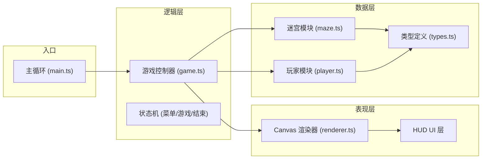

## 1. 架构设计



## 2. 技术描述

- **前端框架**：原生 TypeScript + Canvas API（无UI框架）
- **构建工具**：Vite 5.x
- **语言**：TypeScript 5.x（严格模式，target ES2020）
- **渲染方式**：2D Canvas
- **数据持久化**：localStorage（历史最高分）

### 技术选型理由

1. **原生 Canvas**：游戏需要高性能实时渲染，Canvas API 提供最佳性能
2. **TypeScript**：类型安全，便于维护复杂游戏逻辑
3. **Vite**：快速的开发体验，热更新，构建优化
4. **无UI框架**：游戏界面简洁，使用Canvas绘制即可，减少依赖

## 3. 项目结构

```
├── package.json          # 项目配置与依赖
├── index.html            # 入口页面
├── vite.config.js        # Vite 构建配置
├── tsconfig.json         # TypeScript 配置
└── src/
    ├── main.ts           # 游戏主入口、状态机、主循环
    ├── game.ts           # 游戏逻辑控制器
    ├── maze.ts           # 迷宫生成与重组（波函数坍缩算法）
    ├── player.ts         # 玩家类（移动、状态、轨迹）
    ├── renderer.ts       # Canvas 渲染器
    └── types.ts          # 类型定义
```

## 4. 模块职责

### 4.1 types.ts - 类型定义

定义全局接口和枚举：
- `MazeCell`：迷宫单元格（墙/路）
- `Position`：位置坐标
- `GameState`：游戏状态（menu/playing/gameover）
- `GameStatus`：胜利/失败
- `Treasure`：宝物
- `Trap`：陷阱
- `TrailPoint`：轨迹点

### 4.2 maze.ts - 迷宫模块

核心功能：
- **波函数坍缩算法**：生成初始10x10迷宫
- **出入口固定**：左上角入口，右下角出口
- **路径宽度保证**：至少2格宽
- **局部重组**：每30秒随机3x3区域重新生成
- **连通性保证**：重组后保持出入口连通
- **宝物/陷阱分布**：随机放置5个宝物和3个陷阱

### 4.3 player.ts - 玩家模块

核心功能：
- **位置管理**：网格坐标 + 平滑插值
- **移动控制**：WASD键盘事件，每步一格
- **移动状态**：正常/减速
- **轨迹系统**：半透明轨迹线，5秒消失
- **光环效果**：收集宝物后3秒光环
- **碰撞检测**：墙壁碰撞、宝物/陷阱触发

### 4.4 renderer.ts - 渲染器

核心功能：
- **迷宫渲染**：墙壁、路径、外围微光渐变
- **角色渲染**：亮蓝色角色、光环效果、平滑移动
- **宝物渲染**：金色菱形、脉动动画
- **陷阱渲染**：红色骷髅
- **HUD渲染**：计时器、宝物数、FPS
- **过渡动画**：迷宫重组渐隐渐现（1秒）
- **特效渲染**：陷阱触发红色光晕、轨迹线

### 4.5 game.ts - 游戏控制器

核心功能：
- **状态管理**：菜单/游戏中/结束 三态切换
- **游戏计时**：生存时间计时器
- **得分计算**：宝物数x100 + 生存时间x10
- **胜负判定**：到达出口胜利，陷阱累计3次失败
- **迷宫重组调度**：每30秒触发重组
- **最高分持久化**：localStorage存储

### 4.6 main.ts - 主入口

核心功能：
- **Canvas初始化**：获取DOM、设置尺寸
- **状态机管理**：切换游戏状态
- **主循环**：requestAnimationFrame，60FPS
- **事件监听**：键盘事件、窗口resize
- **模块协调**：串联game、player、maze、renderer

## 5. 核心算法

### 5.1 波函数坍缩算法（WFC）

简化版WFC用于迷宫生成：
1. 初始化每个格子为所有可能状态的叠加
2. 选择熵最低的格子进行坍缩
3. 根据相邻约束传播信息
4. 重复直到所有格子坍缩

约束规则：
- 相邻格子必须在共享边上都为路径或都为墙
- 入口和出口固定为路径
- 保证整体连通性

### 5.2 局部重组算法

1. 随机选择3x3区域（避开出入口）
2. 对该区域重新运行WFC
3. 验证出入口连通性（BFS）
4. 如不连通则重试
5. 更新宝物和陷阱位置

### 5.3 平滑移动插值

- 使用requestAnimationFrame的deltaTime计算插值进度
- 步间插值时长：150ms
- 缓动函数：ease-out

## 6. 性能优化

- **脏矩形渲染**：仅重绘变化区域
- **对象池**：复用轨迹点对象
- **帧率控制**：固定60FPS逻辑更新
- **防抖处理**：键盘输入防抖
- **离屏缓冲**：迷宫静态层预渲染

## 7. 数据持久化

使用 localStorage 存储：
- `mazeTreasureHighScore`：历史最高分

## 8. 构建与运行

- 开发命令：`npm run dev`
- 构建命令：`npm run build`
- 预览命令：`npm run preview`
