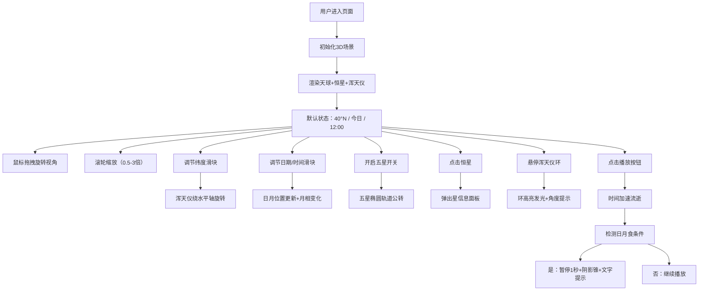

## 1. 产品概述

古代浑天仪交互式3D可视化应用，为天文史教学和科普展示提供直观的天球与浑天仪运转演示系统。解决传统教学中无法直观展示浑天仪内部机械结构（地平环、子午环、赤道环、黄道环）协同运转、日月位置变化、月相交替以及不同地理纬度下天体高度自动调整的问题。

- 核心用户：天文史教师、科普场馆参观者、天文爱好者
- 产品价值：以沉浸式3D交互方式还原古代天文学家的观测工具，让学习者身临其境地理解天体视运动规律

## 2. 核心功能

### 2.1 功能模块

1. **天球场景模块**：三维球形天球（半径200）、2500颗恒星分布、径向渐变穹顶背景（#0A0E27→#120A1F）
2. **浑天仪模型模块**：三环嵌套结构（地平环#8B4513、子午环#C0C0C0、赤道环#DAA520）、每度刻度纹理、金色铆钉连接、黄铜色渐变质感
3. **天体运动模块**：太阳沿黄道带运动、月亮沿白道运动、月相实时变化、日月食检测与阴影锥面展示、五星（金木水火土）椭圆轨道公转
4. **视角交互模块**：鼠标拖拽旋转（灵敏度0.5）、滚轮缩放（0.5-3.0倍，阻尼0.9）、纬度调节自动调整浑天仪倾角
5. **控制面板模块**：纬度滑块（-90°~90°）、日期滑块（全年）、时间滑块（24小时）、五星显示开关
6. **信息展示模块**：左上角实时天文信息栏、恒星点击信息面板、浑天仪环悬浮高亮与提示框
7. **回放控制模块**：播放/暂停按钮（100倍速默认）、重置按钮、速度选择（1/10/100/1000倍）、日月食自动暂停高亮

### 2.2 页面详情

| 页面名称 | 模块名称 | 功能描述 |
|---------|---------|---------|
| 主场景页 | 天球渲染 | 渲染2500颗随机恒星，亮度0.5-1.0，颜色白→淡黄渐变 |
| 主场景页 | 浑天仪展示 | 中心悬浮黄铜色三环结构，每环宽6/外径100/内径88，精细刻度 |
| 主场景页 | 日月位置 | 太阳沿黄道（金色虚线8宽）、月亮沿白道（银色虚线6宽）运动 |
| 主场景页 | 月相显示 | Canvas纹理动态绘制月相，亮面比例随日月经度差变化 |
| 主场景页 | 日月食 | 三者共线时显示半透明灰色圆锥阴影，弹出文字提示 |
| 主场景页 | 五星轨道 | 开启后显示金木水火土沿椭圆轨道公转及轨迹虚线 |
| 主场景页 | 恒星交互 | 悬停放大1.2倍+光环，点击弹出星名/星等/星宿信息 |
| 主场景页 | 纬度调节 | 拖动滑块浑天仪绕水平轴旋转，天体高度同步变化 |
| 主场景页 | 回放控制 | 加速播放时天体连续运动，食相时暂停1秒高亮 |
| 主场景页 | 悬浮提示 | 鼠标悬停金属环时高亮发光，显示环名和角度读数 |

## 3. 核心流程

用户进入页面 → 看到默认天球+浑天仪+北京纬度（40°N）+当前日期12:00
→ 拖拽鼠标旋转视角 / 滚轮缩放
→ 调节纬度滑块 → 浑天仪倾角变化，恒星高度改变
→ 调节日期/时间滑块 → 太阳沿黄道移动，月亮沿白道移动，月相变化
→ 开启五星开关 → 五颗行星出现并沿轨道运行
→ 点击恒星 → 弹出星信息面板
→ 悬停浑天仪环 → 高亮发光+角度提示
→ 点击播放按钮 → 时间加速流逝，天体连续运动
→ 发生日月食 → 画面自动暂停1秒并高亮提示

## 4. 用户界面设计

### 4.1 设计风格

- **主色调**：深空蓝#0A0E27 → 紫黑#120A1F径向渐变（天穹）
- **辅色调**：黄铜#DAA520、红铜#8B4513、银灰#C0C0C0、金#FFD700
- **点缀色**：橙#FF4500（太阳/火星）、淡黄#FFFACD（恒星）
- **UI面板**：半透明深色#1A1A2Ed9、深褐#3E2723CC（控制栏）
- **按钮风格**：黄铜色圆角矩形（8px），悬停提亮
- **字体**：sans-serif，信息栏16px白色
- **整体风格**：古典天文仪器质感 + 现代深空UI，科技与历史融合

### 4.2 页面设计总览

| 区域 | 模块 | UI元素 |
|-----|-----|-------|
| 全屏中央 | 3D场景 | 天球、恒星、浑天仪、日月五星 |
| 左上角（固定） | 天文信息栏 | 半透明黑圆角矩形#00000080，白色16px文字，每秒刷新 |
| 右侧（固定宽250px） | 控制面板 | 半透明深色#1A1A2Ed9，圆角12px，内边距20px |
| 右侧面板内 | 控件组 | 纬度滑块+数字、日期滑块+数字、时间滑块+数字、五星复选框 |
| 底部（固定居中） | 回放控制栏 | 深褐半透明#3E2723CC，高50px，黄铜按钮组 |
| 屏幕跟随 | 悬浮提示框 | 背景#2F2F2F，白字，#DAA520边框，圆角8px，距鼠标上10px |
| 右侧弹出 | 恒星信息面板 | 半透明深色面板，关闭按钮，100ms过渡动画 |

### 4.3 响应式设计

- **桌面端（≥768px）**：右侧控制面板常驻，底部控制栏居中
- **移动端（<768px）**：所有UI元素自动隐藏，改为悬浮按钮图标，点击展开全屏覆盖面板
- **过渡动画**：面板展开/收起、信息弹出/关闭均使用300ms ease-out动画
- **触摸优化**：支持单指拖拽旋转、双指捏合缩放

### 4.4 3D场景指引

- **环境光**：低强度环境光（0.3）+ 方向光模拟星空照明
- **浑天仪材质**：MeshStandardMaterial，金属度0.8-0.9，粗糙度0.2-0.3，黄铜渐变，凹凸贴图锻造纹理
- **恒星材质**：PointsMaterial，大小2-3px，AdditiveBlending，颜色随机白→淡黄
- **太阳材质**：MeshBasicMaterial + 橙色发光，使用PointLight作为场景光源之一
- **月亮材质**：MeshStandardMaterial + Canvas月相纹理
- **黄道/白道**：LineDashedMaterial，金色/银色虚线，宽度8/6
- **相机**：PerspectiveCamera，初始距离500，fov 60°
- **后处理**：轻微Bloom效果增强恒星和太阳发光感，色调映射ACES
- **性能**：60Hz下≥45fps，100倍速≥30fps，使用BufferGeometry优化2500星点渲染
