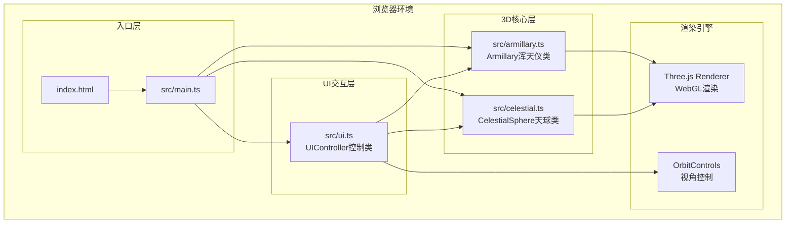

## 1. 架构设计

本项目为纯前端3D可视化应用，采用模块化分层架构，不包含后端服务。



## 2. 技术栈

- **前端框架**：原生 TypeScript（无React/Vue，按用户要求）
- **3D引擎**：Three.js ^0.160.0 + @types/three
- **构建工具**：Vite ^5.0.0
- **编程语言**：TypeScript ^5.3.0（严格模式，target ES2020）
- **样式方案**：原生CSS + CSS变量（不使用Tailwind，用户指定原生JS）
- **无后端、无数据库、无外部服务**

## 3. 文件结构定义

```
auto240/
├── package.json              # 依赖与脚本配置
├── index.html                # 入口HTML（全屏canvas，标题"浑天仪模拟"）
├── vite.config.js            # Vite构建配置（端口3000）
├── tsconfig.json             # TS配置（严格，ES2020，bundler）
└── src/
    ├── main.ts               # 主入口：初始化场景/相机/渲染器，组装模块
    ├── armillary.ts          # 浑天仪核心：三环模型、铆钉、刻度、旋转/高亮接口
    ├── celestial.ts          # 天球天体：恒星、日月位置、月相纹理、食相检测、五星轨道
    └── ui.ts                 # UI控制：右侧面板、回放栏、悬浮提示、星信息面板
```

## 4. 核心类与接口定义

### 4.1 Armillary 类（src/armillary.ts）

```typescript
export interface RingInfo {
  name: string;       // 环名称（地平环/子午环/赤道环）
  angle: number;      // 当前角度读数
  normal: THREE.Vector3; // 法向量用于悬浮检测
}

export class Armillary {
  group: THREE.Group;           // 浑天仪根节点
  horizonRing: THREE.Mesh;      // 地平环 #8B4513
  meridianRing: THREE.Mesh;     // 子午环 #C0C0C0
  equatorRing: THREE.Mesh;      // 赤道环 #DAA520
  rivets: THREE.Mesh[];         // 金色铆钉数组
  ringsMap: Map<THREE.Mesh, RingInfo>; // 用于射线检测

  constructor();
  createRing(color: number, innerR: number, outerR: number, rotation: THREE.Euler): THREE.Mesh;
  createScaleTexture(): THREE.CanvasTexture;  // 每度刻度凹凸纹理
  createRivets(): void;
  setLatitude(latDeg: number): void;          // 绕水平轴旋转调整纬度
  highlightRing(mesh: THREE.Mesh, enabled: boolean): void; // 高亮/取消高亮
  getRingInfo(mesh: THREE.Mesh): RingInfo | null;
  dispose(): void;
}
```

### 4.2 CelestialSphere 类（src/celestial.ts）

```typescript
export interface StarData {
  id: number;
  position: THREE.Vector3;
  magnitude: number;    // 星等 0-6
  color: THREE.Color;
  name: string;
  constellation: string; // 二十八宿
}

export interface PlanetState {
  name: '金星' | '木星' | '水星' | '火星' | '土星';
  color: number;
  semiMajorAxis: number;  // 半长轴
  eccentricity: number;   // 偏心率
  angle: number;          // 当前平近点角
  period: number;         // 公转周期（相对）
  mesh: THREE.Mesh;
  orbitLine: THREE.Line;
  visible: boolean;
}

export interface EclipseEvent {
  type: 'solar' | 'lunar' | null;
  coneMesh?: THREE.Mesh;   // 阴影锥
  label?: string;
}

export class CelestialSphere {
  group: THREE.Group;
  stars: THREE.Points;
  starData: StarData[];
  sun: THREE.Mesh;               // 太阳 #FF4500 r=6
  moon: THREE.Mesh;              // 月亮 #C0C0C0 r=5
  zodiacRing: THREE.Line;        // 黄道带 金色虚线
  lunarOrbitRing: THREE.Line;    // 白道 银色虚线
  planets: Map<string, PlanetState>;
  eclipseState: EclipseEvent;
  
  constructor(radius: number);
  createStars(count: number): void;   // 2500颗均匀分布
  createZodiacRing(): void;           // 黄道宽8
  createLunarOrbitRing(): void;       // 白道宽6
  createSunMoon(): void;
  createPlanets(): void;
  updateSunPosition(jd: number): void;    // 由儒略日计算黄经
  updateMoonPosition(jd: number): void;   // 计算月理
  generateMoonPhaseTexture(phase: number): THREE.CanvasTexture; // phase 0-1
  updatePlanets(jd: number): void;
  setPlanetVisible(name: string, visible: boolean): void;
  detectEclipse(): EclipseEvent;           // 检测共线条件
  setLatitude(latDeg: number): void;       // 调整天体地平线高度
  pickStar(intersection: THREE.Intersection): StarData | null;
  getSunLongitude(): number;               // 黄经（度）
  getMoonLongitude(): number;
  getVisiblePlanets(altitudeThreshold: number): string[]; // 高度角>5°
  dispose(): void;
}
```

### 4.3 UIController 类（src/ui.ts）

```typescript
export interface UIState {
  latitude: number;     // -90 ~ 90
  date: Date;
  timeMinutes: number;  // 0 ~ 1440
  playbackSpeed: 1 | 10 | 100 | 1000;
  isPlaying: boolean;
  planets: Record<string, boolean>;
}

export class UIController {
  state: UIState;
  controlPanel: HTMLElement;       // 右侧面板
  playbackBar: HTMLElement;        // 底部控制栏
  infoBar: HTMLElement;            // 左上角信息栏
  tooltip: HTMLElement;            // 跟随鼠标悬浮提示
  starInfoPanel: HTMLElement;      // 恒星信息弹出面板
  mobileToggle: HTMLElement;       // 移动端悬浮按钮

  listeners: {
    onLatitudeChange?: (lat: number) => void;
    onDateTimeChange?: (date: Date, minutes: number) => void;
    onPlaybackChange?: (playing: boolean, speed: number) => void;
    onReset?: () => void;
    onPlanetToggle?: (name: string, visible: boolean) => void;
  };

  constructor();
  createControlPanel(): void;
  createPlaybackBar(): void;
  createInfoBar(): void;
  createTooltip(): void;
  createStarInfoPanel(): void;
  createMobileToggle(): void;
  updateInfoBar(data: {
    date: string; time: string; lat: string;
    sunLon: string; moonLon: string;
    visiblePlanets: string[];
  }): void;
  showTooltip(x: number, y: number, text: string): void;
  hideTooltip(): void;
  showStarInfo(star: StarData): void;
  hideStarInfo(): void;
  setButtonHighlight(active: boolean): void; // 日月食时控制栏高亮
  addListener(event: string, cb: Function): void;
  dispose(): void;
}
```

## 5. main.ts 主流程

```typescript
import * as THREE from 'three';
import { OrbitControls } from 'three/examples/jsm/controls/OrbitControls.js';
import { Armillary } from './armillary';
import { CelestialSphere } from './celestial';
import { UIController } from './ui';

// 1. 初始化场景、相机、渲染器
// 2. 创建背景（径向渐变穹顶，#0A0E27→#120A1F）
// 3. 实例化 Armillary、CelestialSphere、UIController
// 4. 设置 OrbitControls（拖拽灵敏度0.5，缩放0.5-3，阻尼0.9）
// 5. 建立 UI 事件 → 3D模型 的绑定
//    - 纬度变化 → armillary.setLatitude + celestial.setLatitude
//    - 日期/时间 → 计算儒略日 → 更新日月五星位置
//    - 播放状态 → 循环中累加时间
//    - 五星开关 → celestial.setPlanetVisible
// 6. 射线检测（Raycaster）：
//    - 每帧检测鼠标与浑天仪环相交 → 高亮 + tooltip
//    - 点击检测恒星 → 弹出星信息
// 7. 动画循环（requestAnimationFrame）：
//    - 更新 controls
//    - 若播放中：推进时间，更新天体
//    - 检测日食/月食 → 触发暂停和高亮
//    - 刷新信息栏（1秒节流）
//    - 渲染
// 8. 窗口大小监听 resize
// 9. 页面卸载 dispose
```

## 6. 关键算法说明

### 6.1 恒星均匀分布（球面均匀采样）
使用斐波那契球面分布算法生成2500个均匀点：
```
phi = arccos(1 - 2 * (i + 0.5) / N)
theta = π * (1 + sqrt(5)) * i
x = sin(phi) * cos(theta)
y = sin(phi) * sin(theta)
z = cos(phi)
```

### 6.2 太阳位置简化计算
以J2000.0为历元，使用简化黄经公式（足够科普精度）：
- L0 = 280.4665° + 0.9856474° * D （平黄经，D为J2000起的儒略日差）
- g = 357.5291° + 0.9856003° * D （平近点角）
- λ = L0 + 1.915°·sin(g) + 0.020°·sin(2g) （真黄经）

### 6.3 月亮位置简化计算
- 平黄经 L = 218.316° + 13.176396° * D
- 平近点角 M = 134.963° + 13.064993° * D
- 月相相位角 = |λ_sun - λ_moon| mod 360°，phase = phase_angle / 360

### 6.4 月相纹理绘制（Canvas）
```
phase = 0 新月 → 0.25 上弦 → 0.5 满月 → 0.75 下弦 → 1.0 新月
绘制策略：
1. 填充黑色圆为基底
2. phase < 0.5：右半圆亮，左半圆使用椭圆裁剪叠加灰色
3. phase > 0.5：左半圆亮，右半圆使用椭圆裁剪叠加灰色
4. phase = 0 全黑，0.5 全亮（白→淡黄渐变）
5. 添加轻微陨石坑纹理噪点
```

### 6.5 日月食检测
当 |Δλ - 180°·k| < ε（ε≈1.5°）且月亮纬度 β_moon < 5°：
- k 为偶数（0,2,4...）→ 朔，可能日食（type=solar）
- k 为奇数（1,3,5...）→ 望，可能月食（type=lunar）
阴影锥使用 ConeGeometry + MeshBasicMaterial transparent opacity=0.6

### 6.6 五星椭圆轨道
开普勒方程近似求解：
- M = M0 + 2π·t/T （平近点角）
- E ≈ M + e·sin(M) （一阶近似，科普精度足够）
- 真近点角 ν = 2·arctan( sqrt((1+e)/(1-e)) · tan(E/2) )
- 向径 r = a(1 - e·cos(E))
- 轨道平面相对于黄道有微小倾角（水星7°、金星3.4°、火星1.9°、木星1.3°、土星2.5°）

### 6.7 纬度调整对天球的变换
观测者纬度 φ 对应天球旋转矩阵：绕X轴（东西向）旋转 -(90° - φ)：
- 赤道平面的天顶方向（北天极）随纬度升高而升高
- 等价于将整个 Armillary group.rotation.x = (90 - lat) * DEG2RAD
- 恒星位置在世界空间不变，由相机相对位置体现高度差，或直接将天球整体同浑天仪一起旋转（此处采用后者，保证视觉一致）

## 7. 性能优化方案

1. **恒星渲染**：使用 BufferGeometry + Points（单次draw call）而非2500个Mesh
2. **刻度纹理**：三个环共用同一张Canvas生成的256×2048刻度纹理（GPU内存复用）
3. **环几何体**：TorusGeometry而非CSG，内外径差6单位+厚度3单位，线段数128
4. **射线检测**：每帧仅检测浑天仪的3个Mesh + 恒星Points，使用 frustumCulling
5. **动画循环优化**：
   - 信息栏节流更新（1秒间隔）
   - 月相纹理仅当日月经度差跨0.01相位阈值时重绘
   - 五星轨迹线静态生成，不每帧重建
6. **WebGL属性**：启用 antialias=false 或 MSAA 4x，pixelRatio=min(devicePixelRatio, 2)
7. **材质复用**：相同颜色/属性的行星与铆钉共享材质实例

## 8. 构建与启动

- **开发模式**：`npm run dev`（Vite dev server，端口3000）
- **生产构建**：`npm run build` → dist/
- **依赖安装**：`npm install`
- **TypeScript检查**：`npx tsc --noEmit`（可选，但构建配置中可集成）
