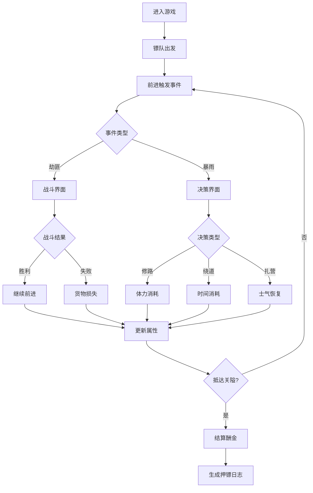

## 1. 产品概述
古代镖师押镖策略小游戏——玩家扮演身手不凡的镖师，带领3-5人镖队穿越险恶山路，随机遭遇劫匪与天气事件，通过战斗、修路或绕道等决策，护送货物安全抵达关隘。

- **目标用户**：喜欢策略决策类、古风题材小游戏的玩家
- **核心玩法**：回合制战斗 + 事件决策 + 属性管理
- **市场价值**：沉浸式古风体验，轻量级策略玩法，适合碎片化时间游戏

## 2. 核心功能

### 2.1 用户角色
| 角色 | 注册方式 | 核心权限 |
|------|----------|----------|
| 玩家 | 无需注册，直接进入 | 控制镖队决策，进行回合制战斗，查看押镖日志 |

### 2.2 功能模块
1. **主游戏页面**：横向卷轴水墨山景、镖队状态栏、路径进度条、事件触发系统
2. **战斗界面**：回合制战斗系统，攻击/防御/撤退操作，伤害飘字动画
3. **事件决策系统**：羊皮纸对话框，三选项决策树，随机事件生成
4. **押镖日志面板**：卷轴展开动画，记录每日事件与决策结果
5. **结算系统**：根据货物完整度、用时、镖师存活数计算酬金

### 2.3 页面详情
| 页面名称 | 模块名称 | 功能描述 |
|----------|----------|----------|
| 主游戏页 | 水墨卷轴背景 | 动态山脉渐变、太阳光晕、土黄色蜿蜒山路、深绿丛林、灰色岩壁 |
| 主游戏页 | 镖队状态栏 | 左侧竖排显示镖师姓名、体力条(红渐变)、武力值、士气旗帜图标 |
| 主游戏页 | 路径进度条 | 蜿蜒浅灰色路径，5个金色印章事件点，事件后变红并显示箭头 |
| 主游戏页 | 日志按钮 | 右侧卷轴按钮，点击展开押镖日志面板 |
| 事件弹窗 | 羊皮纸对话框 | 半透明多边纹理，左侧事件插画，右侧古风楷体描述，下方三决策按钮 |
| 战斗界面 | 回合制对战 | 左侧我方镖师(攻击/防御按钮)，右侧敌方劫匪(血条)，伤害飘字动画 |
| 结算界面 | 酬金计算 | 展示剩余货物、用时、存活镖师数，生成最终押镖日志 |

## 3. 核心流程
玩家进入游戏 → 镖队从山脚出发 → 沿山路前进 → 触发随机事件(劫匪/暴雨) → 弹出羊皮纸对话框 → 选择战斗/修路/绕道 → 执行结果(战斗动画/修路粒子/绕道切换) → 更新镖队属性(体力/士气/货物) → 继续前进 → 抵达关隘 → 结算酬金 → 生成完整押镖日志

## 4. 用户界面设计

### 4.1 设计风格
- **主色调**：暖色草纸色(#F5E6C8)、米白路径区(#FFF8DC)、褐色标题(#5D4037)
- **按钮风格**：圆角矩形，文物铜绿色(#4A7C59)阴影，悬停金色描边
- **字体**：古风楷体，标题大字加粗，正文适中行高
- **布局**：横向卷轴式，左侧镖队状态，右侧日志按钮，中央游戏区域
- **光标**：金色描边圆环，替换默认箭头

### 4.2 页面设计概述
| 页面名称 | 模块名称 | UI元素 |
|----------|----------|--------|
| 主游戏页 | 水墨背景 | 水墨渐变山脉、半透明太阳光晕、蜿蜒土黄山路 |
| 主游戏页 | 镖队状态 | 红色渐变体力条(#E53935→#FFCDD2)、旗帜形士气图标(低落时变灰耷拉) |
| 事件弹窗 | 羊皮纸对话 | #F5DEB3背景、#8B4513深棕双线边框、多边纹理 |
| 事件弹窗 | 决策按钮 | 战斗(#C62828→#E53935悬停上浮5px)、修路(#2E7D32→#388E3C悬停弹起)、绕道(#F57F17→#F9A825悬停摇摆) |
| 战斗界面 | 我方单位 | 头像+圆形攻击按钮+防御按钮(半透明白色盾牌) |
| 战斗界面 | 敌方单位 | 黑色剪影劫匪+血条，被击中后摇晃闪烁红色 |
| 战斗界面 | 伤害动画 | 红色数字从头顶飘出，放大消失 |
| 进度条 | 路径印章 | 金色圆形印章，通过后变红 |

### 4.3 响应性
- 桌面端优先设计，全屏显示
- 使用Canvas绘制游戏场景，自适应窗口大小
- 触摸设备优化按钮点击区域

### 4.4 动画与性能
- **性能要求**：核心循环60FPS，单帧动画≤3ms
- **预加载**：所有资源3秒内预载完成
- **动画效果**：水滴粒子、刀光特效、飘字、盾牌、冲击波、锤子碎石粒子

