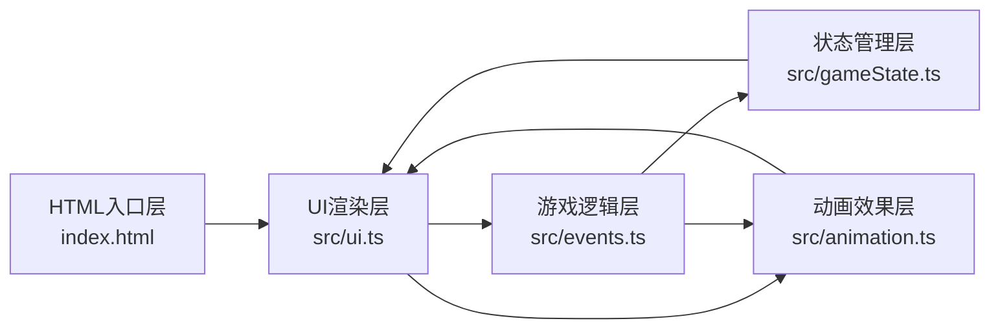

## 1. 架构设计



**层次说明**：
- **HTML入口层**：index.html 提供页面结构和Canvas画布
- **UI渲染层**：src/ui.ts 负责所有DOM和Canvas渲染，处理用户交互
- **游戏逻辑层**：src/events.ts 定义事件系统、决策树、战斗逻辑
- **状态管理层**：src/gameState.ts 管理镖队状态、属性数据、事件序列
- **动画效果层**：src/animation.ts 封装粒子系统、过渡动画，使用requestAnimationFrame驱动

## 2. 技术描述
- **前端技术栈**：TypeScript + 原生JavaScript + Canvas 2D API + HTML5 + CSS3
- **构建工具**：Vite 5.x
- **类型系统**：TypeScript 5.x（严格模式，target ES2020）
- **无后端、无数据库**：纯前端游戏，所有数据在浏览器内存中管理

## 3. 项目文件结构

| 文件路径 | 用途 |
|----------|------|
| `/package.json` | 项目依赖配置（typescript, vite），启动脚本 `npm run dev` |
| `/index.html` | 入口页面，全屏居中布局，古风背景 |
| `/vite.config.js` | Vite构建配置，端口3000 |
| `/tsconfig.json` | TypeScript配置，严格模式，ES2020 |
| `/src/gameState.ts` | 镖队状态管理，数据接口定义 |
| `/src/events.ts` | 事件类与决策树逻辑，随机事件生成 |
| `/src/ui.ts` | UI渲染，Canvas绘制，用户交互监听 |
| `/src/animation.ts` | 粒子动画系统，过渡动画封装 |

## 4. 核心数据模型

### 4.1 数据接口定义

```typescript
// src/gameState.ts

// 镖师属性
interface Escort {
  id: string;
  name: string;
  stamina: number;      // 体力 0-100
  maxStamina: number;
  strength: number;     // 武力值 1-10
  morale: number;       // 士气 0-100
  isAlive: boolean;
  isDefending: boolean; // 当前回合是否防御
}

// 货物状态
interface Cargo {
  integrity: number;    // 完整度 0-100
  value: number;        // 货物价值
}

// 游戏状态
interface GameState {
  escorts: Escort[];
  cargo: Cargo;
  currentDay: number;
  totalDays: number;
  currentEventIndex: number;
  pathProgress: number; // 0-100
  isGameOver: boolean;
  isVictory: boolean;
  logs: LogEntry[];
}

// 日志条目
interface LogEntry {
  day: number;
  event: string;
  decision: string;
  result: string;
  timestamp: number;
}

// 事件类型
type EventType = 'bandit' | 'storm' | 'fork' | 'rest';

// 事件接口
interface GameEvent {
  id: string;
  type: EventType;
  title: string;
  description: string;
  illustration: string; // 插画类型标识
  options: EventOption[];
}

// 事件选项
interface EventOption {
  id: string;
  label: string;
  type: 'fight' | 'repair' | 'detour' | 'camp';
  color: string;
  hoverColor: string;
}

// 敌人接口
interface Enemy {
  id: string;
  name: string;
  health: number;
  maxHealth: number;
  strength: number;
  isHit: boolean;       // 被击中动画状态
  hitTimer: number;     // 击中动画计时器
}
```

### 4.2 状态更新规则

1. **体力值**：每次战斗消耗10-20，修路消耗15-25，扎营恢复20-30
2. **士气值**：战斗胜利+15，失败-20，扎营+10，绕道-5
3. **货物完整度**：战斗失败损失20-30，绕道损失5-10，失败超过50%任务失败
4. **每日消耗**：每天结束自动消耗全体体力5点

## 5. 核心逻辑流程

### 5.1 战斗系统
- 回合制：我方先行动，敌方后行动
- 命中率：我方攻击命中率 = 70% + (士气/500) * 30%
- 敌方攻击命中率：基础60%，我方防御时降至20%
- 伤害计算：基础伤害 = 武力值 * (0.8 + Math.random() * 0.4)
- 防御效果：受到伤害减少50%

### 5.2 事件决策树
```
随机事件
├── 劫匪拦路 → 战斗 / 缴纳买路财(扣货物10%) / 撤退(绕远路)
├── 暴雨栈道 → 冒险修路(体力-20, 70%成功) / 原地扎营(体力+10, 耗时1天) / 绕道(耗时2天, 货物-5%)
└── 三岔路口 → 走险峻近路(可能遇伏) / 平坦远路(安全但耗时) / 原地休息
```

### 5.3 性能优化策略
1. **Canvas分层渲染**：背景层(山脉)、路径层、动态元素层分离，只重绘变化层
2. **对象池模式**：粒子对象复用，避免频繁GC
3. **requestAnimationFrame**：统一动画调度，确保60FPS
4. **预加载**：使用Promise.all预加载所有音效和图片资源
5. **性能监控**：每帧记录耗时，超过3ms自动降级粒子数量

## 6. 技术约束

1. **TypeScript严格模式**：noImplicitAny, strictNullChecks, strictFunctionTypes全部开启
2. **ES2020特性**：可选链、空值合并、BigInt等可用
3. **无第三方UI库**：所有UI组件原生实现
4. **无图片资源**：所有视觉元素使用Canvas绘制或CSS实现，避免外部资源加载
5. **音效使用Web Audio API生成**：不使用外部音频文件，保证3秒内加载完成

