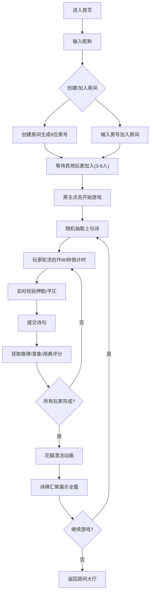

## 1. 产品概述

曲水流觞是一款基于WebSocket的多人协作古代诗词联句创作Web应用，让3-6位玩家围坐虚拟蜿蜒溪流旁，以"曲水流觞"的形式接龙创作古诗。系统自动检测平仄、韵脚、意象匹配度，提供实时评分与名人名句推荐，最终以花瓣漂流动画汇聚成诗碑。

- **目标用户**：博物馆和国潮文化爱好者，喜爱古典诗词文化的用户群体
- **核心价值**：在线体验古代文人雅集的文化活动，通过游戏化方式学习和创作古典诗词
- **市场定位**：文化教育类互动应用，可用于博物馆线上体验、诗词爱好者社群活动

## 2. 核心功能

### 2.1 用户角色
| 角色 | 注册方式 | 核心权限 |
|------|----------|----------|
| 玩家 | 输入昵称加入 | 创建/加入房间、参与联句创作、查看评分 |
| 房主 | 创建房间自动成为 | 开始游戏、控制回合、踢出玩家 |

### 2.2 功能模块
1. **房间管理模块**：创建房间、加入房间、玩家列表、状态同步
2. **溪流与座次模块**：S形溪流动画、6个坐席布局、当前玩家高亮
3. **作诗校验模块**：扇形输入面板、实时韵脚检测、平仄错误高亮、匹配度进度
4. **评分推荐模块**：格律/意象/用典三维评分、名人名句推荐、卷轴展开动画
5. **流觞动画模块**：花瓣SVG漂流动画、贝塞尔曲线路径、诗碑题字效果

### 2.3 页面详情
| 页面名称 | 模块名称 | 功能描述 |
|----------|----------|----------|
| 主页面 | 房间入口 | 创建/加入房间、昵称输入、房间号分享 |
| 游戏页面 | 溪流座次 | 虚拟S形溪流、6个竹垫坐席、当前玩家高亮发光 |
| 游戏页面 | 作诗面板 | 扇形输入面板、上句展示、实时校验、90秒倒计时 |
| 游戏页面 | 评分卷轴 | 三维分数条、名人推荐、折叠式卷轴动画 |
| 游戏页面 | 流觞动画 | 花瓣漂流、诗碑汇聚、逐字题字效果 |
| 游戏页面 | 玩家列表 | 昵称、在线状态、累计得分、房间管理操作 |

## 3. 核心流程

玩家进入首页后，输入昵称创建或加入房间，房间满3人即可开始游戏。系统随机抽取上句，玩家轮流在90秒内创作下句，系统实时校验押韵、平仄。提交后获得三维评分与名人推荐。所有玩家完成后，诗句随花瓣漂流汇聚成诗碑，完成一轮游戏。

## 4. 用户界面设计

### 4.1 设计风格
- **主色调**：青瓷色 #C9DFC3，搭配淡米黄 #F5E6C8 渐变背景
- **点缀色**：胭脂红 #FF4D4D（错误提示）、金色 #FFD700（高亮/标题）、墨色 #3E2723（正文）
- **字体**：行楷用于标题和诗句，正文使用优雅的衬线字体
- **动画风格**：古典优雅，卷轴展开、花瓣漂流、毛笔题字等东方美学元素
- **材质质感**：竹席纹理、宣纸质感、溪水半透明渐变

### 4.2 页面设计概述
| 页面名称 | 模块名称 | UI元素 |
|----------|----------|--------|
| 主页面 | 房间入口 | 古风横匾标题、青瓷色渐变背景、行楷字体、木质纹理输入框、金色按钮 |
| 游戏页面 | 溪流座次 | S形CSS曲线溪水、波浪水纹动画、6个圆形竹垫坐席、金色发光高亮 |
| 游戏页面 | 作诗面板 | 扇形宣纸背景、上句行楷展示、输入框、韵脚状态指示器、平仄错误波浪线、匹配度进度条、倒计时 |
| 游戏页面 | 评分卷轴 | 卷轴展开动画、三色渐变分数条、名人诗句引用卡片 |
| 游戏页面 | 流觞动画 | SVG花瓣、贝塞尔曲线漂流路径、诗碑圆形汇聚、逐字淡入效果 |
| 游戏页面 | 玩家列表 | 齿轮图标展开、绿/灰点在线状态、星形徽章得分、昵称行楷展示 |

### 4.3 响应式
- **桌面端(>1024px)**：溪流和坐席放大1.2倍，坐席间距最大200px
- **平板端(768-1024px)**：保持原大小
- **移动端(<768px)**：坐席直径缩为45px，扇形面板半径100px，翻牌动画缩为0.8倍

### 4.4 性能约束
- 所有动画保持60fps，使用transform和opacity避免重排
- WebSocket消息频率≤30条/秒
- 单次格律检测响应时间<50ms（服务端预编译正则缓存）
- 断开连接后60秒内重连保留状态和积分
