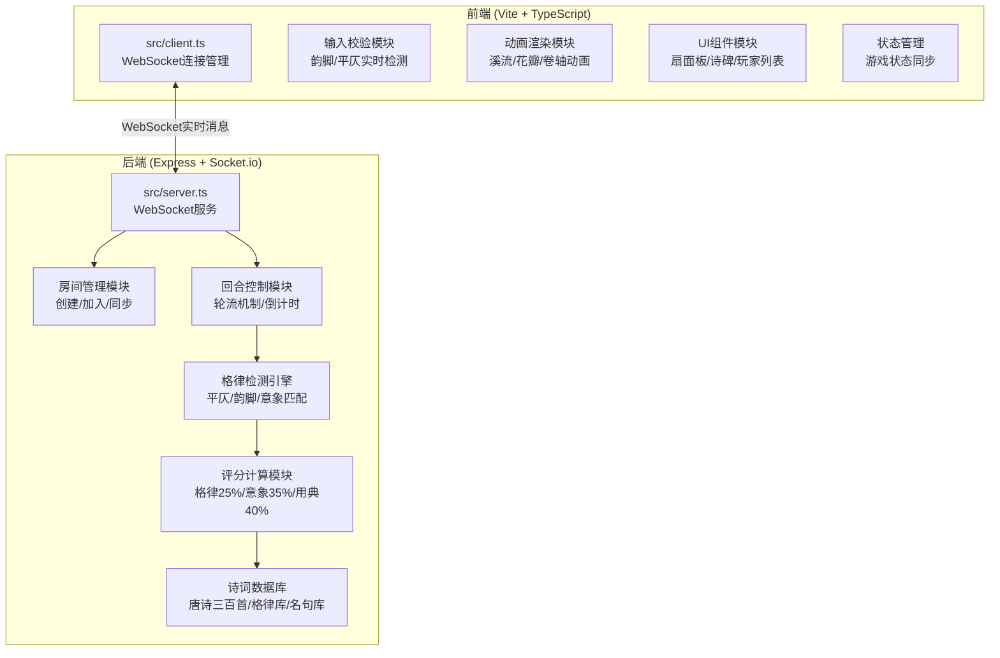

## 1. 架构设计



## 2. 技术描述

- **前端**：TypeScript + 原生JavaScript + Vite构建
- **后端**：Node.js + Express + Socket.io
- **通信协议**：WebSocket (Socket.io)
- **数据格式**：JSON
- **构建工具**：Vite 5.x
- **TypeScript配置**：严格模式、target ES2020、esModuleInterop

## 3. 项目文件结构

| 文件 | 说明 |
|------|------|
| `package.json` | 项目依赖与启动脚本 |
| `index.html` | 入口页面，包含CSS样式与布局 |
| `vite.config.js` | Vite构建配置 |
| `tsconfig.json` | TypeScript配置 |
| `src/client.ts` | 前端主逻辑：WebSocket连接、输入校验、动画渲染 |
| `src/server.ts` | 后端服务：房间管理、回合控制、格律检测、评分计算 |

## 4. WebSocket消息定义

### 4.1 客户端 → 服务器
```typescript
interface ClientMessage {
    type: 'join_room' | 'create_room' | 'submit_poem' | 'start_game' | 'typing';
    data: {
        roomId?: string;
        nickname?: string;
        poem?: string;
        upperLine?: string;
    };
}
```

### 4.2 服务器 → 客户端
```typescript
interface ServerMessage {
    type: 'room_state' | 'turn_start' | 'turn_end' | 'score_result' | 'flowing_start' | 'player_joined' | 'player_left';
    data: {
        roomId?: string;
        players?: Player[];
        currentPlayerId?: string;
        upperLine?: string;
        timeLeft?: number;
        score?: Score;
        recommendations?: Recommendation[];
        allPoems?: PoemEntry[];
    };
}

interface Player {
    id: string;
    nickname: string;
    score: number;
    isOnline: boolean;
    isHost: boolean;
    seatIndex: number;
}

interface Score {
    meter: number;      // 格律 25%
    imagery: number;    // 意象 35%
    allusion: number;   // 用典 40%
    total: number;
}

interface Recommendation {
    poem: string;
    author: string;
    title: string;
    reason: string;
}

interface PoemEntry {
    playerId: string;
    nickname: string;
    upperLine: string;
    lowerLine: string;
    score: Score;
}
```

## 5. 核心算法

### 5.1 平仄检测算法
```
平声: 一声、二声 (阴平、阳平)
仄声: 三声、四声 (上声、去声)
五言格律: 仄仄平平仄, 平平仄仄平
七言格律: 平平仄仄平平仄, 仄仄平平仄仄平
```

### 5.2 韵脚匹配算法
- 使用平水韵韵部分类
- 预编译韵字Map缓存
- 尾字韵母相似度计算

### 5.3 意象匹配算法
- 基于古典诗词意象词库
- 词向量余弦相似度计算
- 情感倾向匹配度

### 5.4 评分公式
```
总分 = 格律分 * 0.25 + 意象分 * 0.35 + 用典分 * 0.40
```

## 6. 内置诗词数据库

### 6.1 唐诗三百首抽样库
| 诗句 | 韵脚 | 平仄 | 意象标签 |
|------|------|------|----------|
| 床前明月光 | ang | 平平平仄平 | 月、思乡 |
| 疑是地上霜 | ang | 平仄仄仄平 | 霜、秋 |
| 举头望明月 | ue | 仄平仄平仄 | 月、仰望 |
| 低头思故乡 | ang | 平平平仄平 | 故乡、思念 |

### 6.2 格律库结构
```typescript
interface RhymeEntry {
    char: string;
    pinyin: string;
    tone: 1 | 2 | 3 | 4;
    rhyme: string;
}

interface MeterPattern {
    pattern: ('平' | '仄' | '中')[];
    type: '五言' | '七言';
    name: string;
}
```

## 7. 性能优化

- **服务端缓存**：格律正则预编译为Map结构，缓存热点查询
- **消息节流**：WebSocket消息频率限制≤30条/秒
- **动画优化**：使用CSS transform和opacity，避免重排
- **重连机制**：60秒内重连恢复状态，session存储临时数据

## 8. 启动方式

1. 安装依赖：`npm install`
2. 启动后端服务：`node server.js` (端口3000)
3. 启动前端开发服务器：`npm run dev` (端口5173)
4. 访问 `http://localhost:5173`
