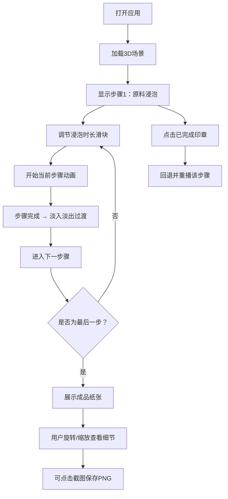

## 1. 产品概述
基于Three.js的交互式3D古代造纸工艺流程模拟Web应用，让用户通过拖拽和点击沉浸式体验从原料到成品的完整造纸六步工序，并实时观察纤维形态、纸张厚度和纹理的渐进变化。

- 核心目的：以寓教于乐的方式展示中国古代四大发明之一的造纸术工艺流程
- 目标用户：学生、历史爱好者、博物馆访客及对传统工艺感兴趣的大众用户
- 市场价值：结合3D可视化与交互体验，为传统文化教育提供现代化展示手段

## 2. 核心功能

### 2.1 用户角色
无需角色区分，所有用户拥有完整功能访问权限。

### 2.2 功能模块
1. **3D场景渲染模块**：基于Three.js构建造纸车间场景，包含环境、灯光、相机控制
2. **工艺流程状态机**：六步工序（浸泡→蒸煮→捣浆→抄纸→压榨→晒干）的状态管理与动画过渡
3. **参数控制面板**：各步骤关键参数滑块调节，实时影响3D模型状态
4. **步骤状态条**：右侧竖排印章式进度指示器，支持回退重播
5. **品质评分系统**：基于参数设置自动计算纸张品质分数
6. **成品交互查看**：旋转、缩放查看纸张纹理细节，支持PNG截图保存

### 2.3 页面详情
| 页面名称 | 模块名称 | 功能描述 |
|---------|---------|---------|
| 主页面 | 3D场景区 | 全屏3D渲染，展示造纸工序动画 |
| 主页面 | 参数控制面板 | 底部/侧边滑块控制，实时调节参数 |
| 主页面 | 步骤状态条 | 右侧竖排印章图标，显示进度与回退 |
| 主页面 | 品质评分区 | 左上角分数显示，颜色渐变反馈 |
| 主页面 | FPS监控 | 帧率实时显示，低于50FPS红色警告 |

## 3. 核心流程
用户打开应用后，默认展示第一步"原料浸泡"场景。用户可通过滑块调节参数后点击开始，观看当前步骤动画。动画完成后自动淡入淡出过渡到下一步。用户也可点击右侧状态条中任意已完成步骤回退重播。六步全部完成后，成品纸张展示，支持右键拖拽旋转、滚轮缩放查看细节，可截图保存。

## 4. 用户界面设计

### 4.1 设计风格
- **主色调**：素白宣纸色#F5F0E1、竹青色#6B8E23、朱红色#C62828
- **背景色**：淡青灰色#E8E0D0（古旧纸墙质感）
- **地面色**：浅木色#DEB887（实木地板）
- **印章色**：已完成#C62828朱红、当前#FFB300金黄、未完成#BDBDBD灰色
- **按钮样式**：圆角方形，悬停放大1.05倍，按下颜色加深
- **字体**：标题仿宋字体，正文清晰易读的衬线/无衬线字体
- **布局**：全屏场景居中，控件浮于上层，右侧竖排状态条，左上角评分，底部参数面板
- **动画**：步骤切换0.8秒淡入淡出，粒子ease-in-out缓动

### 4.2 页面设计详情
| 页面/区域 | 模块名称 | UI元素与设计 |
|----------|---------|-------------|
| 主页面 | 3D场景 | 全屏居中，淡青灰背景，实木地板，暖色调环境光 |
| 主页面 | 评分显示 | 左上角，大号数字，颜色#4CAF50→#FF5722渐变 |
| 主页面 | 步骤状态条 | 右侧宽80px竖排，6个方形印章图标，带文字标注 |
| 主页面 | 参数面板 | 底部/左侧，滑块组+当前步骤名称+开始按钮 |
| 主页面 | FPS监控 | 右上角小字号，<50FPS显示红色 |
| 主页面 | 过渡遮罩 | 步骤切换时半透明素白色遮罩淡入淡出0.8s |

### 4.3 响应式设计
- **桌面端（≥1024px）**：场景全屏，状态条右侧悬浮，参数面板底部横排
- **平板端（768-1024px）**：状态条宽度缩至60px，控件适当缩小
- **移动端（≤768px）**：所有控件堆叠在场景下方，状态条改为横向排列于顶部

### 4.4 3D场景设计指引
- **环境**：古旧造纸作坊室内，墙面淡青灰，地面实木，柔和暖光模拟窗光
- **灯光**：AmbientLight环境光(0.6) + DirectionalLight主光源(0.8) + 点光源补光
- **相机**：PerspectiveCamera，初始位置(0, 3, 8)，OrbitControls控制，禁用平移
- **构图**：中心放置当前工序主体道具，周围留白充足
- **动画**：
  - 浸泡：水波粒子+纤维球悬浮旋转
  - 蒸煮：蒸汽粒子自下而上喷射上升消散
  - 捣浆：木槌上下往复敲击，纤维网格逐步细分变小
  - 抄纸：竹帘从下往上捞起，湿纸纤维在帘上铺平
  - 压榨：上方石板缓慢下降，水滴粒子从四周挤出下落
  - 晒干：墙面材质逐渐变白，表面生成微裂纹凹凸贴图
- **性能**：粒子总数≤500，单帧计算≤2ms，稳定60FPS
