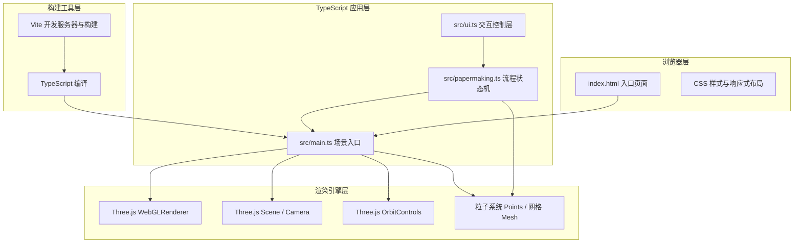

## 1. 架构设计



## 2. 技术选型说明
- **前端框架**：原生 TypeScript（不使用React/Vue，遵循用户需求）
- **3D引擎**：Three.js r^160，直接操作WebGL场景
- **构建工具**：Vite ^5.0，热更新开发服务器，端口3000
- **语言目标**：TypeScript严格模式，target ES2020
- **相机控制**：Three.js OrbitControls（examples/jsm/controls）
- **粒子系统**：Three.js Points + BufferGeometry + ShaderMaterial
- **形变动画**：Mesh顶点位置插值 + 自定义缓动函数
- **截图功能**：WebGLRenderer.domElement.toDataURL('image/png') + 自动下载

## 3. 文件结构
| 文件/目录 | 职责说明 |
|----------|---------|
| `package.json` | 项目依赖：three, typescript, vite, @types/three；脚本：npm run dev |
| `index.html` | 入口页面，素白宣纸背景，全屏居中，仿宋标题，挂载DOM容器 |
| `vite.config.js` | Vite配置：入口index.html，端口3000，服务器配置 |
| `tsconfig.json` | TypeScript严格模式，target ES2020，module ESNext |
| `src/main.ts` | 场景初始化：Renderer、Scene、Camera、Lights、OrbitControls、主循环、FPS监控 |
| `src/papermaking.ts` | 核心流程：六步状态机枚举、参数数据模型、粒子/网格创建、动画帧更新、过渡控制 |
| `src/ui.ts` | UI管理：步骤印章状态条、参数滑块面板、品质评分显示、事件监听分发、响应式布局 |

## 4. 核心数据结构与API

### 4.1 步骤枚举
```typescript
enum PapermakingStep {
  SOAKING = 0,      // 原料浸泡
  COOKING = 1,      // 蒸煮
  PULPING = 2,      // 捣浆
  SHEETING = 3,     // 抄纸
  PRESSING = 4,     // 压榨
  DRYING = 5        // 晒干
}
```

### 4.2 参数模型
```typescript
interface ProcessParams {
  soakingDuration: number;   // 1-10秒 浸泡时长
  pulpingCount: number;      // 3-15次 捣浆次数
  pressingForce: number;     // 1-10级 压榨力度
}
interface PaperQuality {
  softness: number;          // 纤维软化度 0-100
  uniformity: number;        // 纸浆均匀度 0-100
  smoothness: number;        // 表面平滑度 0-100
  thickness: number;         // 纸张厚度 0-100
  totalScore: number;        // 综合评分 0-100
}
```

### 4.3 核心类接口
```typescript
// papermaking.ts 对外接口
class PapermakingProcess {
  constructor(scene: THREE.Scene);
  setParams(params: Partial<ProcessParams>): void;
  startStep(step: PapermakingStep): void;
  jumpToStep(step: PapermakingStep): void;
  update(delta: number): void;
  getQuality(): PaperQuality;
  onStepComplete(callback: (step: PapermakingStep) => void): void;
  getCurrentStep(): PapermakingStep;
  getProgress(): number;  // 当前步骤进度 0-1
}

// ui.ts 对外接口
class UIController {
  constructor();
  bindProcess(process: PapermakingProcess): void;
  onParamChange(callback: (params: ProcessParams) => void): void;
  onStepClick(callback: (step: PapermakingStep) => void): void;
  onStartClick(callback: () => void): void;
  updateQuality(score: number): void;
  updateStepState(current: PapermakingStep, completed: PapermakingStep[]): void;
  updateFPS(fps: number): void;
}
```

## 5. 性能优化策略
- **粒子池化**：所有粒子对象在初始化时一次性创建，动画过程中仅更新位置/颜色/透明度，避免频繁GC
- **粒子上限**：总粒子数严格控制在500个以内，单个步骤最多分配200个，多步共享粒子池
- **BufferGeometry**：使用BufferGeometry存储粒子位置/颜色，单次draw call渲染
- **材质共享**：同类Mesh/粒子共享Material实例，减少GPU状态切换
- **懒初始化**：各步骤专用网格在首次进入该步骤时创建，避免启动延迟
- **矩阵更新优化**：设置mesh.matrixAutoUpdate=false，手动调用updateMatrix()
- **帧率监控**：使用MovingAverage平滑FPS计算，低于50FPS时显示红色警告
- **降级策略**：低性能设备可自动降低粒子数至300，关闭阴影贴图

## 6. 动画与过渡实现要点
- **淡入淡出过渡**：全屏半透明<div>遮罩，CSS transition: opacity 0.8s ease-in-out
- **缓动函数**：统一使用自定义easeInOutCubic(t)作为插值函数
- **步骤动画时间轴**：
  - 浸泡：0→1进度控制纤维球透明度、水波粒子振幅
  - 蒸煮：0→1进度控制蒸汽发射速率、上升速度
  - 捣浆：进度按pulpingCount分段，每段控制木槌上下一个周期，同时细分纤维网格
  - 抄纸：0→0.5竹帘下沉；0.5→1竹帘上升并附带湿纸层显现
  - 压榨：0→0.6石板下降至接触；0.6→1持续挤压并喷射水滴粒子
  - 晒干：0→1控制纸张材质颜色从米黄过渡到纯白，bumpMap强度从0到1
- **评分计算算法**：
  ```
  softness = soakingDuration * 10 (上限100) → +10分（满分）
  uniformity = (pulpingCount 在 8-12 区间) ? 100 : (pulpingCount * 8 或 (15-pulpingCount)*15) → +20分
  smoothness = pressingForce * 10 → +15分
  thickness = 基值50 + 均匀度影响 → +15分
  total = softness*0.2 + uniformity*0.3 + smoothness*0.25 + thickness*0.25
  ```
