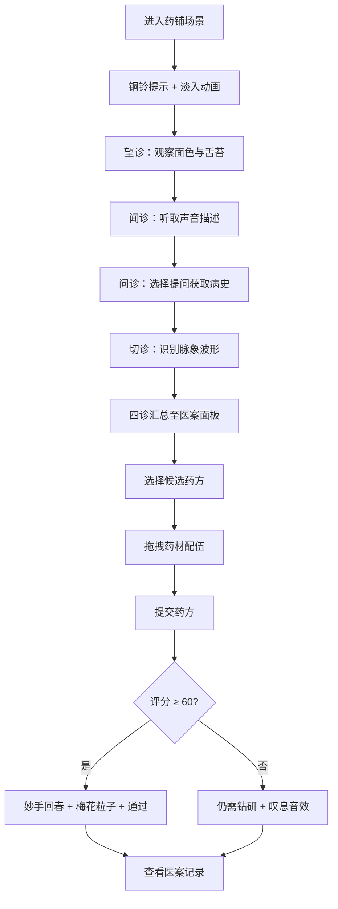

## 1. 产品概述

本项目是一个基于浏览器的中医四诊法交互式教学应用，让用户模拟古代坐堂郎中，在古朴药铺场景中通过望、闻、问、切四步诊断虚拟患者并开具药方，系统根据诊断准确率和药方配伍合理性给出评分与医案记录。目标用户为中医学生、中医爱好者及文化体验者。

## 2. 核心功能

### 2.1 用户角色
| 角色 | 注册方式 | 核心权限 |
|------|----------|----------|
| 学员 | 无需注册 | 完整四诊流程、开具药方、查看评分与医案 |

### 2.2 功能模块
1. **药铺场景页**：药铺内景渲染、药柜、诊桌、患者剪影、脉枕、匾额等场景元素，场景淡入动画与铜铃提示
2. **四诊交互页**：望诊（面色与舌苔观察选择）、闻诊（声音播放与描述选择）、问诊（提问选择与病史生成）、切诊（脉象波形识别）
3. **药方配伍页**：医案汇总面板、候选药方展示、药柜拖拽配药、抽屉动画与音效
4. **结算评分页**：评分圆形进度条动画、梅花粒子特效/叹息音效、"妙手回春"抽屉拼字动画

### 2.3 页面详情
| 页面名称 | 模块名称 | 功能描述 |
|----------|----------|----------|
| 药铺场景页 | 场景渲染 | 绘制深木色药柜（上百小抽屉标注药材名）、悬壶济世匾额（楷体金色）、黑檀木诊桌、脉枕、笔架、患者古装剪影（可切换面色/舌苔） |
| 药铺场景页 | 淡入动画 | 0.5秒渐显场景，铜铃声提示开始 |
| 四诊交互页 | 望诊 | 点击患者面部/舌苔放大查看，选择面色描述（红润/苍白/萎黄/潮红/青紫）和舌苔描述（薄白/黄腻/剥苔），正确+10分错误-5分 |
| 四诊交互页 | 闻诊 | 点击患者触发咳嗽/呼吸音播放（Web Audio 1-2秒循环），从三选项选声音描述 |
| 四诊交互页 | 问诊 | 古风对话气泡，从预设问题列表（如"是否恶寒发热？""二便如何？"）选3-5个，系统生成病史摘要 |
| 四诊交互页 | 切诊 | 显示波形脉图（浮脉/沉脉/数脉/迟脉），点击选择脉象名称，选对后波形由平缓变剧烈再恢复 |
| 药方配伍页 | 医案面板 | 淡黄色绢纸背景(#FFF8DC)，毛笔字体显示四诊摘要，列出三种候选药方（每方3-5味药材） |
| 药方配伍页 | 拖拽配药 | 从药柜拖拽药材到药方，抛物线飞出动画+抽屉开合音效，正确绿色勾/错误红色叉反弹 |
| 结算评分页 | 拼字动画 | 药柜抽屉依次开合拼成"妙手回春"四字（间隔0.3秒，叮当铜钱声） |
| 结算评分页 | 评分面板 | 圆形进度条2秒从0到最终分（诊断正确率40%+药方匹配度40%+用时20%），满分100 |
| 结算评分页 | 结果反馈 | ≥60分：显示"通过"+梅花粒子绽放特效；<60分：显示"仍需钻研"+叹息音效 |

## 3. 核心流程

用户进入药铺场景 → 铜铃提示开始 → 依次进行望诊→闻诊→问诊→切诊 → 四诊汇总到医案面板 → 从候选药方中选择并拖拽药材配伍 → 提交药方 → 结算动画与评分 → 查看医案记录

## 4. 用户界面设计

### 4.1 设计风格
- 主色：宣纸色背景 #F5E6C8，深木色药柜 #5C3A21，黑檀木诊桌 #3E2723
- 辅色：脉枕深红 #8B0000，绢纸淡黄 #FFF8DC，木色边框 #8B4513
- 按钮：仿古书卷形（长条形两端略翘），按下时0.1秒加深阴影按压效果
- 字体：匾额用楷体金色，医案用毛笔字体，正文深褐 #3E2723
- 布局：药柜左侧，患者中央偏右，操作区左侧，医案面板右侧
- 弹出面板：0.3秒缩放淡入（0.8倍+0透明度→1倍+1透明度），0.2秒反向淡出

### 4.2 页面设计概览
| 页面名称 | 模块名称 | UI元素 |
|----------|----------|--------|
| 药铺场景页 | 药柜 | 深木色#5C3A21，上百小抽屉标注药材名，顶部"悬壶济世"楷体金色匾额 |
| 药铺场景页 | 诊桌 | 黑檀木色#3E2723，桌面脉枕(深红#8B0000椭圆)和笔架 |
| 药铺场景页 | 患者 | 古装剪影，面部可切换5种面色，舌苔可切换3种 |
| 四诊交互页 | 望诊面板 | 放大面色/舌苔图，选项按钮（仿古书卷形） |
| 四诊交互页 | 闻诊面板 | 播放按钮，三个声音描述选项 |
| 四诊交互页 | 问诊面板 | 古风对话气泡，问题列表复选框 |
| 四诊交互页 | 切诊面板 | Canvas脉象波形图，脉象名称选项 |
| 药方配伍页 | 医案面板 | 淡黄绢纸#FFF8DC背景，毛笔字体摘要 |
| 药方配伍页 | 药柜 | 可拖拽抽屉，拖出时抛物线动画 |
| 结算评分页 | 评分面板 | 圆形进度条动画，梅花粒子特效 |

### 4.3 响应式设计
- 桌面优先设计，适配320px至1920px
- 320px最小宽：药柜变单列抽屉（每个60px×40px），诊桌下方
- 患者剪影：正常200px高，最小120px，可点击区域不变
- 最小屏文字不小于14px
- 药柜和诊桌等比缩放

### 4.4 性能要求
- 所有动画60FPS（Chrome 90+、Firefox 90+、Safari 14+）
- 脉图波形使用requestAnimationFrame每秒60次更新
- 药柜抽屉动画不超过0.5秒
- 首次加载到可交互不超过3秒（Vite按需编译+异步CSS）
