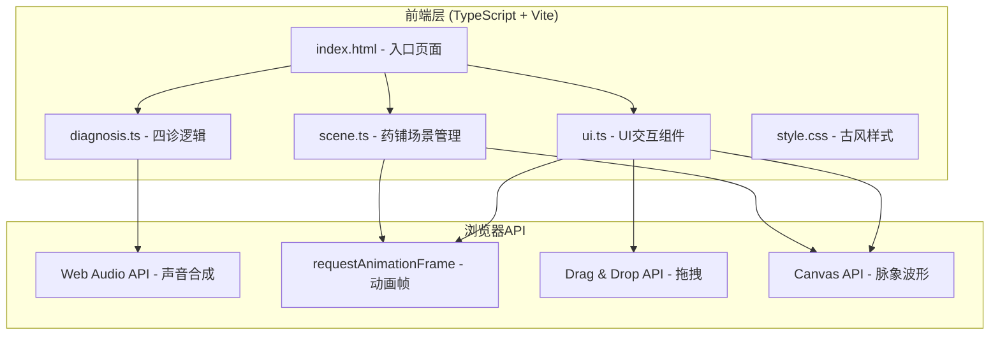

## 1. 架构设计



## 2. 技术说明
- 前端：TypeScript + 原生JavaScript（无框架）+ Vite
- 构建工具：Vite（端口3000，入口index.html）
- 音频：Web Audio API（合成模拟咳嗽/呼吸/铜铃/铜钱/叹息音效）
- 动画：requestAnimationFrame + CSS transition/animation
- 图形：Canvas 2D（脉象波形绘制）
- 拖拽：HTML5 Drag & Drop API + 自定义抛物线动画
- 粒子：Canvas 2D（梅花粒子特效）
- 无后端、无数据库、无外部服务

## 3. 路由定义
本项目为单页应用，无路由切换，所有交互在同一页面内通过状态机管理。

| 状态 | 说明 |
|------|------|
| SCENE_ENTER | 场景淡入 + 铜铃提示 |
| WANG_DIAGNOSIS | 望诊交互 |
| WEN_DIAGNOSIS | 闻诊交互 |
| WEN_DIAGNOSIS | 问诊交互 |
| QIE_DIAGNOSIS | 切诊交互 |
| PRESCRIPTION | 药方配伍 |
| SETTLEMENT | 结算评分 |

## 4. API定义
无后端API，所有数据为前端内置模拟数据。

### 4.1 患者数据结构
```typescript
interface Patient {
  faceColor: '红润' | '苍白' | '萎黄' | '潮红' | '青紫';
  tongueCoating: '薄白' | '黄腻' | '剥苔';
  coughType: '干咳' | '湿咳' | '气喘';
  breathSound: '呼吸急促' | '呼吸微弱' | '呼吸平稳';
  answers: Record<string, string>;
  pulseType: '浮脉' | '沉脉' | '数脉' | '迟脉';
  correctDiagnosis: string;
  correctPrescription: string[];
}
```

### 4.2 诊断结果数据结构
```typescript
interface DiagnosisResult {
  wangScore: number;
  wenScore: number;
  wenQuestionScore: number;
  qieScore: number;
  totalDiagnosisScore: number;
  prescriptionMatchScore: number;
  timeScore: number;
  finalScore: number;
  medicalRecord: string;
}
```

## 5. 文件结构
```
project/
├── package.json          # 依赖：typescript, vite；脚本：npm run dev
├── index.html            # 入口页面，古风配色全屏居中
├── vite.config.js        # 构建配置，入口index.html，端口3000
├── tsconfig.json         # 严格模式，target ES2020
├── src/
│   ├── scene.ts          # 药铺场景管理（背景、药柜、诊桌、患者、缩放、动画）
│   ├── diagnosis.ts      # 四诊逻辑（状态机、选项数据、判分、医案摘要）
│   └── ui.ts             # UI交互（拖拽、评分动画、粒子特效、弹窗）
└── style.css             # 古风样式（CSS变量、响应式、动画关键帧）
```

## 6. 关键技术实现

### 6.1 场景渲染 (scene.ts)
- 使用DOM元素+CSS绘制药铺场景（非Canvas，便于交互和响应式）
- 药柜用CSS Grid布局，每个抽屉为可交互div
- 患者剪影用SVG内联或CSS绘制
- 面色/舌苔通过CSS filter和背景色切换实现
- updateLayout()方法监听resize事件，计算缩放比例

### 6.2 四诊状态机 (diagnosis.ts)
- 状态机模式管理望→闻→问→切流程
- 每种诊断包含选项数据、正确答案、分数计算逻辑
- 望诊：5种面色×3种舌苔 = 15种组合，患者随机一种
- 闻诊：3种声音类型，Web Audio OscillatorNode合成
- 问诊：8个预设问题，用户选3-5个，系统组合生成病史
- 切诊：4种脉象，Canvas绘制不同波形（浮脉-高频低幅、沉脉-低频低幅、数脉-高频高幅、迟脉-低频高幅）

### 6.3 UI交互 (ui.ts)
- 拖拽：mousedown/mousemove/mouseup + touchstart/touchmove/touchend（兼容触屏）
- 抛物线动画：贝塞尔曲线路径 + requestAnimationFrame
- 评分圆形进度条：Canvas弧线绘制 + easing函数
- 梅花粒子：Canvas 2D粒子系统，50-80个粒子从中心向外绽放
- 音效：Web Audio API合成铜铃（高频正弦波衰减）、铜钱（短脉冲）、叹息（低频噪声衰减）
