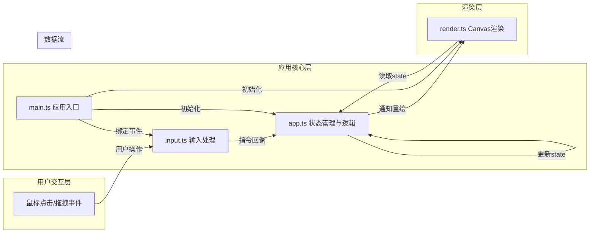

## 1. 架构设计



## 2. 技术说明
- **前端框架**：原生JavaScript + TypeScript（无需React/Vue）
- **构建工具**：Vite 5.x
- **渲染引擎**：HTML5 Canvas 2D API
- **状态管理**：app.ts内部维护（不引入第三方状态库）
- **类型系统**：TypeScript 严格模式，target ES2020

## 3. 文件结构与职责

| 文件路径 | 职责说明 | 调用关系 |
|---------|---------|---------|
| package.json | 项目依赖与脚本配置 | npm run dev启动 |
| vite.config.js | Vite构建配置，端口3000，入口index.html | 被Vite读取 |
| tsconfig.json | TypeScript配置（严格模式、ES2020） | 被TSC读取 |
| index.html | 应用入口HTML页面 | 加载main.ts |
| src/main.ts | 启动应用，初始化Canvas、事件监听 | 调用app.ts初始化，调用input.ts绑定事件，触发render.ts |
| src/app.ts | 核心逻辑：阵型状态管理、变换动画、碰撞检测、历史记录 | 接收input.ts回调，被render.ts读取state |
| src/render.ts | Canvas渲染：沙盘、阵型、路径、面板、边栏 | 从app.ts获取state并绘制 |
| src/input.ts | 鼠标事件处理：选中、拖拽、切换阵型 | 将操作转为指令回调给app.ts |

### 数据流向
1. **用户交互** → input.ts：鼠标点击/拖拽事件被捕获
2. **指令生成** → app.ts：input.ts调用app.ts暴露的回调函数（如selectFormation、moveFormation、changeFormationType）
3. **状态更新** → app.ts内部：更新阵型状态、计算动画帧、检测碰撞、记录历史
4. **重绘通知** → render.ts：app.ts通过回调或直接调用通知render.ts重绘
5. **画面渲染** → render.ts：从app.ts读取当前state，使用Canvas API逐帧绘制

## 4. 核心数据模型

### 4.1 阵型类型定义
```typescript
type FormationType = 'crane_wing' | 'fish_scale' | 'square';

type UnitType = 'infantry' | 'archer' | 'cavalry';

interface Unit {
  x: number;
  y: number;
  targetX: number;
  targetY: number;
  type: UnitType;
}

interface Formation {
  id: string;
  type: FormationType;
  centerX: number;
  centerY: number;
  initialCenterX: number;
  initialCenterY: number;
  units: Unit[];
  isSelected: boolean;
  isMoving: boolean;
  pathPoints: { x: number; y: number }[];
  pathProgress: number;
  transformProgress: number;
  transformFromType?: FormationType;
}

interface CollisionEvent {
  id: string;
  timestamp: number;
  timeStr: string;
  formationA: string;
  formationB: string;
  x: number;
  y: number;
}

interface AppState {
  formations: Formation[];
  events: CollisionEvent[];
  collisionWarnings: { formationId: string; startTime: number }[];
}
```

## 5. 性能优化策略

1. **requestAnimationFrame**：所有动画使用rAF确保50+FPS
2. **脏矩形渲染**：仅重绘变化区域（根据实际复杂度可简化为全屏重绘）
3. **对象池复用**：阵型圆点对象复用，避免频繁GC
4. **碰撞检测优化**：空间分区检测，仅检测相邻阵型
5. **内存控制**：事件列表限制20条，阵型上限6个，每阵型最多50个圆点

## 6. 接口定义（无后端，纯前端）

应用为纯前端实现，无API接口调用。数据导出通过Blob生成JSON文件下载。
