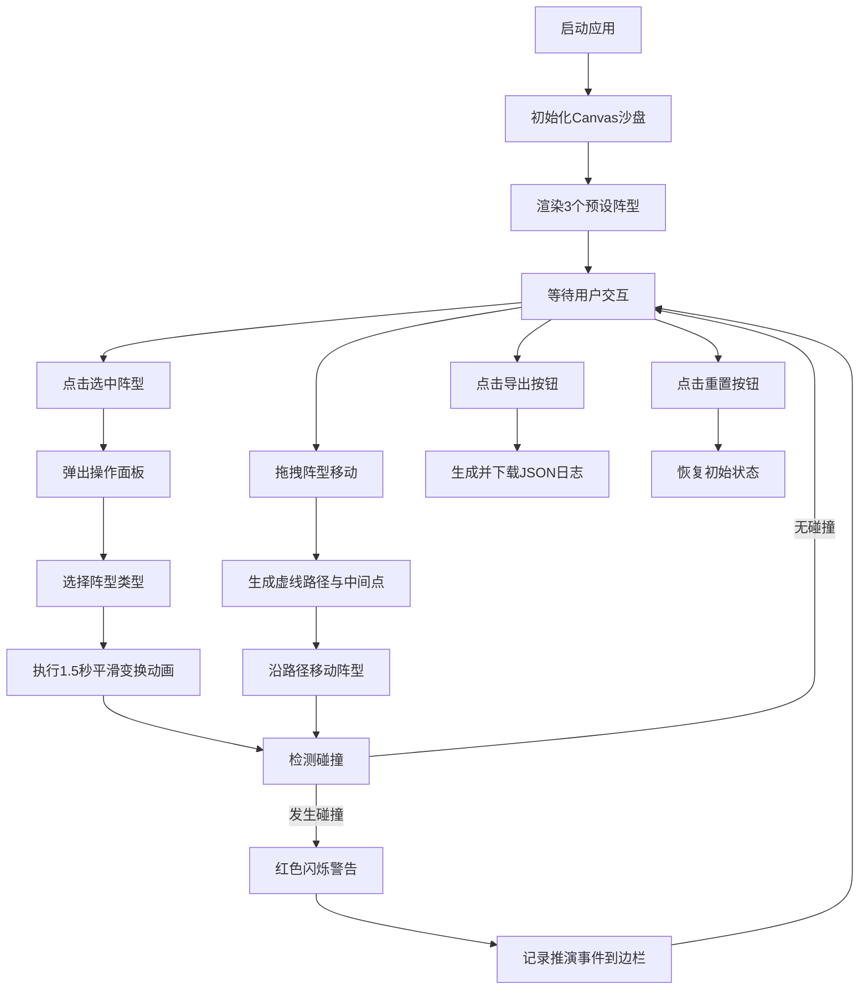

## 1. 产品概述

基于Canvas的古代军阵推演Web应用，为古代战场指挥官提供可视化的阵型演练工具。
- 核心目的：通过交互式沙盘推演鹤翼阵、鱼鳞阵、方圆阵等古代阵型的兵力分布与移动轨迹，提升战场指挥决策效率
- 目标用户：军事指挥官、战术研究者、历史爱好者

## 2. 核心特性

### 2.1 功能模块
1. **沙盘推演区**：Canvas绘制800x600沙盘，支持网格坐标、阵型渲染、路径显示
2. **阵型管理**：3种预设阵型（鹤翼阵、鱼鳞阵、方圆阵），支持切换与平滑变换动画
3. **移动与路径**：拖拽阵型生成虚线路径，沿路径移动并显示中间坐标点
4. **冲突检测**：阵型碰撞检测与红色闪烁警告，自动记录推演事件
5. **历史与导出**：推演事件记录、重置沙盘、导出JSON格式推演日志

### 2.2 页面详情
| 页面名称 | 模块名称 | 功能描述 |
|---------|---------|---------|
| 主界面 | 沙盘区域 | Canvas绘制土黄色沙盘背景、细密网格线、阵型圆点、移动路径、方位标签 |
| 主界面 | 操作面板 | 选中阵型后弹出半透明面板，提供鹤翼/鱼鳞/方圆三种阵型切换按钮 |
| 主界面 | 推演历史边栏 | 右侧200px边栏，记录最多20条碰撞事件，支持新事件滑入动画 |
| 主界面 | 控制按钮 | 沙盘右下角：导出推演日志（金色）、重置（深红） |

## 3. 核心流程

用户打开应用 → 查看初始三个阵型 → 点击阵型选中并弹出操作面板 → 选择切换阵型（触发平滑动画）或拖拽阵型移动 → 移动路径实时生成 → 若发生碰撞触发警告并记录事件 → 可导出日志或重置沙盘

## 4. 用户界面设计

### 4.1 设计风格
- **主色调**：丹霞红（#8B2500、#A52A2A）、墨色（#2C1A0E、#3E2723、#5D4037）、金色点缀（#DAA520）
- **沙盘背景**：土黄色（#D2B48C）带15%透明度网格线
- **按钮样式**：圆角矩形，悬停时上移2px并加深阴影
- **字体**：中文使用楷体，英文使用monospace，隶书用于操作面板标题
- **布局**：左侧沙盘 + 右侧边栏，响应式适配（<900px时沙盘缩至600x450居中）

### 4.2 页面设计概述
| 页面名称 | 模块名称 | UI元素 |
|---------|---------|--------|
| 主界面 | 沙盘区域 | 土黄色背景、半透明网格线、彩色圆点阵型（红=重步兵、蓝=弓兵、绿=骑兵）、虚线路径带箭头、方位标签 |
| 主界面 | 操作面板 | 300px宽，#3E2723→#5D4037渐变背景，圆角10px，白色隶书文字，三个切换按钮 |
| 主界面 | 推演边栏 | 200px宽，#2C1A0E半透明圆角背景，内边距10px，事件列表滑入动画 |
| 主界面 | 控制按钮 | 导出按钮金色#DAA520，重置按钮深红#8B2500，悬停变亮，圆角矩形 |

### 4.3 响应式设计
- 桌面端（≥900px）：沙盘800x600，左右布局（沙盘+边栏）
- 移动端（<900px）：沙盘缩至600x450并居中，边栏置于底部或自适应
- 所有触摸操作支持

### 4.4 动画效果
- 阵型变换：圆点线性移动1.5秒
- 路径绘制：淡入淡出（透明→半透明白→消失）
- 碰撞警告：红色闪烁，频率2次/秒，持续3秒
- 新增事件：从上方滑入，持续0.3秒
- 按钮悬停：上移2px + 阴影加深
