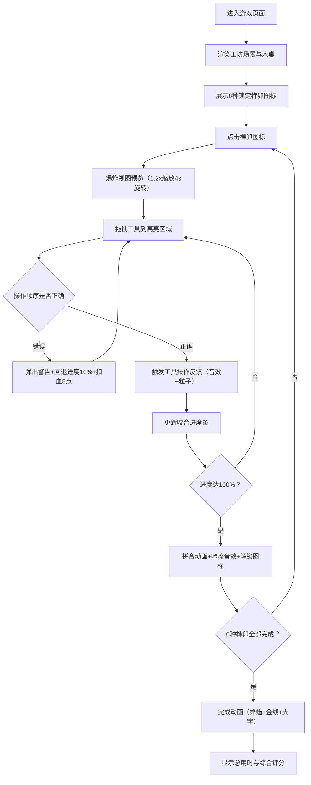

## 1. 产品概述

榫卯工坊是一款在浏览器中模拟古代木匠使用传统榫卯结构拼接木制家具的交互式教学游戏。通过数字化方式呈现6种经典榫卯结构（燕尾榫、直榫、抱肩榫等）的咬合过程，让用户在虚拟工坊中体验拖拽工具操作、感受拆装力度反馈、理解拼装顺序对结构稳定性的影响，解决传统木工教学中缺乏可重复、低成本、趣味化数字体验的问题。

- 核心目标用户：木工爱好者、传统文化学习者、家具修缮从业者、学生群体
- 市场价值：填补传统木工数字化教学空白，以游戏化方式传承非遗榫卯技艺，降低学习门槛

## 2. 核心功能

### 2.1 用户角色
| 角色 | 注册方式 | 核心权限 |
|------|----------|----------|
| 普通用户 | 无需注册，直接进入 | 完整游戏体验、查看用时与评分 |

### 2.2 功能模块
1. **工坊主场景**：古风木作工坊背景、明式黄花梨木桌雏形、工具装饰剪影
2. **榫卯选择系统**：6种榫卯结构图标展示、锁定/解锁状态、爆炸视图预览
3. **工具操作系统**：锤子/凿子/木锉三种工具的拖拽、操作反馈、效果粒子
4. **进度与状态系统**：咬合进度条、木材完好度血条、操作顺序校验
5. **完成与评分系统**：桌面蜂蜡光泽动画、"大匠成器"文字特效、综合评分计算
6. **响应式适配系统**：不同屏幕尺寸的布局自适应

### 2.3 页面详情
| 页面名称 | 模块名称 | 功能描述 |
|---------|----------|----------|
| 工坊主页面 | 场景渲染模块 | 渲染草泥色背景墙、浅木色地面、工具剪影装饰 |
| 工坊主页面 | 木桌渲染模块 | 绘制带木纹的明式黄花梨木桌（线性渐变+平行条纹） |
| 工坊主页面 | 榫卯图标模块 | 6种榫卯结构图标（60x60px），灰色锁定态，彩色解锁态 |
| 工坊主页面 | 爆炸视图模块 | 点击榫卯图标后展开1.2倍缩放4秒旋转爆炸视图，红榫头蓝卯口高亮 |
| 工坊主页面 | 工具架模块 | 右侧工具架（锤子/凿子/木锉），拖拽至榫头/卯口触发操作 |
| 工坊主页面 | 反馈系统模块 | AudioContext音效、粒子特效、进度条更新 |
| 工坊主页面 | 顺序校验模块 | 检测操作顺序，错误时弹出警告并回退进度 |
| 工坊主页面 | 血条系统模块 | 右上角木材完好度血条，错误操作扣点，低血量裂纹效果 |
| 工坊主页面 | 完成动画模块 | 蜂蜡光泽扩散、金色装饰线、"大匠成器"篆体大字 |
| 工坊主页面 | 评分结算模块 | 总用时显示、综合评分计算（满分100） |

## 3. 核心流程

用户进入页面 → 浏览古风工坊场景和6种灰色锁定榫卯图标 → 点击首个榫卯图标触发爆炸视图预览 → 从右侧工具架拖拽锤子到榫头（敲击+咚音效+进度+5%）→ 拖拽凿子到卯口（锯齿粒子+进度+8%）→ 拖拽木锉到摩擦区（烟雾粒子+光滑度+10%）→ 系统校验操作顺序（先凿后锤则弹出警告扣10%进度和5点血）→ 咬合进度达100%触发拼合动画和咔嚓音效 → 榫卯图标变彩色解锁 → 依次完成剩余5种榫卯 → 触发桌面完成动画（蜂蜡光泽+金线+"大匠成器"）→ 显示总用时和综合评分（基于顺序正确率、工具频次、总耗时、木材完好度）

## 4. 用户界面设计

### 4.1 设计风格
- **主色调**：暖木色系，草泥色背景墙#C4A882，浅木色地面#DEB887，黄花梨桌面渐变#C9A96E到#A0834F
- **强调色**：榫头红#FF4444，卯口蓝#4444FF，进度绿#44FF44，金色装饰#DAA520/#FFD700
- **工具色**：锤头灰#808080，凿刀锋银#C0C0C0，木锉网眼纹理
- **按钮/图标**：圆角矩形，悬停缩放1.05倍+阴影加深(5px→8px)，点击scale0.95持续0.1s
- **字体**：标题楷体，正文楷体/宋体，完成文字篆体模拟
- **布局**：Flex居中布局（最小宽960px），桌面600x400px居中，工具架右侧竖向，榫卯图标悬浮桌面上方
- **图标**：Canvas路径手绘榫卯咬合形态（#8B4513到#A0522D渐变），工具剪影装饰

### 4.2 页面设计概述
| 页面名称 | 模块名称 | UI元素 |
|---------|----------|--------|
| 工坊主页面 | 背景层 | 径向渐变#D2B48C到#8B4513，草泥墙#C4A882，木地板#DEB887，左侧工具剪影 |
| 工坊主页面 | 桌子层 | 桌面600x400px，木纹渐变+平行条纹，桌腿结构线 |
| 工坊主页面 | 榫卯图标层 | 6个60x60px图标横向排列悬浮，锁定态灰+锁符号，解锁态彩色渐变 |
| 工坊主页面 | 爆炸视图层 | 桌面中央半透明展示，1.2x缩放，4s旋转一圈，红榫头蓝卯口标注 |
| 工坊主页面 | 工具架层 | 右侧竖向排列，锤子80px/凿子70px/木锉60px，拖拽半透明+3级虚影拖尾 |
| 工坊主页面 | 进度条层 | 桌面左上120x12px，红→绿渐变填充，显示百分比文字 |
| 工坊主页面 | 血条层 | 右上角200x15px，绿→红渐变，<50%快速闪烁，<20%裂纹粒子 |
| 工坊主页面 | 提示框层 | 红底#FF4444白字，楷体20px，圆角矩形，1.5s自动消失 |
| 工坊主页面 | 完成动画层 | 蜂蜡圆形扩散2s，金线3px边框，篆体"大匠成器"60px缩放1s |
| 工坊主页面 | 结算层 | 总用时（秒级精度）+ 综合评分（满分100）显示 |

### 4.3 响应式设计
- **桌面端（≥960px）**：标准布局，Flex居中，桌面600x400px，工具架右侧竖向
- **平板端（768px-959px）**：保留桌面比例，工具架右移适配
- **移动端（<768px）**：桌面比例缩小70%，工具架从右侧移至底部横向排列，字体缩小至14px

### 4.4 性能与动画规范
- **帧率**：50-60FPS，requestAnimationFrame驱动，单帧<16ms
- **粒子系统**：对象池复用，单榫卯粒子≤300个，同时激活≤2个系统
- **内存**：音频/纹理预加载常驻，总内存≤80MB
- **交互延迟**：拖拽/点击反馈≤50ms
- **拖尾效果**：3个连续虚影，间距10px，透明度0.3递减
