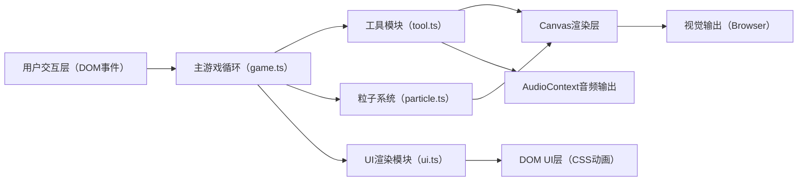

## 1. 架构设计



整体架构采用分层设计：主游戏循环（game.ts）作为核心调度器，通过requestAnimationFrame以60FPS驱动，统一管理工具模块、粒子系统和UI渲染。Canvas负责场景绘制与视觉效果，DOM层承载可点击交互UI元素（榫卯图标、工具图标）。AudioContext实时合成操作音效。

## 2. 技术描述

- **前端框架**：无框架依赖，原生TypeScript + 原生JavaScript API
- **构建工具**：Vite 5.x（入口index.html，端口3000）
- **语言**：TypeScript 5.x，严格模式，target ES2020，moduleResolution bundler
- **渲染引擎**：HTML5 Canvas 2D API（场景/桌子/榫卯/粒子）+ DOM（UI层叠）
- **音频**：Web Audio API（AudioContext实时合成短促脉冲/正弦波音效）
- **动画**：requestAnimationFrame驱动，自定义ease-out缓动函数
- **状态管理**：榫卯状态机（初始-操作-拼合-完成），game.ts内部维护
- **性能优化**：对象池复用粒子、脏矩形渲染策略（如适用）、粒子数量上限控制

## 3. 文件结构定义

| 文件路径 | 职责描述 | 关键类/接口 |
|---------|----------|-------------|
| /package.json | 项目依赖与脚本（typescript, vite；npm run dev） | - |
| /index.html | 入口页面，工坊主背景容器，标题楷体 | - |
| /vite.config.js | Vite构建配置，入口index.html，端口3000 | - |
| /tsconfig.json | TypeScript配置（严格模式，ES2020，bundler） | - |
| /src/game.ts | 主游戏循环：场景初始化、榫卯状态机、rAF调度、子模块协调 | Game, MortiseTenon, MortiseTenonState |
| /src/tool.ts | 工具模块：锤子/凿子/木锉绘制（Canvas路径）、拖拽逻辑、操作反馈（音频+粒子） | Tool, ToolType, Hammer, Chisel, File |
| /src/particle.ts | 粒子系统：对象池模式、锯齿/烟雾/裂纹粒子生成与生命周期管理 | Particle, ParticlePool, ParticleType |
| /src/ui.ts | UI渲染：进度条/血条/提示框/完成动画（Canvas文字+DOM层叠） | UIManager |

## 4. 核心数据结构定义

### 4.1 榫卯状态枚举
```typescript
enum MortiseTenonState {
  LOCKED = 'locked',       // 灰色锁定
  SELECTED = 'selected',   // 爆炸视图预览
  OPERATING = 'operating', // 工具操作中
  COMPLETED = 'completed'  // 拼合完成
}
```

### 4.2 榫卯类型定义（6种）
```typescript
type MortiseTenonType = 
  | 'dovetail'      // 燕尾榫
  | 'straight'      // 直榫
  | 'shoulder'      // 抱肩榫
  | 'mortise_tenon' // 方榫卯
  | 'fishtail'      // 鱼尾榫
  | 'cross_lap';    // 十字搭接榫
```

### 4.3 工具类型
```typescript
type ToolType = 'hammer' | 'chisel' | 'file';
```

### 4.4 粒子类型
```typescript
type ParticleType = 'sawtooth' | 'smoke' | 'crack' | 'shine';
```

### 4.5 操作序列校验
- 正确顺序：木锉打磨 → 凿子修整 → 锤子敲击（每榫卯循环操作直至完成）
- 错误检测：状态机记录上一步工具类型，违反顺序触发惩罚

### 4.6 评分算法
```
综合评分 = 
  (顺序正确率 × 40) 
  + (工具使用合理度 × 20) 
  + (木材完好度 × 20) 
  + (时间效率得分 × 20)
- 木材完好度：初始100，每错误-5，每点扣1分上限20分
- 时间效率：<60s满分20，每超10s扣2分
- 满分100分
```

## 5. 关键技术实现要点

### 5.1 粒子对象池
- 预分配Particle数组（容量300×2=600，最多2个并发系统）
- 粒子使用标志位active标记，生命周期结束后标记inactive回收复用
- 避免运行时GC，确保帧率稳定

### 5.2 AudioContext音效合成
- 锤子"咚"声：低频方波/脉冲振荡器（频率150Hz，时长0.08s，快速衰减）
- "咔嚓"拼合声：高频正弦波（频率800Hz，时长0.1s，快速attack+release）

### 5.3 拖拽拖尾效果
- 记录最近3帧工具位置历史数组
- 绘制时依次透明度递减（1.0→0.6→0.3），位置偏移递减模拟拖尾

### 5.4 榫卯爆炸视图动画
- 榫头与卯口分离显示，偏移量随时间正弦波动
- 整体rotateZ按4秒周期线性旋转（Math.PI×2 × (t%4000/4000)）
- 颜色叠加：榫头红#FF4444描边，卯口蓝#4444FF描边

### 5.5 蜂蜡光泽扩散动画
- 使用径向渐变，radius从10px线性插值到覆盖桌面
- 渐变中心透明度从0.6渐变为0，最终恢复桌面原色
- 持续2000ms，ease-out缓动

### 5.6 响应式断点
- window.resize监听，设置scale变量
- 桌面坐标均乘以scale，<768px时scale=0.7
- Flex布局方向：width<768px时工具架flex-direction从column→row

## 6. 启动与构建
```bash
# 安装依赖
npm install
# 开发服务器（端口3000）
npm run dev
```
