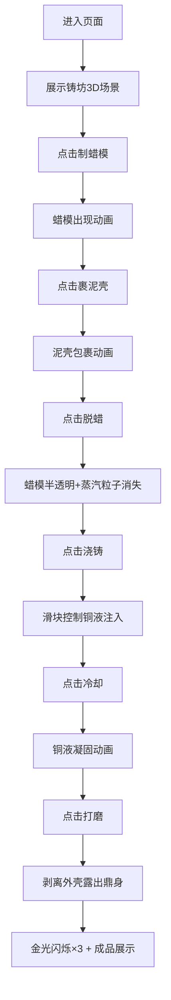

## 1. 产品概述
失蜡铸鼎3D交互可视化项目——模拟古代工匠使用失蜡法铸造青铜鼎的完整工艺流程教育展示应用。
- 面向对古代冶金工艺、中华传统文化感兴趣的学习者与博物馆访客，提供沉浸式交互式体验
- 通过3D可视化与实时交互，将复杂的失蜡法铸造工艺拆解为可理解、可操作的六个步骤，具有文化科普与教育展示价值

## 2. 核心功能

### 2.1 用户角色
| 角色 | 注册方式 | 核心权限 |
|------|----------|----------|
| 访客用户 | 无需注册，直接进入 | 浏览3D场景、按步骤操作、观看完整铸造流程动画 |

### 2.2 功能模块
1. **铸坊3D场景**：夯土墙铸坊、地坑陶范、熔铜炉、灯光氛围
2. **六步工艺流程交互**：制蜡模、裹泥壳、烘烤脱蜡、浇铸铜液、冷却、打磨
3. **粒子特效系统**：火焰粒子、蒸汽粒子、铜液粒子、溅出铜液粒子
4. **浇铸交互控制**：倾角滑块控制铜液流速与溅出效果
5. **进度追踪系统**：步骤进度条、完成金光特效、成品展示

### 2.3 页面详情
| 页面名称 | 模块名称 | 功能描述 |
|----------|----------|----------|
| 主页面 | 铸坊3D场景 | 全景展示铸坊环境，支持鼠标拖拽旋转视角、滚轮缩放 |
| 主页面 | 左侧步骤面板 | 六个篆体步骤按钮，点击激活对应工艺流程动画 |
| 主页面 | 浇铸控制滑块 | 按住鼠标调整浇包倾角(0-90°)，控制铜液流速与溅出 |
| 主页面 | 底部进度条 | 半透明金色进度条，每完成一步跳动一格 |
| 主页面 | 成品展示 | 完成后金光闪烁三次，浮现青铜鼎三维展示模型 |

## 3. 核心流程
用户进入页面后，首先看到完整的铸坊3D场景。通过依次点击左侧面板的六个步骤按钮，逐步推进铸造工艺：点击"制蜡模"显示蜡模→点击"裹泥壳"包裹泥层→点击"脱蜡"蜡模变透明并以蒸汽粒子消失→点击"浇铸"出现滑块控制铜液注入→点击"冷却"等待铜液凝固→点击"打磨"剥离外壳露出鼎身。全部完成后场景金光闪烁并展示成品。

## 4. 用户界面设计

### 4.1 设计风格
- **主色调**：暗金色#B8860B、陶土色#A0522D、背景灰黑色石壁纹理#4A4A4A
- **辅助色**：耐火砖红褐色#A0522D、高温铜液橙色#FF4500、夯土墙#A08050、灰瓦#808080
- **按钮风格**：青铜质感渐变（#8B7355→#6B4226），矩形带细微圆角，悬停浮现淡金色光晕，点击微缩放反馈
- **字体**：标题使用仿宋字体显示"失蜡铸鼎"，步骤按钮使用篆体字配墨线小图
- **布局风格**：全屏3D画布居中，左侧固定步骤面板，底部进度条，浇铸时滑块浮现
- **灯光**：暖色聚光照亮铸坊中央，营造古法制铸的厚重氛围

### 4.2 页面设计概述
| 页面名称 | 模块名称 | UI元素 |
|----------|----------|--------|
| 主页面 | 铸坊3D场景 | 夯土墙围合空间、灰瓦屋顶、半圆形地坑、熔铜炉火焰粒子、暖色聚光灯光 |
| 主页面 | 左侧步骤面板 | 纵向排列6个青铜质感按钮，篆体字+墨线图标，当前激活步骤高亮 |
| 主页面 | 浇铸滑块 | 0°-90°倾角刻度，滑块拖动时实时反馈铜液流速 |
| 主页面 | 底部进度条 | 半透明金色填充，6段式进度格 |
| 主页面 | 成品展示 | 鼎身居中悬浮，360°自动旋转展示 |

### 4.3 响应式
- 桌面端优先设计，画布按浏览器窗口尺寸自适应
- 交互以鼠标操作为主（拖拽旋转视角、点击按钮、拖动滑块）
- 最小支持分辨率：1024×768

### 4.4 3D场景指引
- **环境氛围**：暗色调石壁纹理背景，营造古代铸坊室内环境，无需HDRI
- **灯光设置**：主光源为暖色聚光灯（色温3000K）照亮铸坊中央地坑区域，辅以微弱环境光避免纯黑区域，熔铜炉自发光
- **相机设置**：PerspectiveCamera，初始位置俯视铸坊中央（y: 200, z: 300），支持OrbitControls鼠标拖拽旋转、滚轮缩放、右键平移
- **构图焦点**：地坑中的陶范为视觉中心，熔铜炉位于右侧，步骤面板在左，形成稳定三角构图
- **交互动画**：蜡模透明度渐变动画、泥壳包裹生长动画、铜液粒子流、蒸汽上升粒子、外壳破碎剥离动画
- **后期处理**：适度Bloom效果增强火焰与铜液发光感，整体色调偏暖
- **性能预算**：单帧渲染<20ms，帧率≥45FPS，粒子总数控制在500以内
