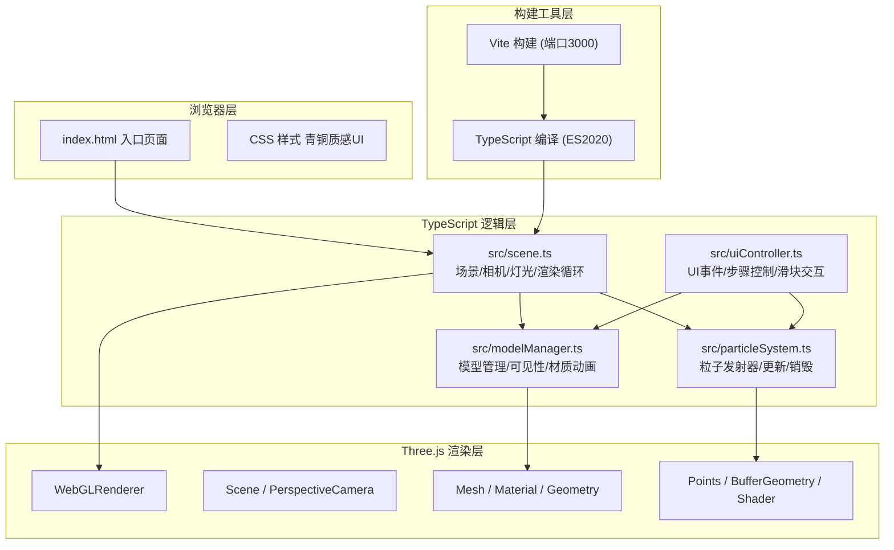

## 1. 架构设计



## 2. 技术说明
- **前端框架**：原生 TypeScript + Three.js（无React/Vue，用户明确指定原生JS+TS）
- **3D引擎**：Three.js @latest，负责所有3D渲染、模型、粒子、相机控制
- **构建工具**：Vite @latest，开发服务器端口3000，HMR热更新
- **语言规范**：TypeScript 严格模式（strict: true），target ES2020，模块 ESM
- **交互控制**：Three.js OrbitControls 实现视角拖拽旋转缩放
- **粒子系统**：基于 THREE.Points + BufferGeometry 自定义实现火焰/蒸汽/铜液粒子
- **UI样式**：原生CSS，青铜渐变质感、篆体/仿宋字体、悬停光晕动画

## 3. 模块文件定义

| 文件路径 | 职责 |
|----------|------|
| package.json | 项目依赖声明：three, typescript, vite, @types/three；启动脚本 npm run dev |
| index.html | 页面入口：全屏3D画布、左侧步骤面板、底部进度条、浇铸滑块容器、仿宋标题 |
| vite.config.js | Vite 配置：入口 index.html，开发服务器端口 3000 |
| tsconfig.json | TypeScript 配置：strict 严格模式，target ES2020，module ESNext |
| src/scene.ts | Three.js 核心：Scene/PerspectiveCamera/WebGLRenderer/OrbitControls初始化，铸坊场景建模（墙、屋顶、地坑、熔铜炉），灯光设置，requestAnimationFrame重绘循环，对外暴露scene/renderer/camera引用 |
| src/modelManager.ts | 核心模型管理：蜡模/泥壳/铜鼎几何体创建，材质透明度与可见性切换，六步状态机驱动模型动画（蜡模渐显→泥壳包裹→蜡模半透明消失→铜液填充→凝固→外壳剥离） |
| src/particleSystem.ts | 粒子系统：通用 ParticleEmitter 类，支持火焰（熔铜炉顶部持续喷射）、蒸汽（脱蜡步骤上升消散）、铜液流（浇铸步骤沿路径注入型腔）、铜液溅出（倾角过大时高温橙色小球）的创建与每帧更新 |
| src/uiController.ts | UI控制器：DOM查询绑定左侧6个步骤按钮点击事件，进度条更新逻辑，浇铸倾角滑块的mousedown/move/up事件处理，调用 modelManager 的步骤方法与 particleSystem 的粒子发射方法，完成时金光闪烁与成品展示 |

## 4. 核心数据结构

```typescript
// 工艺步骤枚举
enum CastingStep {
  IDLE = 'idle',
  WAX_MODEL = 'wax_model',       // 制蜡模
  CLAY_SHELL = 'clay_shell',     // 裹泥壳
  DEWAXING = 'dewaxing',         // 烘烤脱蜡
  POURING = 'pouring',           // 浇铸铜液
  COOLING = 'cooling',           // 冷却
  POLISHING = 'polishing'        // 打磨
}

// 粒子配置
interface ParticleConfig {
  count: number;
  position: THREE.Vector3;
  velocityRange: [THREE.Vector3, THREE.Vector3];
  color: THREE.Color;
  lifetime: number;
  size: number;
}

// 铸坊尺寸常量
const CASTING_WORKSHOP = {
  WALL_HEIGHT: 250,
  WALL_COLOR: 0xA08050,      // 夯土墙
  ROOF_COLOR: 0x808080,      // 灰瓦
  PIT_RADIUS: 150,           // 地坑半径(直径300)
  FURNACE_BODY_COLOR: 0xA0522D, // 耐火砖
};
```

## 5. 性能优化策略

1. **几何体复用**：蜡模/泥壳/铜鼎共享相似几何体，仅切换材质避免重复计算
2. **粒子池化**：粒子对象复用对象池，避免频繁GC，单帧粒子总数≤500
3. **材质实例化**：相同属性的材质共享Material实例，减少WebGL状态切换
4. **渲染优化**：关闭不必要的shadowMap，使用MeshBasicMaterial/MeshLambertMaterial替代StandardMaterial降低开销
5. **帧率监测**：渲染循环中使用performance.now()监控单帧耗时，超过20ms时自动减少粒子发射频率
6. **动画节流**：非活动步骤的模型动画暂停，仅当前激活步骤运行补间
