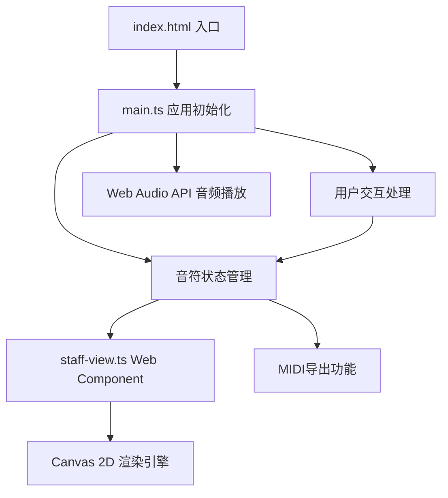

## 1. 架构设计



**调用关系说明：**
- `index.html` → 引入 `main.ts` 和 `<staff-view>` 自定义元素
- `main.ts` → 管理音符状态，创建示例数据，绑定事件监听，同步数据给 `staff-view`
- `staff-view.ts` → 定义 Web Component，监听 `notes` 属性变化，使用 Canvas API 渲染五线谱和音符
- 数据流向：用户交互 → `main.ts` 更新状态 → `staff-view` 接收新数据 → Canvas 重绘

## 2. 技术描述

- **前端**：TypeScript + Vite + 原生 Web Components
- **构建工具**：Vite 5.x
- **编程语言**：TypeScript 5.x（严格模式）
- **渲染技术**：Canvas 2D API
- **音频技术**：Web Audio API（正弦波生成）
- **无后端**，纯前端应用

## 3. 文件结构

| 文件路径 | 职责描述 |
|----------|----------|
| `package.json` | 项目依赖（typescript, vite），启动脚本 |
| `vite.config.js` | Vite 构建配置，入口 `index.html` |
| `tsconfig.json` | TypeScript 配置（strict, ES2020, bundler） |
| `index.html` | 应用入口，引入自定义元素 |
| `src/staff-view.ts` | 五线谱 Web Component，Canvas 渲染逻辑 |
| `src/main.ts` | 应用初始化，状态管理，事件绑定 |
| `src/types.ts` | TypeScript 类型定义 |
| `src/audio.ts` | Web Audio API 封装 |
| `src/utils.ts` | 工具函数（量化、MIDI导出等） |

## 4. 数据模型

### 4.1 音符数据结构

```typescript
interface Note {
  id: string;           // 唯一标识
  pitch: number;        // MIDI音高 (60=C4, 71=B5)
  time: number;         // 时间位置 (四分音符为1单位)
  duration: number;     // 时值 (默认1=四分音符)
  velocity: number;     // 力度 0-127
  selected?: boolean;   // 是否选中
  isNew?: boolean;      // 是否新添加（用于动画）
  isRemoving?: boolean; // 是否正在删除（用于动画）
}
```

### 4.2 应用状态

```typescript
interface AppState {
  notes: Note[];
  selectedNoteId: string | null;
  bpm: number;
  isPlaying: boolean;
  isLooping: boolean;
  quantizeUnit: 'quarter' | 'eighth' | 'sixteenth';
  showQuantizeGuides: boolean;
  currentTime: number;
}
```

### 4.3 MIDI导出格式

```typescript
interface MidiExport {
  version: string;
  bpm: number;
  notes: Array<{
    pitch: number;
    pitchName: string;
    time: number;
    duration: number;
    velocity: number;
  }>;
  createdAt: string;
}
```

## 5. 核心模块说明

### 5.1 staff-view.ts (Web Component)

**生命周期：**
- `connectedCallback()`: 初始化 Canvas，启动渲染循环
- `attributeChangedCallback()`: 监听 `notes` 属性变化，触发重绘
- `disconnectedCallback()`: 清理事件监听和动画帧

**渲染逻辑：**
1. 绘制五线谱（5条水平线）
2. 绘制量化辅助线（可选）
3. 绘制音符符头（椭圆）
4. 绘制音符时值连线
5. 绘制力度条（带颜色渐变）
6. 绘制选中状态高亮
7. 绘制半透明移动预览

### 5.2 main.ts (应用入口)

**职责：**
1. 初始化示例音符序列
2. 创建 `<staff-view>` 元素实例
3. 绑定鼠标/键盘事件监听
4. 管理应用状态
5. 同步状态到 Web Component
6. 处理播放控制逻辑

### 5.3 audio.ts (音频模块)

**功能：**
- 创建 AudioContext 单例
- 生成指定频率的正弦波
- 根据力度计算音量
- 播放音符（0.3秒时长）

### 5.4 utils.ts (工具模块)

**功能：**
- 音高转换（MIDI编号 ↔ 音名）
- 量化对齐算法
- MIDI JSON 导出
- 坐标转换（Canvas像素 ↔ 音符音高/时间）
- 碰撞检测（点击音符判断）

## 6. 性能优化策略

1. **Canvas 渲染优化**：使用 `requestAnimationFrame`，仅在数据变化时重绘
2. **离屏渲染**：静态元素（五线谱）缓存到离屏 Canvas
3. **事件节流**：鼠标移动事件使用 `requestAnimationFrame` 节流
4. **对象池**：复用音符对象，避免频繁 GC
5. **懒加载**：AudioContext 首次播放时初始化
6. **DPR 适配**：根据设备像素比设置 Canvas 分辨率，保证清晰度
