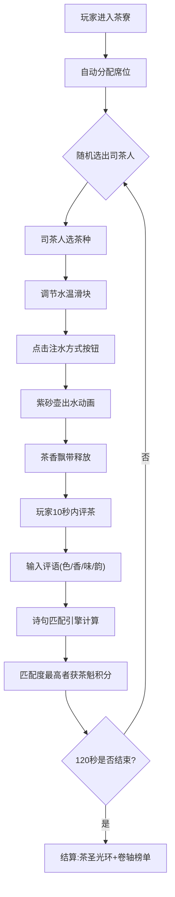

## 1. 产品概述

**《雅集茶寮》** - 一款模拟古代文人雅士茶会社交的在线互动游戏。玩家以匿名身份入座虚拟六边形茶案，轮流担任司茶人泡茶、评茶、赋诗，在120秒内通过诗句匹配度角逐「茶圣」称号。

- **核心价值**：还原宋代点茶文化，结合诗词艺术，打造兼具文化底蕴与社交趣味性的轻量互动体验
- **目标用户**：茶文化爱好者、古风文化群体、轻度社交游戏玩家

---

## 2. 核心功能

### 2.1 用户角色
| 角色 | 加入方式 | 核心权限 |
|------|----------|----------|
| 匿名玩家 | 进入页面自动分配席位 | 泡茶、评茶、赋诗、查看积分 |
| 司茶人 | 每轮系统随机选出 | 选择茶种、水温、注水方式，执行泡茶操作 |

### 2.2 功能模块
1. **茶寮场景**：六边形茶案、九只茶盏、铜炉瓦罐、水墨山水画
2. **泡茶系统**：360°可旋转紫砂壶、水温滑块、注水方式按钮、水流抛物线动画
3. **评茶系统**：四维度气泡（色/香/味/韵）、评语输入、茶香飘带动画
4. **诗句匹配引擎**：内置50句茶诗库、关键词相似度算法、匹配结果展示
5. **回合调度系统**：玩家状态机、司茶人轮替、倒计时、计分
6. **结算系统**：茶圣光环、木质卷轴榜单、称号颁发

### 2.3 页面详情
| 页面名称 | 模块名称 | 功能描述 |
|----------|----------|----------|
| 主游戏页 | 茶寮场景渲染 | 暖黄色调、竹席地面、山水画、茶案火炉持续动画 |
| 主游戏页 | 司茶人控制区 | 紫砂壶3D展示、水温调节滑块（80/90/100°C）、注水方式圆形按钮 |
| 主游戏页 | 评茶交互区 | 茶盏悬停闻香、四维度气泡点击、评语输入框、呼吸动画反馈 |
| 主游戏页 | 诗句展示区 | 洒金宣纸竖向楷体、金色粒子特效、匹配度分值 |
| 主游戏页 | 玩家状态栏 | 昵称、当前积分、回合倒计时、司茶人标识 |
| 主游戏页 | 结算弹窗 | 木质卷轴展开动画、玩家排名、称号授予 |

---

## 3. 核心流程

### 主流程描述
玩家进入茶寮自动入座 → 系统随机选出首位司茶人 → 司茶人选择茶种→水温→注水方式并泡茶 → 水流动画注入茶盏 → 所有玩家10秒内悬停闻香+点评（色/香/味/韵四选一，20字内评语） → 系统根据评语关键词匹配诗句 → 匹配度最高者获得「茶魁」积分 → 轮流担任司茶人直至120秒一炷香时间结束 → 积分最高者获「茶圣」称号，卷轴结算榜展开。

---

## 4. 用户界面设计

### 4.1 设计风格
- **主色调**：暖黄(#F5E6C8) 基底、深棕茶案(#5C4033)、汝窑天青(#68A4B8)渐变、铜炉橙红(#FF4500→#FFD700)
- **装饰色**：洒金(#D4AF37)、竹席米(#D2B48C)、水墨黑(#2C2C2C)
- **字体方案**：标题用楷体/宋体、正文宋体14px、诗句楷体竖向排列
- **按钮风格**：注水按钮为圆形(直径40px/移动端36px)、宋体14px字、微立体阴影
- **布局风格**：居中对称式茶寮布局，茶案为视觉中心，宣纸居右侧，状态条顶置
- **动画基调**：东方古典意境 - 呼吸缩放、飘带缓动、粒子飞散、卷轴展开

### 4.2 页面设计概览
| 页面名称 | 模块名称 | UI元素 |
|----------|----------|--------|
| 主游戏页 | 茶寮背景 | 米黄竹席纹理(#D2B48C)、四幅米芾风格水墨山水画（四壁）、暖黄光晕 |
| 主游戏页 | 中央茶案 | 深棕六边形(#5C4033)、九只汝窑茶盏(#68A4B8渐变+开片纹理)、铜炉火焰粒子、瓦罐水汽气泡 |
| 主游戏页 | 泡茶控制 | 紫砂壶3D模型(篆体"清心")、水温滑块(三档)、三个圆形注水按钮 |
| 主游戏页 | 评茶气泡 | 四个半透明气泡(色/香/味/韵)、呼吸动画(1.0→1.2，2s周期)、评语输入框 |
| 主游戏页 | 诗句宣纸 | 洒金纹理细线条、楷体竖排、金色粒子匹配成功特效 |
| 主游戏页 | 结算弹窗 | 木质卷轴展开(0.8s)、玩家昵称/得分/获评次数/称号、金色光环(60px，1r/s) |

### 4.3 响应式设计
- **桌面端优先 (≥768px)**：茶案100%尺寸，按钮44px，字体16px
- **移动端 (<768px)**：茶案/茶盏等比缩放至70%，交互按钮36px，字体降至13px
- **触控优化**：气泡/按钮最小热区36×36px，评语输入自动弹出键盘

### 4.4 动画性能指导
- **帧率目标**：茶香飘带≥30fps，所有视觉动画(水流/粒子/下沉)60fps
- **CPU占用**：≤15%，使用CSS transform/opacity、requestAnimationFrame、GPU加速
- **粒子控制**：火焰粒子上限30个、金色匹配粒子上限50个，对象池复用
- **图层管理**：茶盏/紫砂壶为独立合成层，will-change:transform提前提示
