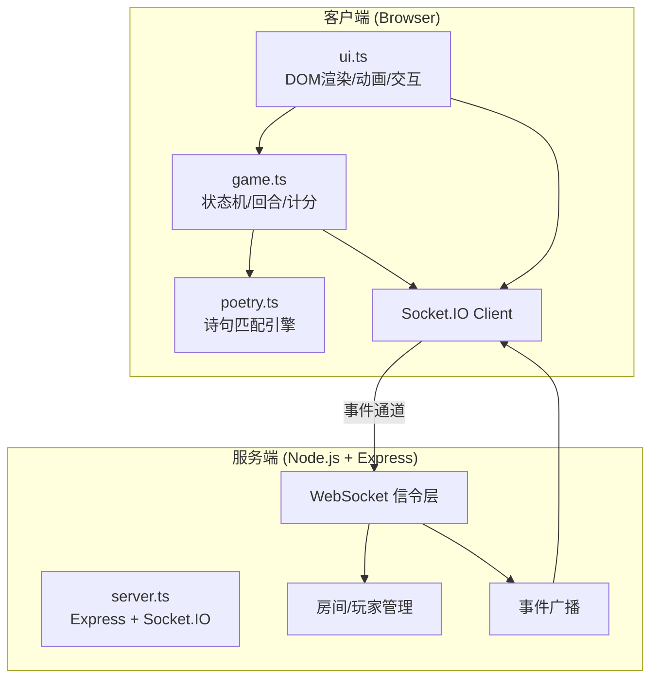
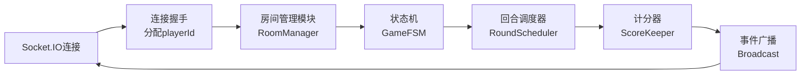

## 1. 架构设计



---

## 2. 技术选型

- **前端框架**：TypeScript + 原生JavaScript + HTML5/CSS3（无框架依赖，轻量高性能）
- **构建工具**：Vite 5.x（HMR热更新，端口3000）
- **3D渲染**：CSS 3D Transform + perspective实现紫砂壶360°旋转（无需three.js，减重）
- **动画方案**：CSS Keyframes + requestAnimationFrame + Canvas（粒子特效）
- **后端框架**：Express 4.x
- **实时通信**：Socket.IO 4.x（WebSocket信令 + 事件广播）
- **类型系统**：TypeScript 5.x（strict严格模式，target ES2020）
- **无数据库**：所有状态保存在内存中，游戏结束即销毁（轻量级演示场景）

---

## 3. 项目文件结构

| 文件 | 职责说明 |
|------|----------|
| `package.json` | 依赖: typescript, vite, express, socket.io, @types/express, @types/socket.io |
| `tsconfig.json` | strict:true, target:ES2020, module:ESNext |
| `vite.config.js` | 入口index.html, server.port:3000, 配置Express中间件挂载 |
| `index.html` | 入口页面，茶寮DOM结构、内联CSS关键帧 |
| `src/game.ts` | 玩家状态机、回合调度、计分逻辑、WebSocket事件处理 |
| `src/ui.ts` | DOM渲染、事件绑定、茶案/茶盏/气泡/动画控制、WS通信封装 |
| `src/poetry.ts` | 50句茶诗库、关键词提取、相似度算法、匹配结果返回 |
| `src/server.ts` | Express启动、Socket.IO服务、房间管理、事件广播 |

---

## 4. WebSocket 事件协议定义

### 4.1 客户端 → 服务端 (C→S)

| 事件名 | 数据结构 | 触发时机 |
|--------|----------|----------|
| `player:join` | `{ nickname: string }` | 玩家进入茶寮 |
| `tea:brew` | `{ teaId: number, temp: 80\|90\|100, pour: 'high'\|'low'\|'circle' }` | 司茶人确认泡茶参数 |
| `tea:comment` | `{ dimension: 'color'\|'aroma'\|'taste'\|'lingering', text: string }` | 玩家提交评茶评语 |

### 4.2 服务端 → 客户端 (S→C)

| 事件名 | 数据结构 | 触发时机 |
|--------|----------|----------|
| `game:state` | `GameState`（见下方类型） | 状态变更广播（新玩家/回合切换/计分） |
| `tea:brewing` | `{ brewerId, teaId, temp, pour }` | 泡茶参数确认，触发水流动画 |
| `tea:matchResult` | `{ playerId, poemId, similarity, poemLine }` | 诗句匹配结果 |
| `game:over` | `FinalRank[]` | 一炷香时间到，结算榜单 |

### 4.3 核心TypeScript类型

```typescript
interface Player {
  id: string;
  nickname: string;
  seatIndex: number; // 0-8 九席
  score: number;
  commentCount: number;
  isBrewer: boolean;
}

interface GameState {
  phase: 'waiting' | 'brewing' | 'commenting' | 'matching' | 'ended';
  players: Player[];
  currentBrewerId: string | null;
  currentTea: { name: string; temp: number; pour: string } | null;
  timeLeft: number; // 总游戏剩余秒数
  roundCommentDeadline: number | null; // 10秒评茶截止
}

interface MatchResult {
  playerId: string;
  poemLine: string;
  similarity: number;
  dimension: string;
}

interface FinalRank extends Player {
  title: string; // 茶圣/茶仙/诗圣/茶客
}
```

---

## 5. 服务端架构



### 核心模块职责
- **RoomManager**：单房间模式，维护玩家列表、席位分配（0-8）、上限9人
- **GameFSM**：waiting→brewing→commenting→matching 状态流转，状态锁防并发
- **RoundScheduler**：随机选司茶人、120秒全局倒计时、10秒评茶窗口计时器
- **ScoreKeeper**：匹配度×10取整积分，获评次数统计，称号映射规则
- **Broadcast**：事件去重、延迟合并、保证所有客户端状态一致

---

## 6. 前端性能优化策略

### 6.1 渲染层
- **DOM最小化**：茶盏/气泡使用CSS变量动态调整，避免频繁重排
- **GPU合成层**：`.gpu-layer { will-change: transform, opacity; transform: translateZ(0); }`
- **粒子池化**：火焰/金色粒子使用Canvas对象池，不复选createElement
- **节流/防抖**：水温滑块mousemove节流(16ms)，评语输入防抖(300ms)

### 6.2 动画实现
- **茶香飘带**：CSS `@keyframes aroma-wave` + SVG path + `stroke-dashoffset`，30fps+
- **水流抛物线**：`requestAnimationFrame` + 贝塞尔曲线，6-12px宽度动态插值
- **火焰粒子**：Canvas 2D，粒子上限30，速度3px/帧，橙红→橙黄渐变
- **金色飞散**：匹配成功时触发，50粒子上限，1.5秒后回收至对象池
- **卷轴展开**：CSS `scaleX(0→1)` + `transform-origin: center`，0.8s ease-out

### 6.3 诗句匹配算法
- **关键词提取**：分词后取与「色/香/味/韵」相关的高频词
- **相似度计算**：Jaccard系数 + 语义加权（茶类词权重×2）
- **缓存策略**：相同评语命中缓存（LRU，容量100）

---

## 7. 启动脚本

| 命令 | 作用 |
|------|------|
| `npm install` | 安装 typescript, vite, express, socket.io 等依赖 |
| `npm run dev` | 同时启动 Vite Dev Server(3000) + Express/Socket.IO服务 |
