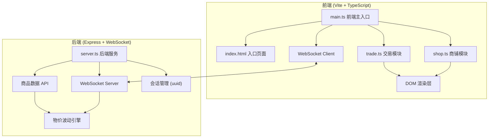
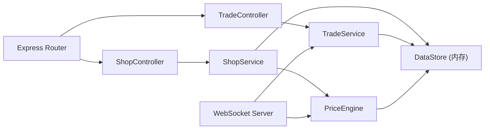
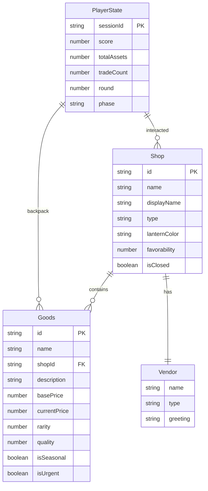

## 1. 架构设计



## 2. 技术说明

- **前端**：TypeScript + 原生JavaScript（无框架），Vite 构建，CSS 动画为主
- **构建工具**：Vite（端口3000，代理 /api 和 /ws 到后端3001）
- **后端**：Express + socket.io（WebSocket），运行在端口3001
- **数据存储**：内存存储（会话级数据），无数据库
- **依赖**：typescript, vite, express, socket.io, uuid, concurrently

## 3. 路由定义

| 路由 | 用途 |
|------|------|
| `GET /` | 前端入口页面（index.html） |
| `GET /api/shops` | 获取八间商铺的初始商品数据 |
| `GET /api/shops/:id` | 获取指定商铺的详细信息 |
| `GET /api/prices` | 获取当前所有商品的市场参考价（含波动） |
| `POST /api/trade` | 提交交易请求，返回交易结果 |
| `WebSocket /ws` | 实时价格波动推送、交易状态同步 |

## 4. API 定义

### 4.1 商品数据类型

```typescript
interface Goods {
  id: string;
  name: string;
  shopId: string;
  description: string;
  basePrice: number;
  currentPrice: number;
  rarity: number;
  quality: number;
  thumbnail: string;
  isSeasonal: boolean;
  isUrgent: boolean;
}

interface Shop {
  id: string;
  name: string;
  displayName: string;
  type: string;
  lanternColor: string;
  vendor: Vendor;
  favorability: number;
  isClosed: boolean;
  goods: Goods[];
}

interface Vendor {
  name: string;
  type: 'shrewd' | 'honest' | 'picky';
  greeting: string;
}

interface TradeRequest {
  sessionId: string;
  shopId: string;
  offerGoodsId: string;
  requestGoodsId: string;
  counterOffer?: {
    addGoodsIds: string[];
    removeGoodsIds: string[];
  };
}

interface TradeResponse {
  success: boolean;
  satisfaction: number;
  favorabilityChange: number;
  vendorReaction: string;
  bonusItem?: Goods;
  totalPrice: number;
}

interface PlayerState {
  sessionId: string;
  backpack: Goods[];
  score: number;
  totalAssets: number;
  tradeCount: number;
  round: number;
  phase: 'standard' | 'seasonal' | 'urgent';
  urgentChecklist: string[];
  achievements: string[];
}
```

### 4.2 请求/响应模式

- `GET /api/shops` → `Shop[]`
- `GET /api/shops/:id` → `Shop`
- `GET /api/prices` → `{ [goodsId: string]: number }`
- `POST /api/trade` → `TradeResponse`
- WebSocket 事件：`priceUpdate`（价格波动推送）、`tradeResult`（交易结果同步）

## 5. 服务端架构图



## 6. 数据模型

### 6.1 数据模型定义



### 6.2 初始数据

八间商铺初始数据定义在服务端，包含：

| 商铺 | 店名 | 类型 | 灯笼颜色 | 商贩性格 |
|------|------|------|----------|----------|
| 布庄 | 瑞锦坊 | cloth | #FFB6C1 | 精明型 |
| 粮铺 | 五谷仓 | grain | #DAA520 | 忠厚型 |
| 铁匠铺 | 百炼堂 | iron | #FF8C00 | 挑剔型 |
| 药铺 | 济世堂 | medicine | #2E8B57 | 忠厚型 |
| 酒肆 | 醉仙居 | wine | #FF4500 | 精明型 |
| 瓷器铺 | 青云窑 | porcelain | #4682B4 | 挑剔型 |
| 茶馆 | 翠云轩 | tea | #6B8E23 | 忠厚型 |
| 杂货铺 | 万宝行 | grocery | #8B668B | 精明型 |

每间商铺3-5种商品，共约30种商品，包含基础价格和稀有度系数。

玩家初始背包6件物品，每次会话随机生成。
