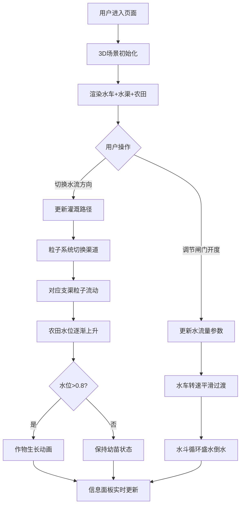

## 1. 产品概述

基于Three.js的交互式3D古代水车灌溉系统模拟Web应用，让用户通过调整水流方向和闸门开合来控制水车转速和灌溉范围，并实时观察农田水位变化与作物生长动画。

- 主要目的：提供一个沉浸式的古代水利工程教学与演示工具，让用户直观理解水车灌溉系统的运作原理
- 目标用户：教育工作者、学生、历史文化爱好者
- 产品价值：通过交互式3D可视化技术，将抽象的水利工程原理转化为可感知、可操作的沉浸式体验

## 2. 核心功能

### 2.1 用户角色
无角色区分，所有用户均可使用全部功能。

### 2.2 功能模块

1. **3D场景模块**：相机控制、光照系统、地面与天空环境、场景生命周期管理
2. **水车系统模块**：水车轮建模、旋转动画、根据水流参数调整转速
3. **灌溉系统模块**：闸门控制、水渠水流粒子系统、农田水位动态更新、作物生长状态机
4. **用户界面模块**：控制面板、状态信息显示、交互事件绑定

### 2.3 页面详情

| 页面名称 | 模块名称 | 功能描述 |
|-----------|-------------|---------------------|
| 主页面 | 3D场景区域 | 展示水车、水渠、农田的完整3D场景，支持鼠标视角控制 |
| 主页面 | 控制面板区域 | 闸门开度滑块（0-100）、水流方向切换按钮（左/右） |
| 主页面 | 信息面板区域 | 水车转速（RPM表盘）、总水流量（L/s）、已灌溉田块数、系统运行时长 |
| 主页面 | 水车模型 | 木质辐条12根、水斗循环盛水倒水、中心铁轴 |
| 主页面 | 粒子系统 | 两条支渠各1000粒子，水流颜色与透明度动态变化 |
| 主页面 | 农田系统 | 10块田地，水位动态上升，作物从幼苗生长到成熟并带弹跳动画 |

## 3. 核心流程

用户进入页面后看到完整的3D水车灌溉场景，通过右侧控制面板调整闸门开度控制水流量，切换水流方向选择灌溉支渠。系统实时计算水车转速、更新粒子效果、驱动农田水位上升，并触发作物生长动画。左侧信息面板持续刷新关键参数。

## 4. 用户界面设计

### 4.1 设计风格
- **主色调**：大地色系 - 土地#A67B5B、农田#6B8E23、水流#4A90D9
- **背景色**：素麻纸色#E8DCC4
- **面板背景**：米黄色#F5E6C8
- **边框色**：木纹色#8B6914
- **按钮风格**：圆角8px，悬停阴影效果
- **字体**：标题使用楷体（KaiTi），正文使用系统无衬线字体
- **布局风格**：Flex布局，桌面端左右分栏（70%/30%），移动端上下堆叠

### 4.2 页面设计概述

| 页面名称 | 模块名称 | UI Elements |
|-----------|-------------|-------------|
| 主页面 | 页面布局 | Flex布局，70% 3D场景 + 30% 面板（最小300px），响应式断点768px |
| 主页面 | 3D场景区 | 全屏Three.js Canvas，支持OrbitControls视角控制，大地色系环境 |
| 主页面 | 控制面板 | #F5E6C8背景，#8B6914边框，圆角8px控件，悬停阴影 |
| 主页面 | 信息面板 | RPM模拟表盘（指针旋转）、数值状态卡片、运行计时器 |
| 主页面 | 水车组件 | 木质色#6B4226辐条12根、#8B5E3C水斗、#4A4A4A中心轴 |
| 主页面 | 粒子系统 | #4A90D9粒子3px，开度<20%时变#B0D4F1半透明0.3 |
| 主页面 | 作物组件 | 绿色圆柱体+锥体，生长ease-out曲线3秒，弹跳动画±2px@2Hz |

### 4.3 响应式
- 桌面端（≥768px）：左右分栏布局，3D场景占70%，面板占30%（最小宽度300px）
- 移动端（<768px）：上下堆叠布局，3D场景在上，控制面板在下
- 触屏优化：滑块和按钮尺寸适合手指触控

### 4.4 3D场景指引
- **环境**：天空球渐变，素麻纸色基调，柔和自然光
- **光照**：环境光（0.6强度）+ 方向光（0.8强度，带阴影），模拟日间自然光
- **相机**：PerspectiveCamera，初始位置(200, 150, 200)，看向原点，OrbitControls限制最小距离50
- **构图**：水车居中偏左，水渠从水车延伸至右侧，10块农田沿两条支渠对称分布
- **动画**：水车旋转、水斗倒水粒子、水流粒子沿渠流动、作物生长缩放、成熟作物微弹跳
- **后处理**：无额外后处理，保持原生Three.js渲染以满足30FPS性能要求
- **性能预算**：粒子数≤2000，Draw Call优化合并几何体，目标帧率≥30FPS
