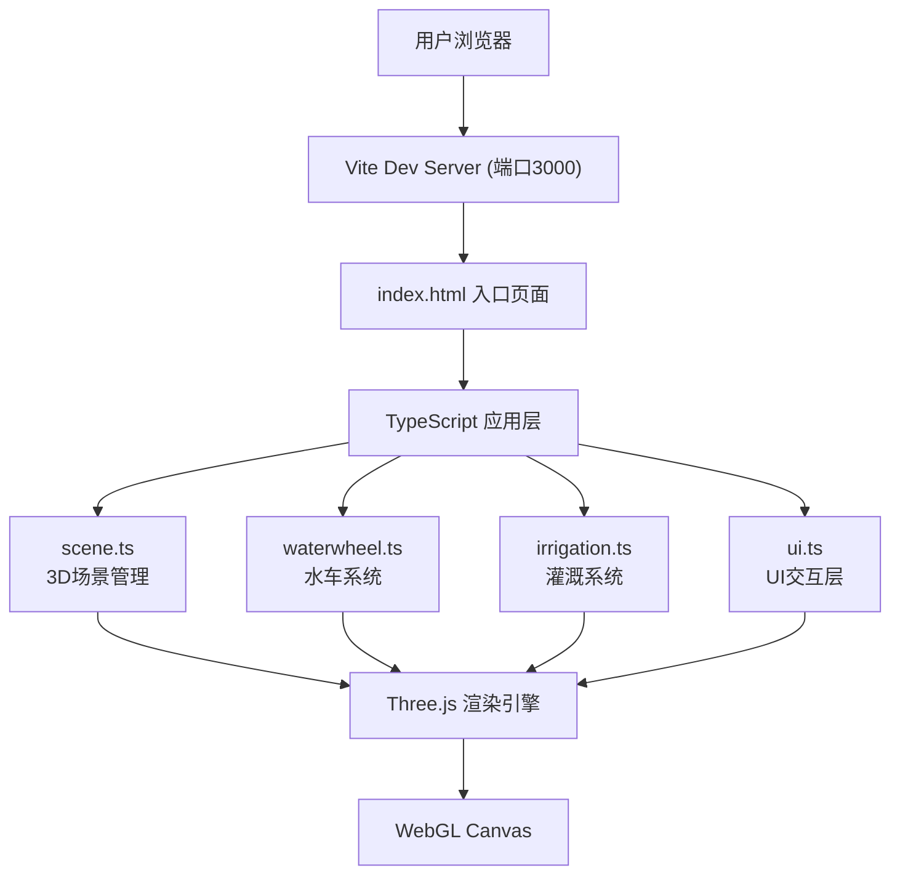

## 1. 架构设计



## 2. 技术描述

- **前端框架**：原生 TypeScript + Three.js（无React/Vue框架）
- **构建工具**：Vite 5.x
- **语言版本**：TypeScript 5.x，target ES2020，严格模式
- **3D引擎**：Three.js 最新版，使用OrbitControls相机控制
- **样式方案**：原生CSS + CSS变量，Flex布局，响应式媒体查询
- **初始化方式**：手动创建项目文件（不使用Vite脚手架模板）

## 3. 文件结构

```
项目根目录/
├── package.json              # 项目依赖与脚本
├── index.html                # 入口HTML页面
├── vite.config.js            # Vite构建配置
├── tsconfig.json             # TypeScript配置
└── src/
    ├── scene.ts              # 3D场景初始化与生命周期管理
    ├── waterwheel.ts         # 水车建模与旋转动画逻辑
    ├── irrigation.ts         # 闸门/粒子/农田/作物系统
    └── ui.ts                 # UI控制面板与事件绑定
```

## 4. 模块职责与接口定义

### 4.1 scene.ts - 3D场景管理

**职责**：初始化Three.js核心对象（Scene、Camera、Renderer、Controls），管理光照、地面、天空球，提供统一的渲染循环入口，调度其他模块的update方法。

**关键接口**：
```typescript
class SceneManager {
  constructor(container: HTMLElement);
  init(): void;
  addObject(obj: THREE.Object3D): void;
  removeObject(obj: THREE.Object3D): void;
  onUpdate(callback: (dt: number) => void): void;
  dispose(): void;
  get scene(): THREE.Scene;
  get camera(): THREE.PerspectiveCamera;
  get renderer(): THREE.WebGLRenderer;
}
```

### 4.2 waterwheel.ts - 水车系统

**职责**：构建水车3D模型（12根辐条、水斗、中心轴），实现旋转动画，提供转速平滑过渡接口，模拟水斗盛水倒水循环。

**关键接口**：
```typescript
class WaterWheel {
  constructor(scene: THREE.Scene);
  build(position: THREE.Vector3): void;
  setTargetRPM(rpm: number): void;      // 平滑过渡目标转速
  update(dt: number): void;              // 每帧更新旋转
  getCurrentRPM(): number;
  getWheelGroup(): THREE.Group;
}
```

**模型参数**：
- 总高度：150单位
- 辐条数量：12根，颜色#6B4226
- 水斗颜色：#8B5E3C
- 中心轴颜色：#4A4A4A
- 转速过渡：线性插值0.5秒

### 4.3 irrigation.ts - 灌溉系统

**职责**：
1. 闸门控制逻辑（开度0-100，左右方向切换）
2. 两条支渠的水流粒子系统（各1000粒子）
3. 10块农田水位动态更新
4. 作物生长状态机（幼苗→生长→成熟+弹跳动画）

**关键接口**：
```typescript
class IrrigationSystem {
  constructor(scene: THREE.Scene);
  build(): void;
  
  // 闸门控制
  setGateOpenness(value: number): void;  // 0-100
  setFlowDirection(dir: 'left' | 'right' | 'both'): void;
  
  // 每帧更新
  update(dt: number): void;
  
  // 状态查询
  getWaterFlow(): number;                // L/s
  getIrrigatedCount(): number;           // 已灌溉田块数
  getFieldWaterLevels(): number[];       // 各田块水位
}
```

**粒子系统参数**：
- 每条支渠：1000粒子
- 正常颜色：#4A90D9，大小3px
- 开度<20%：粒子数500，颜色#B0D4F1，透明度0.3
- 运动轨迹：沿渠线贝塞尔曲线弯曲

**农田参数**：
- 数量：10块（每支渠5块）
- 尺寸：20x15单位
- 初始水位：0，最大水位1.5单位
- 生长阈值：水位>0.8
- 生长时长：3秒，ease-out曲线
- 成熟作物：高度1.0，弹跳±2px @2Hz

### 4.4 ui.ts - 用户界面

**职责**：创建DOM控制面板与信息面板，绑定交互事件，更新实时状态显示（包括RPM模拟表盘）。

**关键接口**：
```typescript
class UIController {
  constructor();
  init(
    onGateChange: (value: number) => void,
    onDirectionChange: (dir: 'left' | 'right') => void
  ): void;
  
  updateStats(stats: {
    rpm: number;
    waterFlow: number;
    irrigatedCount: number;
    runTime: number;
  }): void;
}
```

**UI组件**：
- 闸门开度滑块（range input 0-100）
- 水流方向按钮组（左/右）
- RPM模拟表盘（SVG绘制，指针CSS transform旋转）
- 总水流量数值显示
- 已灌溉田块数（x/10格式）
- 系统运行时长计时器

## 5. 性能优化策略

1. **粒子优化**：使用BufferGeometry + PointsMaterial，共享几何体，最大粒子总数2000
2. **几何体合并**：水车辐条、水斗使用InstancedMesh减少Draw Call
3. **渲染优化**：WebGLRenderer开启antialias=false自适应，powerPreference='high-performance'
4. **动画优化**：所有动画基于dt时间增量，避免setTimeout/setInterval，使用requestAnimationFrame
5. **CSS优化**：动画优先使用transform和opacity，避免触发layout
6. **内存管理**：dispose方法统一清理Geometry、Material、Texture

## 6. 数据模型

运行时状态（内存中，无持久化）：
```typescript
interface SystemState {
  gateOpenness: number;          // 0-100
  flowDirection: 'left' | 'right' | 'both';
  currentRPM: number;
  targetRPM: number;
  waterFlow: number;             // L/s
  runTime: number;               // 秒
  fields: Array<{
    id: number;
    waterLevel: number;          // 0-1.5
    cropStage: 'seedling' | 'growing' | 'mature';
    growthProgress: number;      // 0-1
    position: THREE.Vector2;
  }>;
}
```
