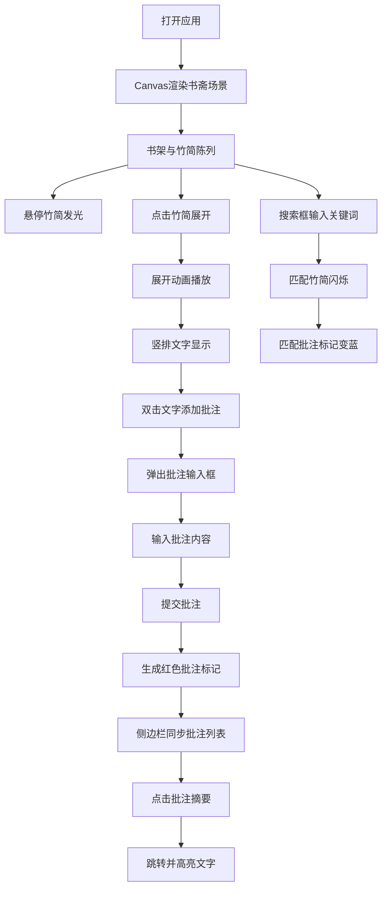

## 1. 产品概述

一款基于Canvas的交互式古代书斋典籍整理与批注Web应用，专为古代学者设计，用于数字化管理、阅读和批注竹简与帛书，让文献管理变得更加高效便捷。

- **主要用途**：数字化整理、阅读和批注古代典籍（竹简、帛书）
- **解决问题**：传统竹简帛书翻阅困难、批注不易保存、检索效率低下
- **目标用户**：古代学者、古籍研究人员、文献收藏家
- **产品价值**：通过数字化技术还原古代书斋场景，提供沉浸式阅读体验，同时实现高效的文献管理和批注功能

## 2. 核心功能

### 2.1 用户角色

| 角色 | 注册方式 | 核心权限 |
|------|---------|---------|
| 学者用户 | 本地使用无需注册 | 浏览书架、展开阅读、添加批注、搜索筛选、导航跳转 |

### 2.2 功能模块

1. **书斋主界面**：Canvas古风书斋场景渲染、四层书架展示、竹简陈列
2. **竹简阅读模块**：竹简展开动画、竖排文字渲染、暗纹背景
3. **批注管理模块**：双击添加批注、批注标记显示、批注列表侧边栏
4. **搜索导航模块**：书名/关键词搜索、匹配高亮、批注导航跳转
5. **交互反馈模块**：悬停效果、点击响应、动画过渡

### 2.3 页面详情

| 页面名称 | 模块名称 | 功能描述 |
|---------|---------|---------|
| 书斋主界面 | 书架渲染 | 绘制深木色四层书架，每层8-10卷竹简，红绳束带，悬停发光效果 |
| 书斋主界面 | 搜索框 | 书架上方半透明搜索框，放大镜图标，支持书名/批注关键词搜索 |
| 书斋主界面 | 批注侧边栏 | 右侧悬浮批注列表，显示书籍名和批注前10字，点击跳转 |
| 竹简阅读 | 展开动画 | 竹简从左向右平铺展开，文字竖排从右向左书写，繁体/楷体文字 |
| 竹简阅读 | 文字批注 | 双击文字弹出半透明批注框，米色背景毛边效果，最多200字 |
| 竹简阅读 | 批注标记 | 提交后文字右侧红色小圆点，悬停显示批注内容 |
| 搜索导航 | 匹配效果 | 匹配竹简闪烁动画（3次淡入淡出，0.5秒/次），匹配批注标记变蓝色 |
| 搜索导航 | 跳转高亮 | 点击批注摘要自动跳转对应竹简，被批注文字底色淡黄高亮 |

## 3. 核心流程

用户打开应用 → 进入书斋主界面，Canvas渲染书架与竹简 → 悬停竹简查看发光效果 → 点击竹简展开阅读 → 双击文字添加批注 → 输入批注内容提交 → 生成红色批注标记 → 右侧侧边栏查看所有批注 → 点击批注摘要跳转定位 → 使用搜索框筛选书籍或批注 → 匹配结果高亮闪烁

## 4. 用户界面设计

### 4.1 设计风格

- **主色调**：米黄宣纸色 #F5E6C8（背景）、深木色 #5C3A21（书架）
- **辅助色**：朱红 #C04000（批注标记、按钮高亮）、墨黑 #2F2F2F（文字）
- **特殊色**：浅棕 #C4A882 至 黄褐 #8B6914 渐变（竹简）、米色 #FFFACD（批注框背景）、淡黄 #FFF8DC（高亮底色）、蓝色 #6495ED（搜索匹配批注）
- **字体**：标题楷体，正文楷体/宋体
- **按钮风格**：古典圆角木牌风格，悬停微亮效果
- **布局风格**：沉浸式Canvas居中，右侧悬浮侧边栏，顶部悬浮搜索框
- **图标风格**：古风线条图标，放大镜采用古典样式

### 4.2 页面设计概述

| 页面名称 | 模块名称 | UI元素 |
|---------|---------|--------|
| 书斋主界面 | 背景 | 米黄宣纸色 #F5E6C8，纸张纹理质感，全屏Canvas |
| 书斋主界面 | 书架 | 深木色 #5C3A21，四层结构，柔和阴影 rgba(0,0,0,0.2) |
| 书斋主界面 | 竹简 | 圆柱体，浅棕到黄褐渐变，红绳束带，悬停亮度+20%发光 |
| 书斋主界面 | 搜索框 | 半透明白色背景，放大镜图标，圆角设计 |
| 书斋主界面 | 侧边栏 | 右侧悬浮，古典边框，批注摘要列表 |
| 竹简阅读 | 展开区域 | Canvas中央，暗纹回字框背景，纸张纹理 |
| 竹简阅读 | 文字 | 竖排从右向左，繁体楷体，墨黑 #2F2F2F |
| 竹简阅读 | 批注框 | 米色 #FFFACD 背景，毛边效果，弹跳动画（40%→100%透明，0.3秒） |
| 竹简阅读 | 批注标记 | 红色 #C04000 小圆点（直径6px），悬停显示批注内容 |
| 交互效果 | 动画 | 竹简展开动画、搜索闪烁（3次淡入淡出，0.5秒/次）、弹跳动画 |
| 交互效果 | 响应 | 所有交互反馈在100ms内响应 |

### 4.3 响应式

- **桌面优先**：适配1920px宽度，四层书架（8-10卷/层）
- **平板适配**：768px-1200px宽度，书架自动从四列变为两列，竹简缩小至原尺寸的70%
- **Canvas自适应**：根据窗口尺寸调整渲染比例，保持场景居中
- **侧边栏**：窄屏下可折叠显示，点击展开

### 4.4 性能约束

- **Canvas动画帧率**：不低于45fps
- **批注查询响应**：小于200ms
- **动画流畅度**：所有过渡动画平滑无卡顿
