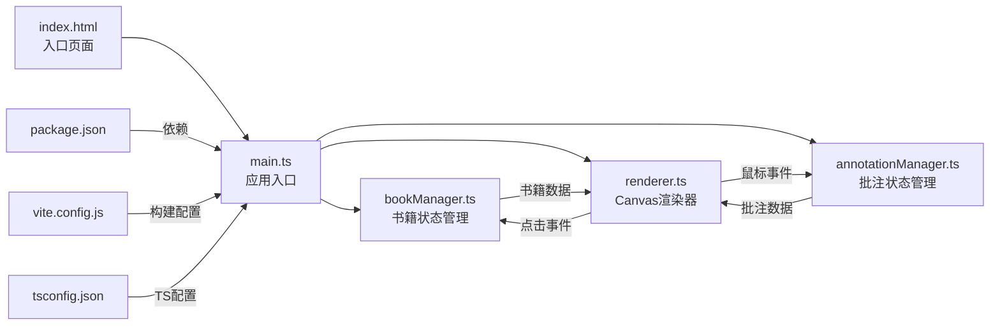
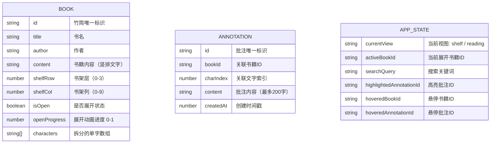

## 1. 架构设计



**数据流向说明：**
- `main.ts` 作为应用核心，初始化状态并协调各模块
- `bookManager.ts` 管理书籍数据，接收 `main.ts` 请求，返回数据触发渲染
- `annotationManager.ts` 处理批注，接收 Canvas 点击事件，存储并返回批注数据
- `renderer.ts` 负责所有 Canvas 绘制，监听鼠标事件并反馈到 manager 层

## 2. 技术描述

- **前端框架**：原生 TypeScript + Canvas API（无额外UI框架）
- **构建工具**：Vite 5.x
- **编程语言**：TypeScript 5.x（严格模式，target ES2020）
- **渲染技术**：HTML5 Canvas 2D API
- **状态管理**：模块化类实例管理（bookManager / annotationManager）
- **动画实现**：requestAnimationFrame 实现流畅动画
- **事件系统**：原生 DOM 事件 + 自定义事件分发
- **本地存储**：localStorage 持久化批注数据
- **响应式**：CSS Media Queries + Canvas 动态尺寸计算

## 3. 文件结构

| 文件路径 | 职责描述 | 调用关系 |
|---------|---------|---------|
| `package.json` | 项目依赖配置，包含 typescript、vite，启动脚本 `npm run dev` | 被 `npm install` / `npm run dev` 调用 |
| `vite.config.js` | Vite 构建配置，入口 index.html，端口 3000 | 被 Vite 构建工具调用 |
| `tsconfig.json` | TypeScript 配置，严格模式，target ES2020 | 被 TypeScript 编译器调用 |
| `index.html` | 入口页面，米黄宣纸色背景，楷体标题，全屏居中 | 加载 main.ts |
| `src/main.ts` | 应用初始化：创建 Canvas、加载配置、管理整体状态 | 调用 bookManager、annotationManager、renderer |
| `src/bookManager.ts` | 管理书架所有竹简/帛书状态：书名、位置、展开状态 | 被 main.ts 调用，向 renderer 提供数据 |
| `src/annotationManager.ts` | 处理用户批注：点击文字弹出输入框，保存关联批注 | 被 renderer 鼠标事件触发，向 renderer 提供批注标记 |
| `src/renderer.ts` | Canvas 绘制：书斋场景、书架、书本、批注标记，监听鼠标事件 | 被 main.ts 初始化，调用 manager 层获取数据 |
| `src/types.ts` | 类型定义：Book、Annotation、Position 等接口 | 被所有模块引用 |

## 4. 数据模型

### 4.1 数据模型定义



### 4.2 核心接口定义

```typescript
// src/types.ts
export interface Position {
  x: number;
  y: number;
}

export interface Size {
  width: number;
  height: number;
}

export interface Book {
  id: string;
  title: string;
  author: string;
  content: string;
  characters: string[];
  shelfRow: number;
  shelfCol: number;
  isOpen: boolean;
  openProgress: number;
  color: { start: string; end: string };
}

export interface Annotation {
  id: string;
  bookId: string;
  charIndex: number;
  content: string;
  createdAt: number;
}

export interface CharacterPosition {
  char: string;
  index: number;
  x: number;
  y: number;
  width: number;
  height: number;
}

export interface AppState {
  currentView: 'shelf' | 'reading';
  activeBookId: string | null;
  searchQuery: string;
  highlightedAnnotationId: string | null;
  hoveredBookId: string | null;
  hoveredAnnotationId: string | null;
  matchedBookIds: Set<string>;
  matchedAnnotationIds: Set<string>;
}

export interface SearchResult {
  bookIds: Set<string>;
  annotationIds: Set<string>;
}
```

### 4.3 初始数据

```typescript
// 预置书籍数据（古代典籍）
const MOCK_BOOKS = [
  { id: 'book-1', title: '论语', author: '孔子', content: '子曰学而时习之不亦说乎有朋自远方来不亦乐乎人不知而不愠不亦君子乎' },
  { id: 'book-2', title: '道德经', author: '老子', content: '道可道非常道名可名非常名无名天地之始有名万物之母' },
  { id: 'book-3', title: '诗经', author: '佚名', content: '关关雎鸠在河之洲窈窕淑女君子好逑参差荇菜左右流之' },
  // ... 更多书籍，共32-40卷
];
```

## 5. 核心算法

### 5.1 竹简展开动画算法
```
progress = easeInOutCubic(elapsed / duration)
scrollWidth = maxWidth * progress
绘制竹简：
  - 左侧卷轴固定位置
  - 竹简主体从左向右延伸 width = scrollWidth
  - 文字逐步显示 alpha = progress
```

### 5.2 竖排文字布局算法
```
columns = floor(availableWidth / (charSize + columnGap))
rows = ceil(characters.length / columns)
for each char i:
  col = floor(i / rows)
  row = i % rows
  x = rightMargin - col * (charSize + columnGap)
  y = topMargin + row * (charSize + rowGap)
```

### 5.3 碰撞检测算法
```
function hitTest(point: Position, rect: {x, y, w, h}): boolean
  return point.x >= rect.x && point.x <= rect.x + rect.w &&
         point.y >= rect.y && point.y <= rect.y + rect.h
```

### 5.4 搜索匹配算法
```
function search(query: string): SearchResult
  bookIds = books.filter(b => 
    b.title.includes(query) || b.content.includes(query)
  ).map(b => b.id)
  annotationIds = annotations.filter(a =>
    a.content.includes(query)
  ).map(a => a.id)
  return { bookIds, annotationIds }
时间复杂度：O(n + m)，n=书籍数，m=批注数
```

## 6. 性能优化策略

1. **Canvas 分层渲染**：静态背景层 + 动态元素层，减少重绘面积
2. **离屏 Canvas**：书架、竹简等静态元素预渲染到离屏 Canvas
3. **脏矩形渲染**：仅重绘变化区域，而非全屏重绘
4. **对象池**：复用动画对象，减少 GC 压力
5. **requestAnimationFrame**：统一动画调度，确保帧率稳定
6. **事件节流**：鼠标移动事件节流，避免频繁计算
7. **索引缓存**：批注数据建立书籍ID索引，加速查询
8. **LocalStorage 缓存**：批注数据持久化，避免重复加载

## 7. 响应式适配

| 断点 | 书架列数 | 竹简缩放 | 侧边栏 |
|------|---------|---------|-------|
| ≥1200px | 4列 | 100% | 展开 |
| 768px-1200px | 2列 | 70% | 可折叠 |
| <768px | 2列 | 60% | 默认折叠 |

## 8. 构建与部署

- **开发命令**：`npm run dev`（端口 3000）
- **构建命令**：`npm run build`
- **产物目录**：`dist/`
- **类型检查**：`npx tsc --noEmit`
