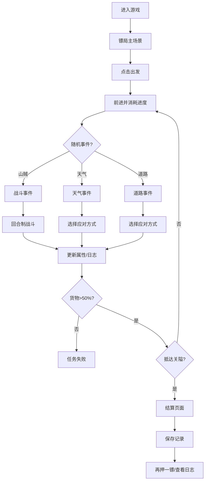

## 1. 产品概述

古代镖局押镖策略游戏，玩家扮演镖师带领镖队穿越险恶山路，应对随机事件与战斗，最终安全护送货物抵达关隘。

- 核心玩法：回合制策略 + 随机事件 + 属性管理
- 目标用户：喜爱古风、策略和轻度RPG游戏的玩家
- 市场价值：沉浸式古风体验 + 轻量级策略玩法，适合碎片化时间娱乐

## 2. 核心功能

### 2.1 用户角色
| 角色 | 注册方式 | 核心权限 |
|------|----------|----------|
| 玩家 | 无需注册 | 进行游戏、查看历史记录 |

### 2.2 功能模块
1. **主场景**：镖局大院渲染、镖队属性面板、日志区域、进度展示
2. **事件系统**：随机生成山贼战斗、天气事件、道路损坏等事件
3. **战斗系统**：回合制战斗，攻击/防御/撤退选项，暴击闪避特效
4. **结算系统**：抵达关隘后的酬金计算、结果展示、江湖点评
5. **历史记录**：localStorage存储押镖记录，支持查看和清空

### 2.3 页面详情
| 页面名称 | 模块名称 | 功能描述 |
|----------|----------|----------|
| 主游戏页 | 镖局场景 | 绘制夯土墙镖局、青石板地面、载货牛车、三层景深山峦 |
| 主游戏页 | 镖队面板 | 左侧展示6位镖师头像及体力/武力/士气属性条，动态更新 |
| 主游戏页 | 日志区域 | 右侧羊皮纸底色日志区，隶书字体，墨迹扩散动画 |
| 事件弹窗 | 古风卷轴 | 事件触发时展开卷轴对话框，木牌选项，悬停上浮效果 |
| 战斗场景 | Q版战斗 | 中央展示回合制打斗，刀光/盾牌/残影特效，屏幕抖动 |
| 天气效果 | 粒子系统 | 暴雨粒子、篝火粒子，路面湿润效果 |
| 结算页面 | 卷轴结算 | 顶部缓缓展开卷轴，显示耗时/货物/存活/酬金，江湖点评 |
| 历史记录 | 日志列表 | 按时间倒序展示历史押镖记录，支持清空 |

## 3. 核心流程

玩家点击"出发"按钮 → 镖队前进，进度旗逐根消失 → 触发随机事件（山贼/天气/道路）→ 弹出选择对话框 → 玩家选择行动 → 执行对应动画和效果 → 更新镖队属性和日志 → 继续前进或任务失败 → 抵达关隘 → 生成结算页面 → 保存记录到localStorage

## 4. 用户界面设计

### 4.1 设计风格
- 主色调：暖黄#FFF8DC、木色#8B4513、深红#8B0000
- 辅助色：夯土墙#A08050、灰瓦#808080、青山#4A6741/#7B9C6B
- 按钮：暗红色#8B0000底、金色字、悬停发光
- 字体：标题隶书，正文楷体
- 边框：毛边/宣纸纹理，古风卷轴装饰
- 动效：0.3s ease-out过渡，scale 1.05缩放，drop-shadow阴影

### 4.2 页面设计概述
| 页面名称 | 模块名称 | UI元素 |
|----------|----------|--------|
| 主游戏页 | 镖局场景 | Canvas绘制，三层景深山峦，夯土墙大院，牛车麻袋 |
| 主游戏页 | 镖队面板 | 纵向排列头像，绿/红/黄三色属性条，平滑过渡动画 |
| 主游戏页 | 日志区域 | 羊皮纸底色，隶书字体，底部滑入，墨迹扩散 |
| 事件弹窗 | 卷轴对话框 | 左右木轴装饰，浅黄背景，楷体木牌选项 |
| 战斗场景 | Q版战斗 | 中央对战区，刀光闪烁，盾牌发光，残影闪避 |
| 天气效果 | 粒子系统 | 蓝色雨滴30度斜落，篝火橙红粒子 |
| 结算页面 | 卷轴展开 | 工笔画边框，酬金计算，随机江湖点评 |
| 历史记录 | 日志列表 | 交替底色，悬停高亮，清空确认 |

### 4.3 响应式
- 桌面端：左侧镖队面板、中央游戏区、右侧日志区三栏布局
- 移动端：镖队头像横向排列，日志区折叠为可展开侧边栏，战斗角色缩小70%
- 触摸优化：按钮最小44x44px，增加点击区域

### 4.4 动画与特效
- 卷轴展开：从上到下的clip-path动画，持续1s
- 墨迹扩散：scale + opacity动画，持续0.5s
- 屏幕抖动：transform: translate随机偏移，持续0.3s
- 粒子系统：requestAnimationFrame驱动，目标55fps+
- 属性条过渡：颜色渐变 + 宽度过渡，持续0.3s
