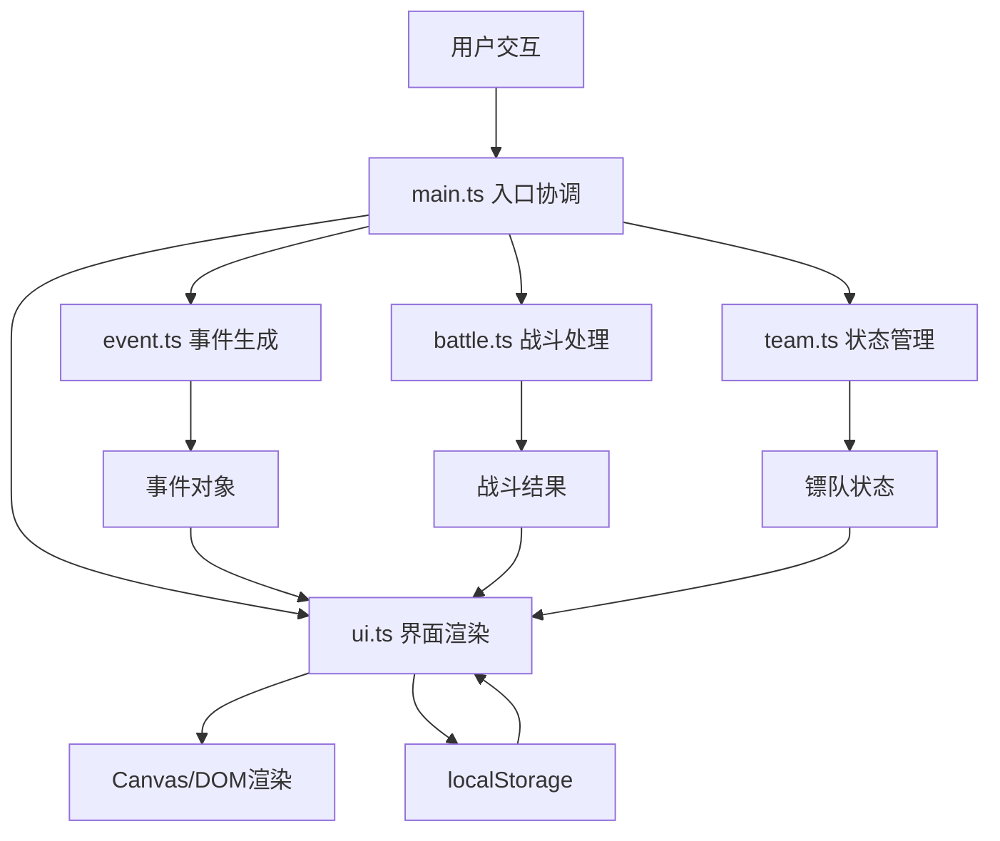

## 1. 架构设计



## 2. 技术描述
- 前端：TypeScript + Vite + 原生JavaScript (无框架)
- 构建工具：Vite 5.x
- 渲染方式：Canvas 2D + DOM混合渲染
- 数据存储：localStorage
- 状态管理：模块化单例状态

## 3. 文件结构
| 文件 | 职责 |
|------|------|
| package.json | 依赖配置，启动脚本 |
| index.html | 入口页面，全屏布局 |
| vite.config.js | Vite配置，端口3000 |
| tsconfig.json | TypeScript配置，严格模式 |
| src/team.ts | 镖队数据结构、属性管理、状态更新 |
| src/event.ts | 随机事件生成、事件类型定义 |
| src/battle.ts | 回合制战斗逻辑、伤害计算、暴击闪避 |
| src/ui.ts | 场景绘制、对话框、动画、响应式布局 |
| src/main.ts | 初始化入口、模块协调、数据流控制 |

## 4. 核心数据模型

### 4.1 镖师数据结构
```typescript
interface Escort {
  id: string;
  name: string;
  avatar: string;
  stamina: number;    // 体力 0-100
  strength: number;   // 武力 0-100
  morale: number;     // 士气 0-100
  alive: boolean;
}

interface TeamState {
  escorts: Escort[];
  cargoIntegrity: number;  // 货物完整度 0-100
  progress: number;        // 进度 0-100
  elapsedTime: number;     // 用时(秒)
  consecutiveLosses: number; // 连续败场
  isGameOver: boolean;
  isVictory: boolean;
}
```

### 4.2 事件数据结构
```typescript
type EventType = 'battle' | 'weather' | 'road';

interface GameEvent {
  id: string;
  type: EventType;
  title: string;
  description: string;
  options: EventOption[];
}

interface EventOption {
  id: string;
  text: string;
  effect: EventEffect;
}

interface EventEffect {
  stamina?: number;
  strength?: number;
  morale?: number;
  cargo?: number;
  time?: number;
  triggerBattle?: boolean;
}
```

### 4.3 战斗数据结构
```typescript
interface BattleState {
  active: boolean;
  round: number;
  maxRounds: number;
  playerTurn: boolean;
  enemy: Enemy;
  log: string[];
  result: 'ongoing' | 'win' | 'lose' | 'retreat';
}

interface Enemy {
  name: string;
  health: number;
  maxHealth: number;
  strength: number;
  morale: number;
}
```

### 4.4 历史记录
```typescript
interface EscortRecord {
  id: string;
  date: string;
  duration: number;
  cargoIntegrity: number;
  survivors: number;
  reward: number;
  comment: string;
}
```

## 5. 性能优化策略

### 5.1 渲染性能
- Canvas分层：背景层、游戏层、UI层分离
- 脏矩形渲染：只重绘变化区域
- 粒子对象池：复用粒子对象避免GC

### 5.2 动画性能
- 使用transform和opacity属性触发GPU加速
- will-change提示浏览器优化
- requestAnimationFrame统一动画帧

### 5.3 加载性能
- 代码分割：按需加载
- 资源预加载：关键资源提前加载
- 图片优化：使用CSS绘制为主，减少图片资源

### 5.4 内存管理
- 事件监听器及时清理
- 定时器统一管理
- Canvas上下文复用

## 6. 模块接口定义

### team.ts 接口
```typescript
// 创建初始镖队
createTeam(): TeamState;
// 应用事件效果
applyEffect(state: TeamState, effect: EventEffect): TeamState;
// 检查游戏结束条件
checkGameOver(state: TeamState): boolean;
// 镖师受伤
damageEscort(state: TeamState, escortId: string, damage: number): TeamState;
```

### event.ts 接口
```typescript
// 生成随机事件
generateEvent(progress: number): GameEvent;
// 预设事件库
const EVENT_POOL: GameEvent[];
```

### battle.ts 接口
```typescript
// 开始战斗
startBattle(team: TeamState): BattleState;
// 执行战斗回合
executeRound(battle: BattleState, action: 'attack' | 'defend' | 'retreat'): BattleState;
// 计算伤害
calculateDamage(attacker: { strength: number; morale: number }, defender: { strength: number; morale: number }): number;
// 检查暴击
checkCritical(): boolean;
// 检查闪避
checkDodge(): boolean;
```

### ui.ts 接口
```typescript
// 初始化UI
initUI(container: HTMLElement): void;
// 渲染场景
renderScene(state: TeamState): void;
// 显示事件对话框
showEventDialog(event: GameEvent, callback: (optionId: string) => void): void;
// 渲染战斗
renderBattle(battle: BattleState, callback: (action: string) => void): void;
// 显示结算
showSettlement(state: TeamState, callback: () => void): void;
// 更新日志
updateLog(message: string): void;
// 显示历史记录
showHistory(records: EscortRecord[]): void;
```
