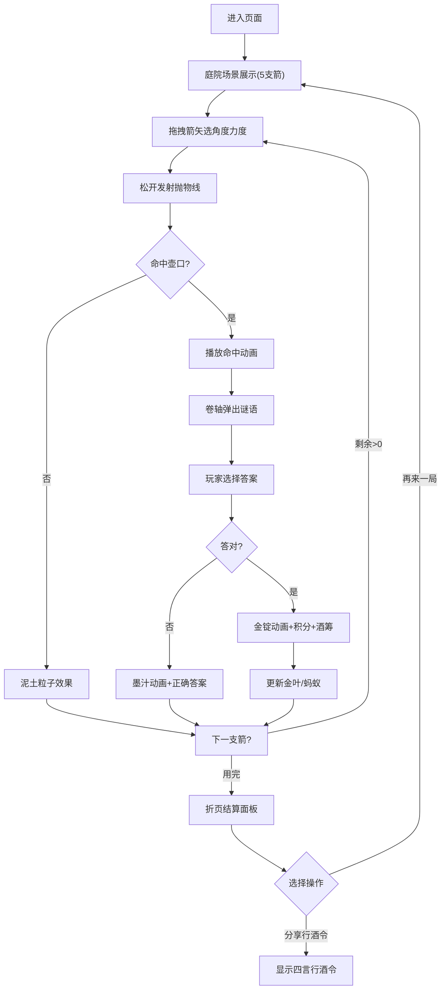

# 古风投壶谜语行酒令游戏 - 产品需求文档

## 1. 产品概述

### 1.1 项目背景
本项目是一款浏览器端交互式古风游戏，模拟古代文人墨客以投壶为乐的场景。玩家通过调整投掷角度和力度将箭矢投入壶中，根据投中位置触发不同难度的谜语，答对获得积分和虚拟酒筹，最终生成行酒令文本。

### 1.2 目标用户
- 对中国传统文化感兴趣的休闲游戏玩家
- 需要团建/聚会互动游戏的用户群体
- 喜欢解谜和文字游戏的玩家

### 1.3 产品价值
- 传播古代投壶文化与谜语知识
- 提供寓教于乐的互动体验
- 可分享的行酒令增加社交属性

---

## 2. 核心功能模块

### 2.1 庭院场景系统
| 需求编号 | 需求描述 | 优先级 |
|---------|---------|--------|
| SC-01 | 深灰砖石色背景墙(#3A3F32)，浅灰色石板地面(#7A7A6E) | P0 |
| SC-02 | 右侧老槐树，树干纹理，根据积分显示金色银杏叶 | P0 |
| SC-03 | 左侧棕红色箭架(#8B5A2B)，悬挂5支竹青色箭矢 | P0 |
| SC-04 | 中央青铜投壶，青绿色渐变(#2E8B57→#3CB371)，蟠虺纹装饰 | P0 |
| SC-05 | 壶口三环形区域：入门(0-30mm)、登堂(30-70mm)、入室(70-120mm) | P0 |
| SC-06 | 积分每满50分，树冠增加金色树叶 | P1 |
| SC-07 | 酒筹每满3支，树根处出现2只爬行蚂蚁 | P1 |

### 2.2 投壶物理系统
| 需求编号 | 需求描述 | 优先级 |
|---------|---------|--------|
| PH-01 | 鼠标拖拽箭矢，显示半透明青灰色虚线方向指示 | P0 |
| PH-02 | 实时显示角度(0-90°)和力度(0-100)数值 | P0 |
| PH-03 | 抛物线轨迹计算，飞行时间0.5-1.5秒(随力度变化) | P0 |
| PH-04 | 命中检测：命中区域编号返回 | P0 |
| PH-05 | 命中动画：箭杆摇晃0.3秒+绿色光晕 | P0 |
| PH-06 | 未命中：泥土溅落粒子效果(10-15个土黄色粒子) | P0 |
| PH-07 | 60fps稳定帧率，动画总时长≤2秒 | P2 |

### 2.3 谜语答题系统
| 需求编号 | 需求描述 | 优先级 |
|---------|---------|--------|
| RD-01 | 投中后卷轴展开动画弹出谜语面板(宣纸色#F5E6C8) | P0 |
| RD-02 | 三选项单选，命中区域决定谜语难度 | P0 |
| RD-03 | 答对：金锭动画+积分(入门10/登堂20/入室30) | P0 |
| RD-04 | 答错：墨汁泼洒动画+显示正确答案 | P0 |
| RD-05 | 答对获得竹制酒筹(刻四字摘要) | P0 |
| RD-06 | 面板展开CSS transition≤0.4秒 | P2 |
| RD-07 | 内容展示延迟≤0.1秒 | P2 |

### 2.4 结算与分享系统
| 需求编号 | 需求描述 | 优先级 |
|---------|---------|--------|--------|
| FN-01 | 5支箭用完弹出古风折页结算面板 | P0 |
| FN-02 | 左侧：每回合详情(区域/谜语/对错/积分) | P0 |
| FN-03 | 右侧：总积分+酒筹列表(竹片刻字，可滚动) | P0 |
| FN-04 | "再来一局"按钮：重置所有状态 | P0 |
| FN-05 | "分享行酒令"：生成四言行酒令(仿宋字体) | P0 |

### 2.5 交互与响应式系统
| 需求编号 | 需求描述 | 优先级 |
|---------|---------|--------|
| UX-01 | 木刻印章样式按钮(#8B5A2B背景，白色隶书，悬停红边光晕) | P0 |
| UX-02 | 面板展开/收缩0.3秒缓动 | P1 |
| UX-03 | 移动端触屏适配(拖拽+点击) | P1 |
| UX-04 | 屏幕<768px时场景缩至90% | P1 |
| UX-05 | 交互元素最小40×40px触控区域 | P1 |
| UX-06 | 单帧状态更新耗时≤8ms | P2 |

---

## 3. 用户流程

---

## 4. 视觉设计规范

### 4.1 配色方案
| 用途 | 色值 | 说明 |
|-----|-----|------|
| 主背景(青砖) | #4A5335 | 页面整体背景 |
| 背景墙 | #3A3F32 | 深灰砖石 |
| 地面 | #7A7A6E | 浅灰石板 |
| 箭架木料 | #8B5A2B | 棕红色 |
| 箭身 | #7B9C5E | 竹青色 |
| 箭羽 | #F5F5DC | 米白色 |
| 壶身渐变起点 | #2E8B57 | 深青绿 |
| 壶身渐变终点 | #3CB371 | 浅青绿 |
| 卷轴面板 | #F5E6C8 | 宣纸色 |
| 木质边框 | #8B4513 | 深褐色 |
| 金叶渐变起点 | #6B8E23 | 橄榄绿 |
| 金叶渐变终点 | #FFD700 | 金色 |
| 印章按钮 | #8B5A2B / #FFF | 棕红底白字 |

### 4.2 字体规范
- 标题：行书字体 (Ma Shan Zheng / Zhi Mang Xing)
- 谜语文本：楷体 (KaiTi / STKaiti)
- 酒筹/行酒令：仿宋 (FangSong / STFangsong)
- 按钮文字：隶书 (LiSu / STLiti)

### 4.3 动效规范
- 面板展开：`ease-out` 0.3-0.4s
- 按钮悬停：光晕脉冲 0.2s
- 箭矢飞行：`cubic-bezier(0.25, 0.46, 0.45, 0.94)`
- 粒子爆炸：随机散射 0.6s

---

## 5. 性能指标

| 指标 | 目标值 |
|-----|-------|
| 投壶动画帧率 | ≥60fps |
| 单次投壶总时长 | ≤2秒 |
| 谜语面板展开动画 | ≤0.4秒 |
| 面板内容展示延迟 | ≤0.1秒 |
| 单帧状态更新耗时 | ≤8ms |
| 移动端触控响应 | ≤100ms |
