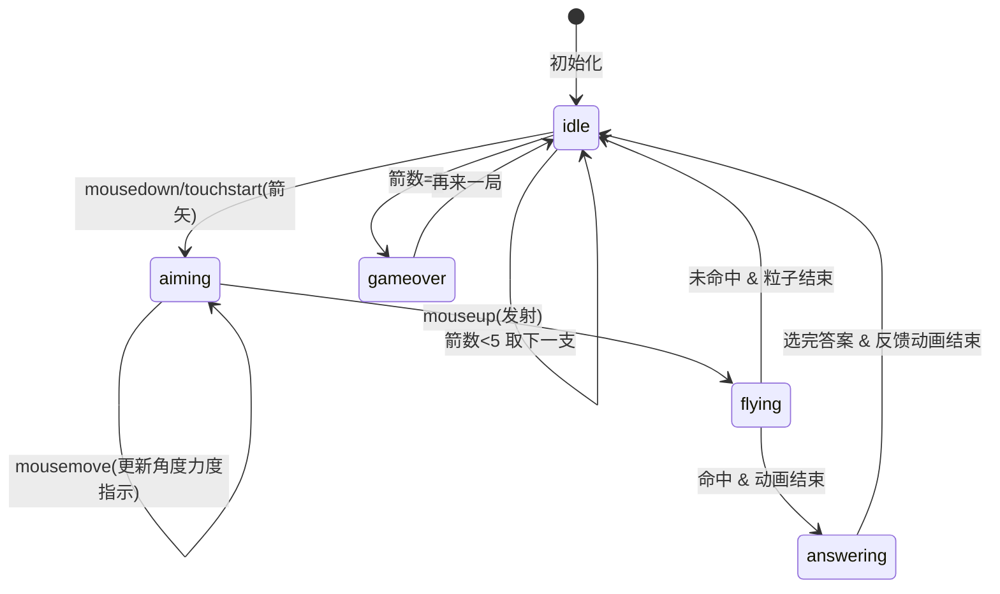

# 古风投壶谜语行酒令游戏 - 技术架构文档

## 1. 技术栈选型

| 层级 | 技术 | 选型理由 |
|-----|------|---------|
| 构建工具 | Vite 5.x | 极速HMR，原生ESM支持，零配置TypeScript |
| 语言 | TypeScript 5.x | 静态类型检查，大型项目可维护性 |
| 渲染 | HTML5 Canvas + DOM | Canvas负责动画/粒子/箭矢物理，DOM负责UI面板 |
| 样式 | 原生CSS + CSS Variables | 零依赖，配合transition实现缓动效果 |
| 字体 | Google Fonts CDN | 引入中文字体(行书/楷体/仿宋/隶书) |

---

## 2. 文件结构设计

```
auto259/
├── package.json               # 依赖声明：typescript, vite
├── vite.config.js             # 构建配置：端口3000，入口index.html
├── tsconfig.json              # 严格模式，target ES2020
├── index.html                 # 入口页面：Canvas容器+UI层
└── src/
    ├── arrow.ts               # 箭矢物理与碰撞检测模块
    ├── riddle.ts              # 谜语库与行酒令生成模块
    └── game.ts                # 主控制器：场景/输入/状态/协调
```

### 模块职责边界

| 模块 | 职责 | 输入 | 输出 | 依赖 |
|-----|-----|------|------|------|
| `arrow.ts` | 物理计算、轨迹、碰撞 | angle(度), power(0-100), 坐标配置 | 命中结果{hit, zoneId, position} | 无(纯函数) |
| `riddle.ts` | 谜语数据、抽取、行酒令 | zoneId(难度等级), 历史记录 | {谜面,选项[],答案,摘要,酒筹文本} | 无(数据+纯函数) |
| `game.ts` | 场景渲染、事件处理、状态机 | 用户输入(DOM事件) | Canvas绘制、DOM更新、状态流转 | arrow.ts, riddle.ts |

---

## 3. 核心数据结构

### 3.1 箭矢物理计算

```typescript
// arrow.ts
export interface LaunchParams {
  angle: number;        // 角度(度，0水平~90垂直)
  power: number;        // 力度(0-100)
  startX: number;       // 起点像素坐标
  startY: number;
}

export interface TrajectoryPoint {
  x: number;
  y: number;
}

export interface HitResult {
  hit: boolean;               // 是否命中壶口
  zoneId: 0 | 1 | 2 | null;   // 0入门 1登堂 2入室
  impactX: number;            // 落点像素X
  impactY: number;            // 落点像素Y
  flightDuration: number;     // 飞行时长(秒)
}

// 壶口配置(相对Canvas坐标)
export const POT_CONFIG = {
  centerX: 500,          // 壶口中心X
  centerY: 300,          // 壶口顶面Y
  radius: 75,            // 壶口半径(150px直径)
  zones: [
    { id: 0, name: '入门', depth: [0, 30], score: 10 },  // 相对深度mm
    { id: 1, name: '登堂', depth: [30, 70], score: 20 },
    { id: 2, name: '入室', depth: [70, 120], score: 30 },
  ]
} as const;
```

### 3.2 谜语系统

```typescript
// riddle.ts
export type Difficulty = 'easy' | 'medium' | 'hard'; // 对应入门/登堂/入室

export interface Riddle {
  id: string;
  question: string;     // 谜面
  options: [string, string, string];  // ABC三选项
  answerIndex: 0 | 1 | 2;
  keyword: string;      // 酒筹四字摘要，如"精卫填海"
  difficulty: Difficulty;
}

export interface RoundRecord {
  round: number;
  zoneId: 0 | 1 | 2 | null;
  zoneName: string;
  riddle: Riddle | null;
  answeredCorrect: boolean | null;
  scoreEarned: number;
  keyword: string | null;
}
```

### 3.3 游戏状态

```typescript
// game.ts
type GamePhase = 'idle' | 'aiming' | 'flying' | 'answering' | 'gameover';

interface GameState {
  phase: GamePhase;
  currentArrow: number;        // 0-4 (共5支)
  totalScore: number;
  chipCount: number;           // 酒筹数量
  roundHistory: RoundRecord[];
  goldenLeaves: number;        // 金叶数量 = floor(totalScore/50)
  antsCount: number;           // 蚂蚁对数 = floor(chipCount/3) * 2
}
```

---

## 4. 关键算法设计

### 4.1 箭矢抛物线 (arrow.ts)

**公式**：考虑重力加速度 g = 980 px/s²

```
初速度分解：
  v0 = power × 0.12 + 2      // px/s，力度映射到 2~14 px/ms 量级
  vx = v0 × cos(θ)
  vy = v0 × sin(θ)

位置公式 (t秒)：
  x(t) = startX + vx × t
  y(t) = startY - vy × t + 0.5 × g × t²  // 屏幕Y轴向下

飞行时长：0.5 + power × 0.01 秒 (范围0.5~1.5s)
命中检测：
  遍历轨迹点，当 point.x 接近 POT.centerX 时：
  - 若 |point.y - POT.centerY| < depthThreshold 且 Δx < POT.radius
    → 命中，根据穿透深度映射 zoneId
  - 否则继续，直到 y > 地面高度 → 未命中
```

### 4.2 泥土粒子系统 (game.ts内实现)

```
粒子结构: { x, y, vx, vy, size, alpha, life }
数量: 10~15个随机
初始化: 以落点为中心 ±20px
  size: 2~6px 随机
  vx: [-60, 60] px/s
  vy: [-120, -20] px/s (向上弹起)
更新 (每帧 16ms):
  y += vy * dt;  vy += 300 * dt (重力)
  x += vx * dt
  alpha -= dt * 1.5
  life > 0 时继续绘制
总生命周期: ~0.6s
```

### 4.3 行酒令生成 (riddle.ts)

```
输入: RoundRecord[] (取 answeredCorrect=true 的记录)
模板(四言，每句一行):
  第N投 + 区域 + ， + 关键词二字 + 关键词二字；
  ...(最多4句，超出截断/摘要)

示例：
  一投入门，精卫衔石；
  再中登堂，夸父逐日；
  三投入室，嫦娥奔月；
  终局成章，尽醉方休。(收尾句固定或取最精彩者)
```

---

## 5. 渲染与性能策略

### 5.1 双Canvas分层
```
Canvas#scene (底层):  庭院背景、树、箭架、壶、金叶、蚂蚁 → 低频次重绘(状态变化时)
Canvas#fx  (顶层):    箭矢飞行、粒子、光晕 → requestAnimationFrame高频
```

### 5.2 性能优化清单
| 优化点 | 方案 | 目标 |
|-------|------|------|
| 箭矢轨迹 | 预计算100个点，插值渲染 | <1ms/帧 |
| 粒子上限 | 最多15个，life到0立即回收 | <2ms/帧 |
| 金叶/蚂蚁 | 仅在score/chipCount跨过阈值时重建 | <1ms |
| 面板动画 | CSS transition而非JS逐帧 | GPU加速 |
| 移动适配 | DPR缩放 + 事件坐标 `getBoundingClientRect` 换算 | 触控无偏差 |

### 5.3 帧率保证
- 使用 `requestAnimationFrame` 而非 `setInterval`
- 每帧耗时监控：`performance.now()` 差值 >15ms 时降低粒子数量
- 箭矢飞行期间暂停背景非必要更新

---

## 6. 状态机与事件流



---

## 7. 响应式设计

| 断点 | 策略 |
|-----|------|
| ≥768px (桌面) | Canvas 1000×600 居中，按DPR缩放 |
| <768px (移动) | Canvas宽=min(90vw, 562.5px)，等比缩放高；箭矢/壶口点击区域扩展至40×40px |

事件兼容：Pointer Events统一处理鼠标+触屏
- `pointerdown` / `pointermove` / `pointerup`
- `setPointerCapture` 确保拖拽不中断

---

## 8. 构建与运行

```bash
npm install        # 安装 typescript vite
npm run dev        # 启动开发服务器 http://localhost:3000
npm run build      # 生产构建 (非必须，但验证无类型错误)
```
