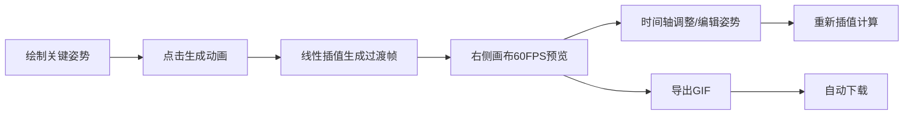

## 1. 产品概述

2D骨骼动画生成器是一款面向动画创作者和游戏开发者的Web应用，通过手绘关键姿势自动生成流畅骨骼动画，解决传统逐帧手绘耗时且动作僵硬的问题。

- 核心功能：点线绘制关键姿势 → 线性插值生成过渡帧 → 实时预览动画 → GIF导出
- 目标用户：独立动画师、游戏开发者、教育工作者
- 产品价值：大幅降低2D动画制作门槛，提升创作效率

## 2. 核心功能

### 2.1 用户角色
| 角色 | 注册方式 | 核心权限 |
|------|----------|----------|
| 访客用户 | 无需注册 | 使用全部绘制、预览和导出功能 |

### 2.2 功能模块
1. **姿势编辑器**：左侧600x800画布，支持关节点绘制、拖拽调整、颜色选择、撤销操作
2. **动画播放器**：右侧600x800画布，60FPS循环播放骨骼动画，关节点小球标记
3. **时间轴编辑器**：横向滚动缩略图条，支持关键帧拖拽排序、双击编辑
4. **插值引擎**：线性插值算法，每两个关键姿势间生成4个过渡帧
5. **GIF导出器**：调用gif.js库导出600x800尺寸、12FPS、循环播放的GIF文件

### 2.3 页面详情
| 页面名称 | 模块名称 | 功能描述 |
|----------|----------|----------|
| 主页面 | 姿势编辑器 | 关节点绘制、拖拽、连线、颜色选择、撤销/重做 |
| 主页面 | 动画预览 | 60FPS循环播放、骨骼渲染、关节小球标记 |
| 主页面 | 时间轴 | 关键帧/过渡帧缩略图、拖拽排序、双击编辑、滚动浏览 |
| 主页面 | 控制面板 | 生成动画按钮、GIF导出按钮、进度条显示 |

## 3. 核心流程

用户在左侧画布绘制2-4个关键姿势，点击生成动画后系统自动插值生成过渡帧，在右侧画布实时预览动画效果，可通过时间轴调整帧顺序或重新编辑姿势，最终导出为GIF文件。

## 4. 用户界面设计

### 4.1 设计风格
- **主题**：暗色科技风，营造专业创作氛围
- **主色调**：背景#1a1a2e，画布#16213e，控件#0f3460
- **强调色**：高亮#e94560（洋红），文字#eaeaea
- **按钮风格**：圆角矩形（border-radius:8px），悬停缩放1.05倍，0.2s过渡
- **字体**：现代无衬线字体，清晰易读
- **网格线**：10px间隔微弱网格，颜色#2a2a4e，透明度0.3
- **时间轴**：横向滚动容器，white-space:nowrap，支持鼠标滚轮浏览

### 4.2 页面设计概述
| 页面名称 | 模块名称 | UI元素 |
|----------|----------|--------|
| 主页面 | 画布区域 | 600x800双画布并排，网格背景，关节点/骨骼线 |
| 主页面 | 工具栏 | 颜色选择器（5种预设色）、撤销按钮、生成动画按钮 |
| 主页面 | 时间轴 | 横向滚动缩略图条，50x40px缩略图，半透明拖拽指示 |
| 主页面 | 导出区 | 导出GIF按钮、进度条（0%-100%） |

### 4.3 响应式设计
- **设计方式**：桌面优先，窄屏适配
- **最小宽度**：800px
- **窄屏布局**：两画布纵向堆叠
- **触摸优化**：关节点拖拽区域适当放大

### 4.4 性能要求
- 姿势编辑拖拽响应延迟 < 16ms
- 插值计算总耗时（2-4个姿势，每对4个过渡帧） ≤ 500ms
- GIF导出时间 ≤ 3秒
