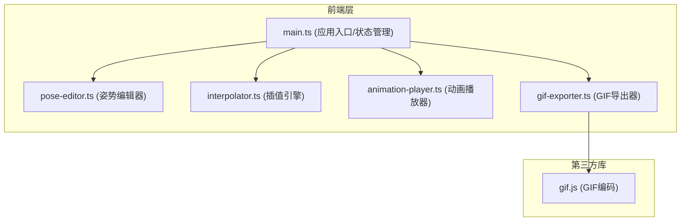

## 1. 架构设计



## 2. 技术描述
- **构建工具**：Vite@5
- **语言**：TypeScript@5（严格模式，target ES2020）
- **渲染**：原生Canvas API（2D上下文）
- **状态管理**：模块级状态，通过main.ts统一协调
- **第三方库**：gif.js（GIF文件编码导出）
- **样式**：原生CSS，CSS变量主题系统

## 3. 文件结构
| 文件路径 | 用途 |
|----------|------|
| package.json | 项目依赖和脚本配置 |
| tsconfig.json | TypeScript编译配置（严格模式） |
| vite.config.js | Vite构建配置 |
| index.html | 入口HTML页面 |
| src/main.ts | 应用入口，状态管理，模块协调 |
| src/pose-editor.ts | 姿势编辑器：绘制、拖拽、撤销 |
| src/interpolator.ts | 线性插值引擎：生成过渡帧 |
| src/animation-player.ts | 动画播放器：60FPS循环渲染 |
| src/gif-exporter.ts | GIF导出器：调用gif.js导出 |

## 4. 核心数据模型

### 4.1 关节点 (Joint)
```typescript
interface Joint {
  id: string;
  name: string;
  x: number;
  y: number;
}
```

### 4.2 骨骼连接 (Bone)
```typescript
interface Bone {
  from: string; // 起始关节id
  to: string;   // 结束关节id
}
```

### 4.3 姿势 (Pose)
```typescript
interface Pose {
  joints: Joint[];
  bones: Bone[];
  color: string;
}
```

### 4.4 动画帧 (Frame)
```typescript
interface Frame {
  joints: Joint[];
  isKeyFrame: boolean;
  keyFrameIndex?: number;
}
```

## 5. 核心算法

### 5.1 线性插值算法
对两个姿势之间的每个关节点坐标进行线性插值：
- 公式：`x = x1 + (x2 - x1) * t`，`y = y1 + (y2 - y1) * t`
- 每两个关键姿势间生成4个过渡帧，t值分别为0.2, 0.4, 0.6, 0.8

### 5.2 撤销栈
- 使用数组存储历史状态（最多30步）
- 每次关节点变化时push当前状态快照
- 撤销时pop上一状态恢复

### 5.3 动画播放
- 使用requestAnimationFrame实现60FPS
- 根据当前时间和总时长计算帧索引
- 循环播放：帧索引取模总帧数

## 6. 性能优化策略
- 拖拽时使用requestAnimationFrame合并渲染
- 插值计算使用简单算术运算，确保≤500ms
- GIF导出使用Web Worker（gif.js内置）避免阻塞主线程
- 时间轴缩略图使用离屏Canvas预渲染
