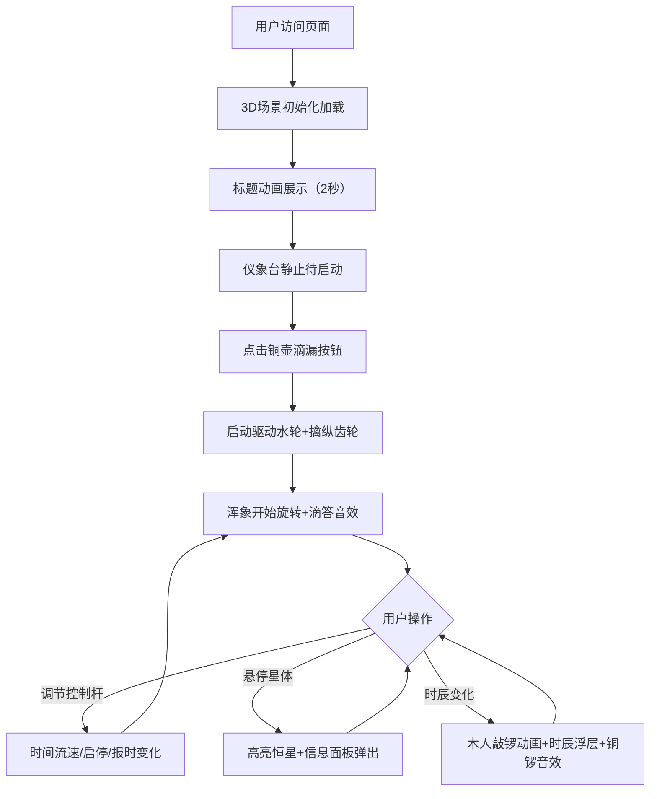

## 1. 产品概述
宋代水运仪象台3D交互式模拟器，让用户在浏览器中直观体验古代天文仪器的机械运作与星象演示过程。
- 主要用途：天文科普教育、古代科技文化展示、交互式机械原理演示
- 目标用户：天文爱好者、历史文化研究者、学生及普通公众
- 市场价值：将古代科技瑰宝以现代3D技术重现，兼具教育性与观赏性

## 2. 核心功能

### 2.1 用户角色
| 角色 | 注册方式 | 核心权限 |
|------|----------|----------|
| 访客用户 | 无需注册 | 浏览仪象台、操作控制杆、查看星图信息 |

### 2.2 功能模块
1. **3D场景展示**：仪象台木结构模型、夜空背景、银河粒子系统、闪烁星光
2. **机械联动系统**：铜壶滴漏驱动、擒纵齿轮组、浑象旋转、报时木人动作
3. **星图系统**：浑象表面2500颗恒星、悬停高亮、星座信息面板
4. **交互控制系统**：视角控制、时间流速调节、启停控制、报时开关
5. **音效系统**：擒纵滴答声、铜锣报时声、按钮反馈音

### 2.3 页面详情
| 页面名称 | 模块名称 | 功能描述 |
|----------|----------|----------|
| 主页面 | 3D视口 | 水运仪象台整体展示，支持鼠标拖拽旋转、滚轮缩放 |
| 主页面 | 仪象台底层 | 铜壶滴漏启动按钮，点击启动机械运作 |
| 主页面 | 仪象台中层 | 三个控制杆：时间流速、浑象启停、报时开关 |
| 主页面 | 仪象台顶层 | 浑象天球模型，展示星图旋转；报时木人敲锣动画 |
| 主页面 | 时辰浮层 | 顶部显示当前时辰名称，金色行楷字体 |
| 主页面 | 星体信息面板 | 悬停恒星时弹出星名、星等、宿名信息 |
| 主页面 | 标题动效 | 入口楷体标题居中展示2秒后渐隐为顶部浮层 |

## 3. 核心流程
用户访问页面 → 3D场景加载（仪象台+夜空+银河）→ 标题动画展示 → 用户点击铜壶按钮启动机械 → 齿轮转动+浑象旋转+滴答声 → 用户调节控制杆（时间/启停/报时）→ 用户悬停星体查看信息 → 时辰变化触发木人敲锣+浮层提示

## 4. 用户界面设计

### 4.1 设计风格
- **主色调**：夜空深蓝 #0B1026，木材色 #6B4226，深灰瓦 #706C61
- **强调色**：金色 #DAA520/#FFD700，古铜色 #8B4513，星白 #FFFFFF，淡蓝 #B0C4DE
- **按钮风格**：深铜色底嵌金色边框，圆角6px，发光投影，点击下沉3px+金色粒子爆发
- **字体**：标题楷体（KaiTi）36px金色，时辰显示行楷（XingKai）24px金色，信息面板宋体
- **布局风格**：全屏3D场景为主体，UI控件以浮层形式分布，仿古铜器装饰风格
- **动效风格**：机械联动动画、骨骼动画敲锣、粒子脉动、星体闪烁、渐隐过渡

### 4.2 页面设计概览
| 页面名称 | 模块名称 | UI元素 |
|----------|----------|--------|
| 主页面 | 3D场景 | 深蓝渐变夜空、随机闪烁像素星光、半透明银河粒子带（500粒子） |
| 主页面 | 仪象台模型 | 三层木结构（高400宽300）、雕花护栏、铜壶齿轮组、浑象浑仪、报时木人 |
| 主页面 | 星图 | 2500颗恒星（白到淡蓝渐变，亮度0.3-1.0）、悬停高亮效果 |
| 主页面 | 仿古铜控件 | 启动按钮、三个控制杆，深铜+金色配色，粒子反馈 |
| 主页面 | 时辰浮层 | 顶部居中，金色行楷，时辰变化时淡入淡出 |
| 主页面 | 星体面板 | 悬停触发，显示星名/星等/宿名，仿古边框样式 |

### 4.3 响应式设计
- 桌面端优先（1920x1080 / 1366x768），3D视口自适应居中
- UI控件采用固定比例定位，确保不超出可视区域
- 触屏设备支持手势缩放和旋转视角

### 4.4 3D场景指导
- **环境**：深蓝夜空渐变背景，无HDRI，自发光星点营造氛围
- **光照**：环境光+方向光模拟月光，仪象台内部点光源模拟灯光
- **相机**：PerspectiveCamera，初始距离足够展示整体，OrbitControls控制
- **构图**：仪象台居中悬浮，银河环绕，星点遍布背景
- **交互**：鼠标拖拽旋转视角，滚轮缩放，悬停星体高亮，点击控件操作
- **后期**：轻微泛光效果增强星点发光感
- **性能预算**：面数控制在合理范围，粒子系统用Points优化，目标60fps
