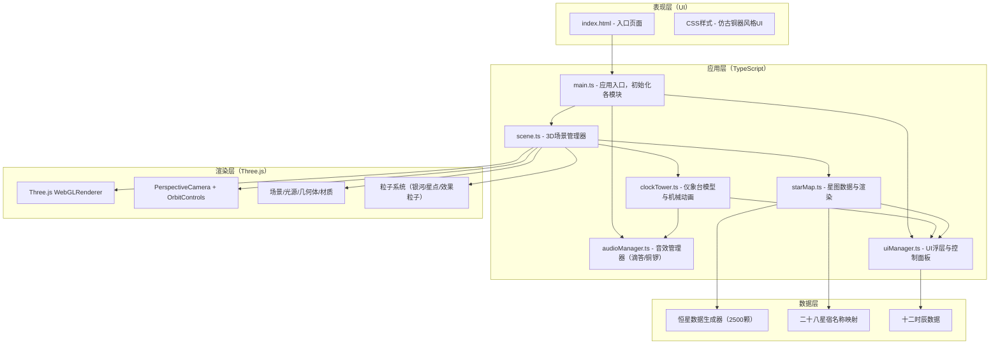

## 1. 架构设计



**模块调用关系与数据流向：**
1. `main.ts` → 实例化 `Scene` → 创建 `ClockTower` / `StarMap` / `AudioManager` / `UIManager`
2. `ClockTower` → 每帧更新机械状态 → 通过回调通知 `StarMap` 更新星象位置
3. `ClockTower` → 时辰变化事件 → 通知 `AudioManager` 播放铜锣音 + `UIManager` 显示时辰
4. `StarMap` → 射线检测悬停星体 → 通知 `UIManager` 显示星体信息面板
5. `UIManager` → 用户操作控件 → 回调 `ClockTower` 修改时间流速/启停/报时开关
6. `Scene` → 每帧调用各模块 `update(deltaTime)` → 统一渲染

## 2. 技术选型说明
- **前端框架**：TypeScript（严格模式）+ Vite（构建工具，端口3000）
- **3D引擎**：Three.js r160+ 原生API（不使用React封装，保持轻量高性能）
- **交互控制**：Three.js OrbitControls（拖拽/缩放），自定义射线检测（悬停/点击）
- **音效**：Web Audio API（AudioContext）合成滴答声和铜锣音
- **动画**：requestAnimationFrame 主循环，TWEEN.js 处理插值动画（可选，或手写lerp）
- **UI**：原生HTML/CSS浮层 + 仿古铜器风格设计，不引入额外UI库

## 3. 项目结构定义
```
auto260/
├── package.json              # 依赖：three, typescript, vite, @types/three
├── vite.config.js            # 构建配置：入口index.html，端口3000
├── tsconfig.json             # 严格模式，target ES2020
├── index.html                # 入口页面，楷体标题，深蓝背景
├── src/
│   ├── main.ts               # 应用入口，模块装配
│   ├── scene.ts              # 3D场景：相机/光源/渲染器/控制器/主循环
│   ├── clockTower.ts         # 仪象台：木结构/齿轮/浑象/木人/机械联动
│   ├── starMap.ts            # 星图：2500星数据/星图绘制/射线检测
│   ├── audioManager.ts       # 音效：滴答声/铜锣声/按钮反馈
│   ├── uiManager.ts          # UI：时辰浮层/星体面板/控制杆/标题动画
│   ├── types/
│   │   └── index.ts          # 共享类型定义
│   ├── utils/
│   │   ├── math.ts           # 数学工具：角度转换/lerp等
│   │   └── geometryBuilder.ts# 几何体构建辅助函数
│   └── styles/
│       └── main.css          # 全局样式：仿古铜器UI/星空背景
```

## 4. 核心类型定义

```typescript
// src/types/index.ts

// 时间状态
export interface TimeState {
  timeSpeed: 1 | 2 | 8;          // 时间流速倍率
  isRunning: boolean;            // 浑象是否旋转
  bellEnabled: boolean;          // 报时开关
  currentHour: number;           // 当前小时（0-24）
  currentShiChen: string;        // 当前时辰名
  lastBellHour: number;          // 上次报时时辰
}

// 恒星数据
export interface StarData {
  id: number;
  ra: number;                    // 赤经（弧度）
  dec: number;                   // 赤纬（弧度）
  magnitude: number;             // 亮度 0.3-1.0
  color: THREE.Color;            // 颜色白到淡蓝
  name: string;                  // 星名
  apparentMagnitude: number;     // 星等 -1到6
  xiu: string;                   // 宿名
}

// 控制杆事件
export type ControlEventType = 'SPEED_CHANGE' | 'TOGGLE_RUN' | 'TOGGLE_BELL';

// 仪象台回调接口
export interface ClockTowerCallbacks {
  onTimeUpdate: (state: TimeState) => void;
  onShiChenChange: (shiChen: string) => void;
  onStarHover: (star: StarData | null, screenX: number, screenY: number) => void;
}
```

## 5. 关键算法与数据生成

### 5.1 恒星数据生成（2500颗）
- 赤经范围：0 到 2π，均匀分布加随机抖动
- 赤纬范围：-π/2 到 π/2，纬度正弦分布（模拟真实天球密度）
- 亮度：0.3-1.0 随机，偏暗星占多数（真实天文分布）
- 颜色：基于亮度插值 #FFFFFF → #B0C4DE
- 星名：随机组合"星+序号"或使用常见星官名
- 宿名：按赤经范围映射二十八宿

### 5.2 时辰映射算法
- 浑象角度（绕极轴旋转）每30°对应1个时辰（一圈12时辰，对应24小时）
- 24小时制 → 时辰：hour//2 映射子丑寅卯...
- 时辰变化检测：记录上一时辰，当跨边界时触发报时

### 5.3 机械联动比例
- 一昼夜 = 浑象转一圈 = 驱动轮转N圈（按真实机械比例简化为视觉效果）
- 擒纵齿轮：每滴答对应浑象转过约0.25°，配合音频节奏
- 时间流速倍率直接作用于所有角速度参数

### 5.4 性能优化策略
- 星图使用 THREE.Points + ShaderMaterial，单DrawCall渲染2500星
- 银河粒子同样使用 Points，合并粒子更新
- 仪象台木结构尽可能合并几何体，减少DrawCall
- 射线检测使用BVH加速或简化为球面距离检测
- 悬停检测每2帧执行一次，降低开销
