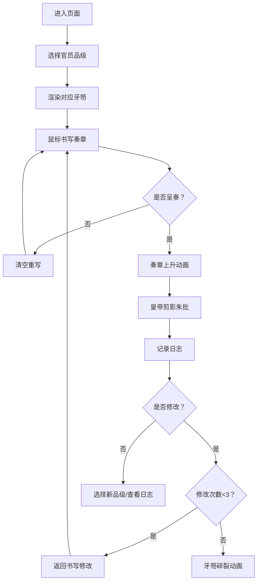

## 1. 产品概述

朝堂牙笏书写交互应用是一款模拟古代官员在朝堂之上使用牙笏书写奏章的沉浸式教育类Web应用。通过Canvas技术还原毛笔在玉、木、竹等不同材质牙笏上的书写效果，配合朱批批注与朝会日志系统，为书法教学和历史场景模拟提供数字化体验。

- 核心价值：在数字空间内动态体验毛笔书写的笔锋变化、墨色浓淡扩散效果，以及皇帝朱批的视觉反馈
- 目标用户：历史爱好者、书法学习者、文化教育机构
- 差异化：融合品级制度、材质变化、墨色扩散、朱批动画、书写回放于一体的沉浸式朝堂体验

## 2. 核心功能

### 2.1 功能模块

1. **品级选择模块**：一品至九品下拉选择，决定牙笏材质、尺寸、装饰纹样
2. **牙笏书写模块**：Canvas毛笔书写，笔触随速度变化，墨色湿扩散效果
3. **呈奏与朱批模块**：奏章上升动画、皇帝剪影、朱批飞白效果
4. **朝会日志模块**：记录书写时长/字数/品级/批注，星级评价，书写过程回放
5. **修改与碎裂模块**：最多修改三次，超限后牙笏碎裂动画

### 2.2 页面详情

| 页面名称 | 模块名称 | 功能描述 |
|-----------|-------------|---------------------|
| 主页面 | 品级选择区 | 左侧深褐色面板，下拉选择官员品级（一品至九品） |
| 主页面 | 中央书写区 | 御案居中，牙笏立式显示，Canvas毛笔书写区域 |
| 主页面 | 日志侧边栏 | 右侧黄绢色边栏，朝会奏章日志列表，支持回放 |
| 主页面 | 操作工具栏 | 呈奏、清空、修改按钮，带有交互动画 |

## 3. 核心流程

用户从进入页面开始，首先选择官员品级，系统根据品级渲染对应材质和尺寸的牙笏。用户在牙笏上用鼠标书写奏章文字，书写过程中笔触随移动速度变化粗细，墨色带有湿扩散效果。书写完成后点击"呈奏"按钮，奏章缓缓上升至御案上方，皇帝剪影出现并进行朱批批注。批注结果自动记录到右侧日志中，支持点击回放书写过程。用户可对已呈奏的奏章进行修改，最多三次，超过次数后牙笏碎裂。

## 4. 用户界面设计

### 4.1 设计风格

- **设计方向**：明清宫廷画风，庄重典雅，皇家气派
- **主色调**：宫墙红 #800000、御案黑檀色 #2B1A0D、朱砂红 #CC3333、象牙白 #F5F0E1、金色 #D4AF37、黄绢色 #E8D68C
- **背景**：从深红到暗金的径向渐变，营造朝堂庄严肃穆氛围
- **按钮风格**：深褐色底配金色描边，悬停时金色描边闪烁动画（0.3秒），点击时缩放回弹效果（0.95倍）
- **字体**：标题使用书法风格字体，正文使用典雅衬线体，整体统一宫廷风格
- **图标**：扁平化描边风格，金色线条
- **布局**：朝堂中轴对称式设计，御案居中，左右功能区对称分布

### 4.2 页面设计概述

| 页面名称 | 模块名称 | UI元素 |
|-----------|-------------|-------------|
| 主页面 | 品级选择区 | 深褐色#4A2C1A面板，下拉菜单，品级说明文字，左侧垂直排列 |
| 主页面 | 中央书写区 | 黑檀木御案（宽800px，龙纹浮雕阴影），左右各一叠空白牙笏，中央立式牙笏书写Canvas，木质边框阴影 |
| 主页面 | 日志侧边栏 | 宽200px，黄绢色#E8D68C背景，日志条目按时间倒序，星级评价，点击回放 |
| 主页面 | 操作按钮区 | "呈奏""清空""修改"三个按钮，金色描边，悬停闪烁，点击回弹 |

### 4.3 响应式设计

- 桌面端优先，最小支持宽度1000px
- 宽度小于1000px时，日志区折叠为左上角悬浮图标，点击展开为浮层
- 牙笏书写区域占屏幕中央70%高度，保持垂直居中
- 按钮和文字大小根据视口宽度等比缩放

### 4.4 动画与交互

- **墨色扩散**：书写时墨色从深黑#1A1A1A到浅灰#666渐变，扩散半径3-8像素，0.5秒逐渐缩小
- **奏章上升**：1.5秒缓慢上升动画至御案上方
- **朱批飞白**：毛笔飞白效果，带笔锋拖尾和墨点飞溅，持续1秒
- **牙笏碎裂**：碎片向四周飞散，3秒后消失
- **按钮悬停**：金色描边闪烁，0.3秒循环
- **按钮点击**：按下缩放0.95，弹起恢复，带弹性过渡
- **书写回放**：1.2倍原速重现，保留墨色渐变动画

## 5. 性能要求

- **帧率**：书写和动画过程中不低于55帧，目标60FPS
- **首屏加载**：不超过2秒
- **动画驱动**：全部使用requestAnimationFrame
- **内存管理**：及时清理历史绘制数据，避免内存泄漏
