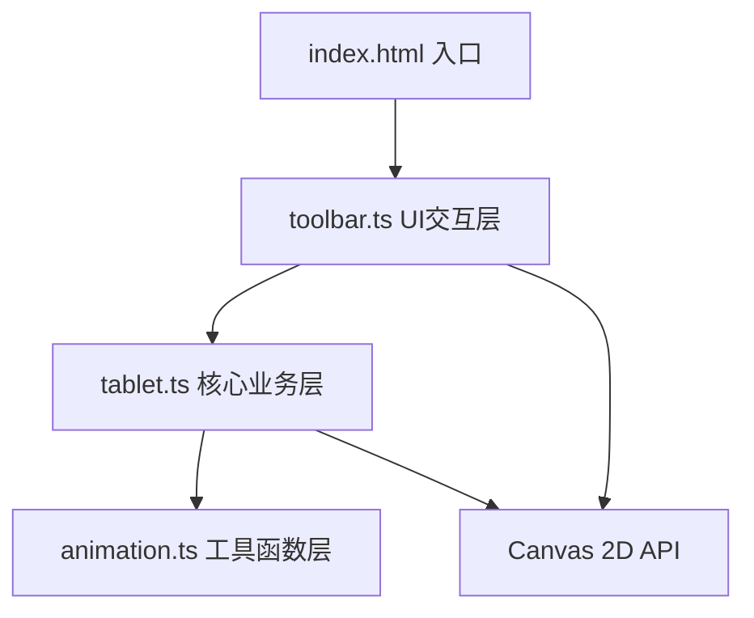

## 1. 架构设计

本项目采用纯前端架构，基于 TypeScript + Vite + 原生 Canvas API 构建，无后端依赖。代码按职责划分为三层：UI交互层、核心业务层、工具函数层。



### 模块职责
- **index.html**：页面骨架、内联样式、字体引入、根容器
- **toolbar.ts**：品级选择下拉菜单、呈奏/清空/修改按钮渲染与事件绑定，调用tablet核心方法
- **tablet.ts**：核心类Tablet，管理牙笏材质纹理、墨迹线条存储与渲染、朱批动画、日志记录与回放
- **animation.ts**：通用动画工具函数，包括上升动画、碎片飞散、描边闪烁、点击回弹等

## 2. 技术选型

| 技术 | 版本 | 用途 |
|------|------|------|
| TypeScript | 5.x | 类型安全开发 |
| Vite | 5.x | 构建工具、开发服务器 |
| Canvas 2D API | - | 牙笏绘制、毛笔书写、墨色扩散、朱批效果 |
| requestAnimationFrame | - | 所有动画的驱动引擎 |
| LocalStorage | - | 可选：持久化日志数据 |

### 关键技术决策
1. **原生Canvas而非WebGL**：2D绘制场景，Canvas 2D API足够，降低复杂度
2. **无框架纯TypeScript**：用户明确指定原生JS，保持轻量
3. **Vite构建**：快速开发体验，HMR支持
4. **基于时间戳的动画**：所有动画使用performance.now()计算进度，确保60FPS流畅性
5. **离屏Canvas双缓冲**：使用离屏canvas缓存牙笏底纹，避免每帧重绘

## 3. 核心数据结构

### 3.1 官员品级配置

```typescript
interface RankConfig {
  rank: number;          // 1-9 品
  name: string;          // 品级名称，如"一品大员"
  material: 'jade' | 'wood' | 'bamboo';
  width: number;         // 牙笏宽度 px
  height: number;        // 牙笏高度 px
  color: string;         // 基础色
  decoration: string;    // 装饰纹样描述
  hasDragonPattern: boolean;
  format: {              // 奏章格式
    header: string;      // 开头格式
    date: boolean;       // 是否有日期
    signature: boolean;  // 是否署名
  };
}
```

### 3.2 墨迹线条数据

```typescript
interface InkPoint {
  x: number;
  y: number;
  pressure: number;      // 笔触粗细，由速度计算
  timestamp: number;
  diffusionRadius: number;
}

interface InkStroke {
  points: InkPoint[];
  color: string;
  startTime: number;
  endTime: number;
}
```

### 3.3 奏章日志

```typescript
interface MemorialLog {
  id: string;
  timestamp: number;
  rank: number;
  rankName: string;
  wordCount: number;
  duration: number;      // 书写时长秒
  annotation: string;    // 批注意见
  annotationColor: string;
  stars: number;         // 1-5星
  strokes: InkStroke[];
  revisionCount: number; // 修改次数
  prevAnnotations: string[];
}
```

## 4. 核心类设计

### 4.1 Tablet 类（核心）

```typescript
class Tablet {
  // 属性
  private canvas: HTMLCanvasElement;
  private ctx: CanvasRenderingContext2D;
  private rankConfig: RankConfig;
  private strokes: InkStroke[] = [];
  private currentStroke: InkStroke | null = null;
  private isDrawing = false;
  private logs: MemorialLog[] = [];
  private isReplaying = false;
  
  // 构造与初始化
  constructor(canvas: HTMLCanvasElement, rankConfig: RankConfig)
  
  // 品级相关
  setRank(rank: number): void
  private drawTabletTexture(): void
  
  // 书写相关
  startDrawing(x: number, y: number): void
  draw(x: number, y: number): void
  endDrawing(): void
  private calculateStrokeWidth(speed: number): number
  private drawInkDiffusion(point: InkPoint): void
  
  // 呈奏与朱批
  async presentMemorial(): Promise<string>
  private playRiseAnimation(): Promise<void>
  private playEmperorAnnotation(annotation: string): Promise<void>
  
  // 日志与回放
  private addToLog(annotation: string): void
  async replayLog(logId: string, speed?: number): Promise<void>
  
  // 修改与清空
  clearTablet(): void
  reviseMemorial(): boolean  // 返回是否可修改
  private playShatterAnimation(): Promise<void>
}
```

### 4.2 animation 工具模块

```typescript
// 上升动画
export function animateRise(
  element: HTMLElement | CanvasRenderingContext2D,
  fromY: number,
  toY: number,
  duration: number
): Promise<void>

// 碎片飞散动画
export function animateShatter(
  canvas: HTMLCanvasElement,
  pieces: ShatterPiece[],
  duration: number
): Promise<void>

// 描边闪烁
export function animateBorderGlow(
  element: HTMLElement,
  color: string,
  duration: number
): () => void

// 点击回弹
export function animateClickBounce(
  element: HTMLElement,
  scale: number = 0.95
): void

// 飞白书写效果
export function animateFlyingWhite(
  ctx: CanvasRenderingContext2D,
  text: string,
  x: number,
  y: number,
  color: string,
  duration: number
): Promise<void>
```

## 5. 渲染流程

### 5.1 书写渲染循环

```
mousedown → startDrawing()
  ↓
mousemove → draw()
  ├─ 计算鼠标速度
  ├─ 根据速度计算笔触粗细
  ├─ 添加到当前stroke的points数组
  ├─ 绘制主线条（深黑色）
  └─ 绘制墨色扩散（浅灰渐变，半径随时间衰减）
  ↓
mouseup → endDrawing()
  └─ stroke存入strokes数组
```

### 5.2 每帧重绘策略

为保证60FPS，采用分层渲染策略：
1. **背景层**（离屏canvas缓存）：牙笏材质纹理、边框装饰 - 仅在品级变化时重绘
2. **书写层**（主canvas）：所有墨迹线条 - 书写时逐帧重绘
3. **效果层**（主canvas叠加）：墨色扩散、朱批动画 - 动画期间逐帧更新

## 6. 性能优化策略

1. **离屏Canvas缓存**：牙笏底纹绘制到离屏canvas，每帧直接drawImage
2. **增量渲染**：书写时只重绘新增线段而非全量重绘
3. **对象池**：墨迹点对象复用，减少GC
4. **节流处理**：mousemove事件使用requestAnimationFrame节流
5. **requestAnimationFrame驱动**：所有动画统一调度
6. **像素比适配**：使用devicePixelRatio保证高清显示

## 7. 构建配置

- **入口**：index.html
- **开发端口**：3000
- **TypeScript目标**：ES2020
- **严格模式**：开启
- **输出目录**：dist/
- **模块格式**：ES Modules
