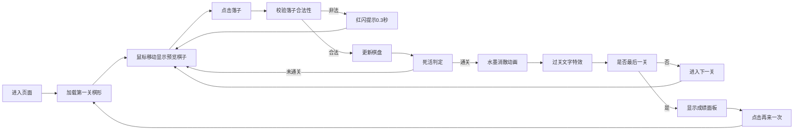

## 1. 产品概述
围棋死活题闯关游戏是一款在浏览器中运行的交互式棋类益智应用，让用户通过落子解决经典死活棋形问题，体验古代棋手对弈的意境。产品以宣纸水墨风格呈现，融合传统围棋文化与现代交互体验。
- **目标用户**：围棋爱好者、初学者、对传统文化感兴趣的用户
- **核心价值**：通过闯关形式学习死活题基本棋形，寓教于乐，传承围棋文化

## 2. 核心功能

### 2.1 功能模块
1. **游戏主界面**：19x19棋盘渲染、棋子落子交互、关卡进度显示
2. **关卡系统**：6个经典死活棋形关卡（直二、弯三、直四、梅花五、刀把五、板六）
3. **死活判定**：基于气数的死活算法，自动判定棋局胜负
4. **操作工具**：悔棋、重置、提示三大辅助功能
5. **动画效果**：棋子水墨消散粒子动画、过关文字特效、错误红闪提示
6. **战绩统计**：总用时、通关步数、使用提示数统计面板
7. **响应式布局**：适配宽屏/窄屏不同显示模式

### 2.2 页面详情
| 页面名称 | 模块名称 | 功能描述 |
|---------|---------|---------|
| 主游戏页 | 棋盘区域 | Canvas绘制19x19棋盘网格，渲染黑白棋子，支持鼠标悬停预览和点击落子 |
| 主游戏页 | 关卡列表 | 左侧/顶部显示6个关卡圆形图标，当前关高亮，通关后显示绿色和勾号 |
| 主游戏页 | 提示面板 | 右侧显示当前关名称和快速口诀 |
| 主游戏页 | 底部工具条 | 悔棋、重置、提示三个操作按钮 |
| 主游戏页 | 成绩面板 | 通关后显示总用时、步数、提示数，支持再来一次 |

## 3. 核心流程
用户进入页面后直接加载第一关棋形（直二），鼠标移动时显示半透明预览棋子，点击空交叉点落子。每步落子后系统自动判断死活，若满足通关条件则播放消散动画并进入下一关。六关全部通过后显示成绩面板，可选择重新开始。

## 4. 用户界面设计

### 4.1 设计风格
- **整体风格**：传统水墨宣纸风格，古朴典雅
- **主背景色**：宣纸色 #F5F0E1
- **主色调**：深棕 #4A3728、古铜 #B87333、水墨黑 #1A1A1A
- **点缀色**：橙色 #E67E22（当前关高亮）、绿色 #27AE60（通关标识）、金色 #D4AF37（提示按钮）、深红 #8B0000（重置按钮）
- **按钮风格**：圆角矩形，毛玻璃效果（半透明白背景 + 细白边），hover时放大1.1倍加阴影
- **字体**：标题用隶书字体，正文用衬线字体
- **布局风格**：居中棋盘布局，左右两侧辅助面板，底部浮动工具条

### 4.2 页面设计概述
| 页面名称 | 模块名称 | UI元素 |
|---------|---------|--------|
| 主游戏页 | 标题区域 | 左上角隶书"死活题·围棋"字样，深棕色28px |
| 主游戏页 | 棋盘区域 | 19x19网格，深棕线条，坐标汉字标注，棋子渐变+高光 |
| 主游戏页 | 关卡列表 | 6个圆形图标，古铜色边框，简化棋形轮廓，当前关橙色边框，通关绿色填充 |
| 主游戏页 | 提示面板 | 当前关名称 + 口诀文字，毛玻璃背景 |
| 主游戏页 | 底部工具条 | 三个按钮横排，间距12px，毛玻璃效果 |
| 主游戏页 | 成绩面板 | 毛边纸纹理背景，三项统计数据，"再来一次"按钮 |
| 主游戏页 | 过关文字 | 水墨风格"过关"二字，48px，渐显+上下抖动 |
| 主游戏页 | 粒子动画 | 棋子消散为8个黑色圆点，2秒扩散淡出 |

### 4.3 响应式设计
- **桌面端（>800px）**：棋盘完整尺寸，左侧竖排关卡列表，右侧提示面板
- **平板端（600-800px）**：棋盘缩放至容器宽度80%，保持正方形
- **移动端（<600px）**：关卡列表移至顶部横向滚动，按钮字体缩小至12px，棋盘自适应缩放

### 4.4 动效设计
- **棋子消散**：每颗棋子分裂为8个黑色小圆点，向外扩散2秒，透明度从1降至0
- **过关文字**：从透明渐显，上下抖动0.5秒后稳定
- **提示闪烁**：蓝色发光圆环闪烁3次后消失
- **错误提示**：整屏红闪0.3秒
- **按钮交互**：hover时放大1.1倍，添加阴影
- **鼠标跟随**：半透明预览棋子，20ms节流渲染
