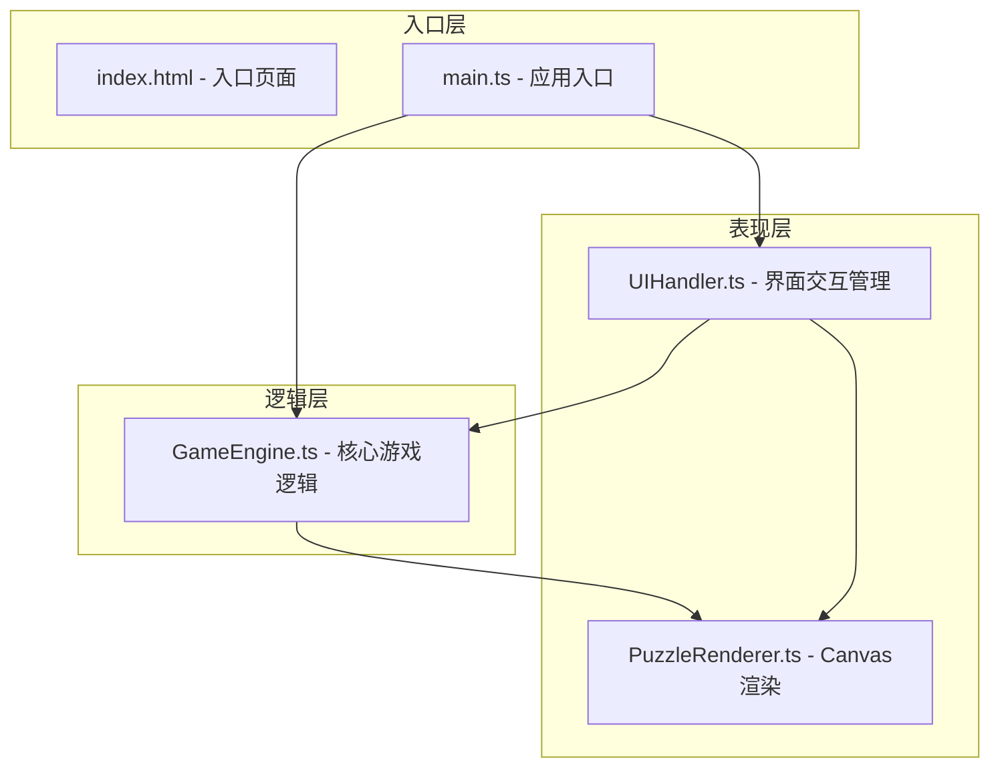

## 1. 架构设计

本项目采用纯前端架构，基于 TypeScript + Vite + Canvas 构建，无后端依赖。整体采用模块化设计，分为游戏逻辑层、渲染层和交互层。



## 2. 技术描述

- **构建工具**：Vite 5.x（端口 3000，入口 index.html）
- **开发语言**：TypeScript 5.x（严格模式，target ES2020）
- **渲染技术**：HTML5 Canvas 2D
- **状态管理**：纯 TypeScript 类封装状态，无第三方状态管理库
- **动画系统**：requestAnimationFrame + 粒子系统
- **无后端、无数据库**：所有数据本地预置

## 3. 项目结构

```
.
├── index.html              # 入口页面
├── package.json            # 项目配置
├── vite.config.js          # Vite 构建配置
├── tsconfig.json           # TypeScript 配置
└── src/
    ├── main.ts             # 应用入口，初始化各模块
    ├── GameEngine.ts       # 核心游戏逻辑
    ├── PuzzleRenderer.ts   # Canvas 渲染引擎
    └── UIHandler.ts        # 界面交互管理
```

## 4. 核心模块定义

### 4.1 GameEngine.ts - 游戏引擎

**职责**：管理棋盘状态、落子校验、死活判定、关卡数据、胜负检测。

**核心类型**：
```typescript
type StoneColor = 'black' | 'white' | null;
type Position = { x: number; y: number };
type BoardState = StoneColor[][];

interface Puzzle {
  id: number;
  name: string;
  description: string;
  tips: string;       // 快速口诀
  initialStones: { pos: Position; color: StoneColor }[];
  solution: Position[]; // 正解落子位置
  playerColor: StoneColor; // 玩家执子颜色
  winCondition: 'kill' | 'live'; // 杀棋或活棋
}
```

**核心方法**：
- `initBoard(puzzleId: number): void` - 初始化指定关卡棋盘
- `placeStone(x: number, y: number): boolean` - 落子（返回是否成功）
- `isAlive(group: Position[]): boolean` - 判定棋块死活（根据气数）
- `checkWin(): boolean` - 检查是否达成通关条件
- `getBoard(): BoardState` - 获取当前棋盘状态
- `getCurrentTurn(): StoneColor` - 获取当前轮到哪方
- `undo(): boolean` - 悔棋
- `reset(): void` - 重置到初始棋形

### 4.2 PuzzleRenderer.ts - 渲染引擎

**职责**：Canvas 绘制棋盘、棋子、粒子动画、过关文字。

**核心方法**：
- `setBoard(board: BoardState): void` - 设置棋盘数据
- `render(): void` - 渲染一帧
- `startDissolveAnimation(stones: Position[]): void` - 触发棋子消散动画
- `showPassText(): void` - 显示过关文字
- `showHintRing(pos: Position): void` - 显示提示发光圆环
- `showErrorFlash(): void` - 显示错误红闪
- `setHoverStone(pos: Position | null, color: StoneColor): void` - 设置鼠标悬停预览棋子
- `resize(width: number): void` - 响应式调整尺寸

**粒子系统**：
```typescript
interface Particle {
  x: number;
  y: number;
  vx: number;
  vy: number;
  radius: number;
  alpha: number;
  life: number;
  maxLife: number;
}
```

### 4.3 UIHandler.ts - 界面交互

**职责**：管理 DOM 元素交互、关卡列表、工具按钮、成绩面板。

**核心方法**：
- `init(gameEngine: GameEngine, renderer: PuzzleRenderer): void` - 初始化
- `updateLevelList(currentLevel: number, completedLevels: number[]): void` - 更新关卡列表
- `updateHintPanel(levelName: string, tips: string): void` - 更新提示面板
- `setHintButtonEnabled(enabled: boolean): void` - 设置提示按钮状态
- `showScorePanel(time: string, steps: number, hints: number): void` - 显示成绩面板
- `hideScorePanel(): void` - 隐藏成绩面板

## 5. 关卡数据定义

六关预置棋形数据：

| 关卡 | 名称 | 棋形 | 玩家 | 目标 | 关键点位 | 口诀 |
|-----|------|------|------|------|----------|------|
| 1 | 直二 | 2颗黑子相邻直线 | 白 | 杀棋 | 中间点 | 直二死 |
| 2 | 弯三 | 3颗白子L形 | 黑 | 杀棋 | 弯勾内侧 | 弯三可活可杀 |
| 3 | 直四 | 4颗白子直线 | 黑 | 活棋 | 中间两点任一点 | 直四活 |
| 4 | 梅花五 | 5颗白子十字 | 黑 | 活棋 | 中心点 | 梅花五中点活 |
| 5 | 刀把五 | 5颗白子刀形 | 黑 | 杀棋 | 刀身处 | 刀把五杀在刀身 |
| 6 | 板六 | 6颗白子矩形 | 黑 | 杀棋 | 两行中间点 | 板六点杀 |

## 6. 性能优化策略

1. **渲染节流**：鼠标移动预览棋子使用 20ms 节流，避免频繁重绘
2. **离屏缓存**：棋盘网格预渲染为离屏 Canvas，每帧直接贴图
3. **粒子限制**：每帧粒子数不超过 40 个，动画时长 2 秒
4. **脏区域渲染**：仅重绘变化区域（如棋子变化时）
5. **requestAnimationFrame**：所有动画统一使用 RAF，确保流畅度
6. **内存管理**：动画结束后及时清理粒子数组，避免内存泄漏

## 7. 响应式适配

| 断点 | 棋盘尺寸 | 关卡列表 | 按钮字体 |
|------|---------|---------|---------|
| > 800px | 原始尺寸（约570px） | 左侧竖排 | 16px |
| 600-800px | 容器宽度 80%，正方形 | 左侧竖排 | 14px |
| < 600px | 容器宽度 80%，正方形 | 顶部横向滚动 | 12px |
