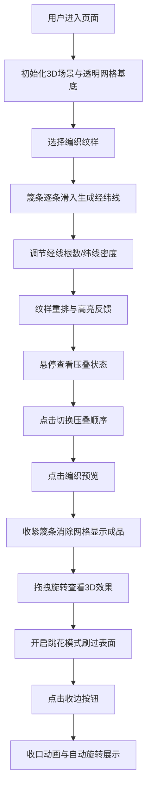

## 1. 产品概述

传统竹编工艺三维交互式可视化应用，通过数字技术还原编竹/编藤工艺的动态过程，解决非遗教学与展示中无法直观体验篾条穿插顺序、松紧力度、纹样变化的痛点。

- 核心价值：将传统手工艺数字化，提供沉浸式的编织过程体验与实时反馈
- 目标用户：非遗传承人、手工艺学习者、文化展示机构、艺术教育工作者
- 产品定位：专业级工艺教学与文化展示工具

## 2. 核心功能

### 2.1 功能模块

1. **纹样选择系统**：人字纹、回纹、十字纹、菱形纹四种经典编织纹样
2. **参数调节系统**：经线根数（8-24根）、纬线密度（0.5-2.0）实时调节
3. **交互动画系统**：篾条滑入、高亮渐变、涟漪扩散、收口动画
4. **压叠编辑系统**：悬停显示压叠状态、点击切换经纬压叠顺序
5. **3D预览系统**：编织成品展示、凹凸纹理、视角旋转、阴影投射
6. **跳花模式**：鼠标刷过区域随机跳过1-3根线形成留空效果
7. **收边系统**：外缘篾条弯折收拢、光滑收口边缘、自动旋转展示

### 2.2 页面详情

| 页面名称 | 模块名称 | 功能描述 |
|-----------|-------------|---------------------|
| 主页面 | 3D场景区 | 半球形编织基底、经纬线动态生成、成品3D展示 |
| 主页面 | 左侧工具栏 | 四种纹样选择按钮、悬停提示、点击反馈 |
| 主页面 | 右侧控制面板 | 经线根数滑块、纬线密度滑块、跳花模式开关 |
| 主页面 | 顶部菜单栏 | 半透明磨砂导航栏、标题展示 |
| 主页面 | 底部工具栏 | 编织预览按钮、收边按钮、重置功能 |

## 3. 核心流程

## 4. 用户界面设计

### 4.1 设计风格
- **主色调**：竹青#D2E0C0、深金#B8860B、金木#8B6914、浅金#D2B48C
- **交互高亮**：金色#FFD700
- **背景**：深灰#1A1A1A
- **UI风格**：宋代文人竹器雅致风格，边缘细微划痕纹理（0.3px虚线border）
- **毛玻璃效果**：半透明背景#22222280配合backdrop-filter
- **字体**：衬线体展示标题，无衬线体用于控件标签

### 4.2 页面设计概览

| 页面名称 | 模块名称 | UI元素 |
|-----------|-------------|-------------|
| 主页面 | 3D场景区 | 浅竹青展示台、灰白石纹地面、半球形透明网格基底、经纬线动画、成品凹凸纹理、柔和阴影 |
| 主页面 | 左侧工具栏 | 竖向固定面板宽120px、圆角8px、按钮间距12px、按钮填充#3E3E3E悬停#5A5A5A、点击缩放0.1秒 |
| 主页面 | 右侧控制面板 | 宽220px毛玻璃面板、金色#D4AF37滑块轨道、圆形#FFD700手柄 |
| 主页面 | 顶部菜单栏 | 高50px半透明磨砂栏、毛玻璃效果 |
| 主页面 | 底部工具栏 | 高60px固定栏、按钮间距20px |
| 主页面 | 交互提示 | Tooltip浅色#F5F5DC背景黑字、圆角4px、跟随鼠标偏移15px |

### 4.3 响应式设计
- **1440px以上**：理想布局，侧边栏完整展开
- **1024px-1440px**：侧栏折叠为下拉图标按钮
- **768px以下**：3D场景全屏单一视图，控件改为半透明悬浮按钮

### 4.4 3D场景设计
- **环境**：浅竹青色#D2E0C0虚浮展示台，灰白石纹#A9A9A9地面
- **光照**：主光源+环境光+柔和补光，突出竹篾材质感
- **相机**：初始视角45度俯角，支持360度水平旋转、45度俯仰限制
- **基底**：半径200单位半球形/扇形，透明网格辅助线
- **材质**：经线凸起0.5单位，纬线凹陷0.2单位，真实凹凸纹理
- **阴影**：深灰#555柔和阴影，随视角移动保持相对位置
- **后处理**：轻微抗锯齿，边缘柔光效果

### 4.5 动画时序
- 篾条滑动：0.6秒缓入缓出
- 高亮渐变：1.2秒金木色#8B6914高亮后淡出
- 涟漪扩散：0.3秒从#FFD700到#FFF8DC渐变缩小
- 收口动画：1.5秒外缘收拢
- 自动旋转：20秒绕Y轴一周
- 开关按钮：0.2-0.4秒缓入缓出
- 跳花轨迹：0.8秒金色轨迹消失
- 跳花透明：0.3秒后恢复
