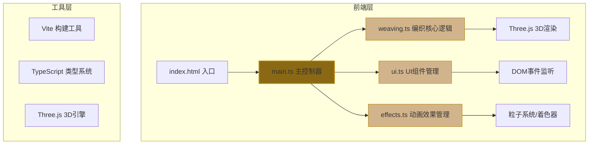

## 1. 架构设计



## 2. 技术描述

- **前端框架**：原生 TypeScript + Three.js（无React/Vue，按需求定制）
- **构建工具**：Vite 5.x
- **3D引擎**：Three.js r160+
- **类型定义**：@types/three
- **编程语言**：TypeScript 5.x（严格模式，target ES2020）

## 3. 文件结构

```
auto265/
├── package.json              # 依赖与脚本
├── index.html                # 入口HTML
├── vite.config.js            # Vite配置
├── tsconfig.json             # TypeScript配置
└── src/
    ├── main.ts               # 主入口：场景初始化、模块组装、交互循环
    ├── weaving.ts            # 编织逻辑：经纬线生成、压叠处理、收紧计算
    ├── ui.ts                 # UI管理：工具栏、滑块、按钮、事件回调
    └── effects.ts            # 效果系统：动画、粒子、着色器、时间轴
```

## 4. 核心数据结构

### 4.1 全局状态 (main.ts)
```typescript
interface WeavingState {
  currentPattern: 'herringbone' | 'meander' | 'cross' | 'diamond';
  warpCount: number;           // 经线根数 8-24
  weftDensity: number;         // 纬线密度 0.5-2.0
  isPreviewMode: boolean;      // 预览模式
  isJumpPattern: boolean;      // 跳花模式
  isEdgeFinished: boolean;     // 收边完成状态
  intersections: Map<string, { warpOver: boolean; position: Vector3 }>;
}
```

### 4.2 编织数据结构 (weaving.ts)
```typescript
interface WeaveLine {
  id: string;
  type: 'warp' | 'weft';
  points: Vector3[];           // 路径点
  color: Color;
  lineWidth: number;
  isVisible: boolean;
  opacity: number;
}

interface IntersectionPoint {
  id: string;
  position: Vector3;
  warpId: string;
  weftId: string;
  warpOver: boolean;           // 经压纬 true / 纬压经 false
}
```

### 4.3 动画时间轴 (effects.ts)
```typescript
interface AnimationTrack {
  id: string;
  startTime: number;
  duration: number;
  easing: (t: number) => number;
  onUpdate: (progress: number) => void;
  onComplete?: () => void;
}
```

## 5. 核心算法

### 5.1 纹样路径生成
- **人字纹**：经线按正弦曲线分布，纬线按交替相位偏移
- **回纹**：经纬线按阶梯式矩形路径穿插
- **十字纹**：正交网格，每两格交错压叠
- **菱形纹**：45度斜向网格，对角线交错

### 5.2 半球面UV映射
```typescript
function mapToHemisphere(u: number, v: number, radius: number): Vector3 {
  const theta = u * Math.PI;           // 经度 0-π
  const phi = v * Math.PI / 2;         // 纬度 0-π/2 (半球)
  return new Vector3(
    radius * Math.sin(phi) * Math.cos(theta),
    radius * Math.cos(phi),
    radius * Math.sin(phi) * Math.sin(theta)
  );
}
```

### 5.3 压叠顺序计算
基于纹样类型和坐标位置计算每个交叉点的默认压叠关系，支持用户点击切换。

### 5.4 性能优化策略
1. **几何体复用**：使用BufferGeometry减少Draw Call
2. **实例化渲染**：InstancedMesh渲染多条篾条
3. **LOD策略**：远距离降低细分精度
4. **按需更新**：仅参数变化时重新计算几何体
5. **帧率控制**：requestAnimationFrame配合deltaTime

## 6. 性能指标

| 指标 | 要求 | 实现策略 |
|------|------|----------|
| 最大配置帧率 | ≥45fps | BufferGeometry、实例化渲染、Frustum Culling |
| 交互响应时间 | ≤50ms | 事件防抖、WebWorker计算、缓存路径数据 |
| 内存占用 | ≤200MB | 及时释放几何体、纹理复用、对象池 |

## 7. 模块接口定义

### 7.1 weaving.ts 对外接口
```typescript
export class WeavingEngine {
  constructor(scene: Scene, radius: number);
  setPattern(pattern: PatternType): void;
  setWarpCount(count: number): void;
  setWeftDensity(density: number): void;
  toggleOverlap(intersectionId: string): boolean;
  getIntersectionAt(worldPos: Vector3): IntersectionPoint | null;
  tighten(): void;                   // 收紧篾条
  applyJumpPattern(area: Box3): void; // 跳花效果
  finishEdge(): AnimationTrack;       // 收边动画
  getWeaveLines(): WeaveLine[];
  getIntersections(): IntersectionPoint[];
  dispose(): void;
}
```

### 7.2 ui.ts 对外接口
```typescript
export class UIManager {
  constructor(container: HTMLElement);
  onPatternChange(callback: (pattern: PatternType) => void): void;
  onWarpCountChange(callback: (count: number) => void): void;
  onWeftDensityChange(callback: (density: number) => void): void;
  onPreviewClick(callback: () => void): void;
  onJumpPatternToggle(callback: (enabled: boolean) => void): void;
  onEdgeFinishClick(callback: () => void): void;
  showTooltip(text: string, x: number, y: number): void;
  hideTooltip(): void;
  setHighlight(element: HTMLElement, duration: number): void;
}
```

### 7.3 effects.ts 对外接口
```typescript
export class EffectManager {
  constructor(scene: Scene, camera: Camera);
  addAnimation(track: AnimationTrack): string;
  createSlideInAnimation(line: WeaveLine, delay: number): AnimationTrack;
  createHighlightAnimation(position: Vector3, color: Color, duration: number): void;
  createRippleAnimation(position: Vector3, color: Color, duration: number): void;
  createEdgeFinishAnimation(weaveLines: WeaveLine[]): AnimationTrack;
  createJumpTrail(position: Vector3, color: Color, duration: number): void;
  update(deltaTime: number): void;
  dispose(): void;
}
```
