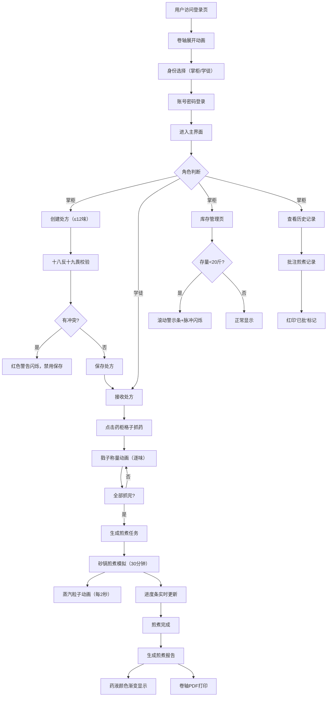

## 1. 产品概述

古代药铺管理系统是一款模拟传统中药铺掌柜与学徒协同工作的全栈Web应用。解决传统药店管理中纸质药方易丢失、药材存量模糊不清、煎煮火候无法回溯的痛点问题。

- 目标用户：中药铺的掌柜与学徒
- 核心价值：实现药材管理数字化、抓药流程标准化、煎煮记录可追溯、库存预警实时化

## 2. 核心功能

### 2.1 用户角色

| 角色 | 登录方式 | 核心权限 |
|------|----------|----------|
| 掌柜 | 账号密码登录 | 全部管理权限：新增药材、查看历史方剂、审批补货、批注煎煮记录 |
| 学徒 | 账号密码登录 | 按方抓药、提交煎煮记录 |

### 2.2 功能模块

1. **登录界面**：仿古卷轴展开动画、木质纹理背景、墨绿色隶书字体
2. **药柜视图**：九格药柜展示、药材拼音首字母分组、存量与保质期显示
3. **处方管理**：新增处方（最多12味药）、十八反十九畏药性校验、冲突警告
4. **抓药流程**：逐味抓药弹窗、戥子称量动画、自动生成煎煮任务
5. **煎煮模拟**：砂锅动画、蒸汽粒子效果、30分钟倒计时、进度条实时更新
6. **煎煮报告**：药材清单、煎煮时长、药液量、颜色渐变显示、卷轴PDF打印
7. **历史批注**：掌柜批注功能、红印"已批"标记
8. **库存预警**：20斤阈值预警、渐变红底滚动警示条、脉冲红色闪烁边框

### 2.3 页面详情

| 页面名称 | 模块名称 | 功能描述 |
|-----------|-------------|---------------------|
| 登录页 | 卷轴动画模块 | 卷轴从中间向左右展开动画，木质纹理背景#8B6914，字体#2F4F2F |
| 登录页 | 身份选择模块 | 掌柜/学徒身份切换，账号密码输入，登录验证 |
| 主界面 | 九格药柜模块 | 3×3药柜，每格60px，深木色#5C4033边框，药材本色渐变 |
| 主界面 | 处方面板模块 | 新增处方表单，药名+克数输入，最多12味，实时校验 |
| 主界面 | 抓药弹窗模块 | 逐味抓药，戥子称量动画，进度追踪 |
| 煎煮模拟页 | 砂锅动画模块 | 灰色#808080砂锅，蒸汽粒子每2秒升腾，30分钟倒计时 |
| 煎煮报告页 | 报告展示模块 | 药材清单、煎煮数据、药液颜色从#D2B48C到#4A3728渐变 |
| 库存管理页 | 预警模块 | <20斤预警条（#FF6B6B→#B22222渐变），脉冲红色闪烁 |
| 历史记录页 | 批注模块 | 掌柜批注文本框，红印楷体"已批"标记 |

## 3. 核心流程

### 3.1 主流程描述

用户登录系统选择身份后，进入主界面。掌柜可创建处方并校验药性，学徒接收处方后逐味抓药（触发戥子动画），抓药完成自动生成煎煮任务。煎煮过程中显示砂锅动画和蒸汽效果，完成后生成煎煮报告。掌柜可查看历史记录并批注，低于20斤的药材自动触发库存预警。

### 3.2 核心流程图

## 4. 用户界面设计

### 4.1 设计风格

- **主色调**：暖色调药铺风格，细麻布纹理背景#D2B48C
- **配色方案**：
  - 深木色（边框/按钮悬停）：#5C4033
  - 木质纹理：#8B6914
  - 墨绿字体：#2F4F2F
  - 药材黄（黄芪）：#D2B48C
  - 药材棕（当归）：#8B4513
  - 砂锅灰：#808080
  - 渐变红警示：#FF6B6B → #B22222
  - 米白浮窗：#FFF8DC
- **字体**：标题使用隶书字体（Ma Shan Zheng / LiSu），正文宋体
- **按钮样式**：圆角复古风格，悬停变深木色#5C4033，放大1.05倍（transform 0.2s ease）
- **浮窗样式**：米白背景#FFF8DC，阴影模糊12px，圆角设计
- **动画风格**：古典雅致，卷轴展开、蒸汽升腾、戥子摇晃等传统意象

### 4.2 页面设计概述

| 页面名称 | 模块名称 | UI元素 |
|-----------|-------------|-------------|
| 登录页 | 卷轴动画 | 从中间向左右展开，木质纹理#8B6914，墨绿字体#2F4F2F |
| 主界面 | 九格药柜 | 3×3布局，每格60px，#5C4033边框，药材本色渐变内填 |
| 主界面 | 处方面板 | 左右分栏（≥1024px：药柜40%+处方60%），输入表单 |
| 抓药弹窗 | 戥子动画 | 木质戥子从上方降下，药材小堆增至目标克数，轻微摇晃 |
| 煎煮模拟 | 砂锅动画 | #808080砂锅，锅盖边缘蒸汽粒子每2秒升腾，进度条 |
| 煎煮报告 | 颜色渐变 | 药液颜色从#D2B48C到#4A3728动态渐变 |
| 库存页 | 预警条 | 渐变红底白字滚动警示，脉冲红色每秒闪烁1次 |
| 历史记录 | 红印标记 | 楷体"已批"红印叠加在记录卡片右上角 |

### 4.3 响应式适配

- **大屏（≥1024px）**：左右分栏布局，药柜占40%，处方面板占60%
- **中屏（768px-1023px）**：保持分栏但调整比例
- **小屏（<768px）**：竖向排列，药柜变为可横向滚动的两行格子，触控优化

### 4.4 性能指标

- 页面加载时间：≤2秒（首次请求）
- 药柜搜索响应：≤200ms
- 煎煮动画帧率：稳定30fps以上
