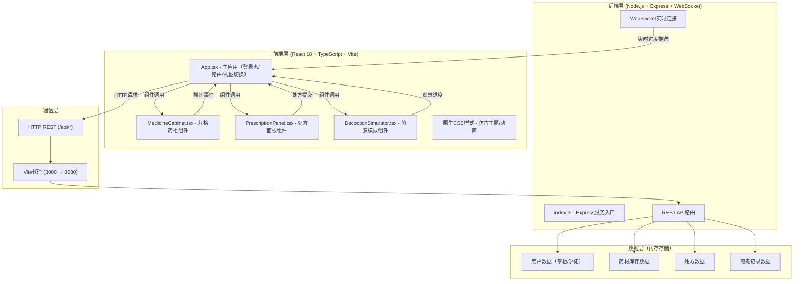
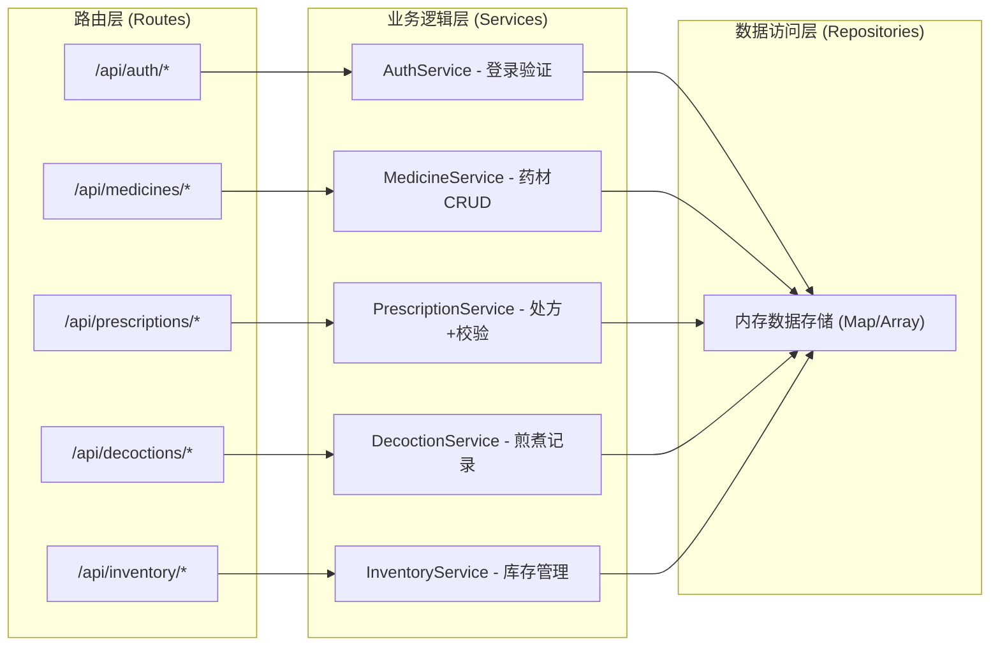

## 1. 架构设计



## 2. 技术说明

- **前端框架**：React@18 + TypeScript@5
- **构建工具**：Vite@5（端口3000，HMR支持）
- **样式方案**：原生CSS（CSS变量主题，CSS动画，响应式媒体查询）
- **后端框架**：Express@4（端口8080）
- **实时通信**：ws（WebSocket库，煎煮进度推送）
- **数据存储**：内存数据（Mock数据，无需数据库）
- **PDF打印**：window.print() + 专用打印样式

### 项目依赖版本
```json
{
  "react": "^18.2.0",
  "react-dom": "^18.2.0",
  "typescript": "^5.3.3",
  "vite": "^5.0.10",
  "express": "^4.18.2",
  "ws": "^8.16.0"
}
```

## 3. 路由定义

### 前端视图路由（App.tsx内部状态管理）

| 视图 | 触发条件 | 展示内容 |
|-------|---------|----------|
| 登录页 | 初始状态/未登录 | 卷轴动画+登录表单 |
| 主界面 | 登录成功 | 九格药柜+处方面板 |
| 抓药弹窗 | 点击药柜格子 | 逐味抓药+戥子动画 |
| 煎煮模拟 | 抓药完成 | 砂锅动画+进度条 |
| 煎煮报告 | 煎煮完成 | 报告详情+颜色渐变 |
| 库存管理 | 掌柜菜单 | 库存列表+预警条 |
| 历史记录 | 掌柜菜单 | 煎煮记录+批注 |

### 后端API路由

| HTTP方法 | 路由 | 用途 |
|----------|------|------|
| POST | /api/auth/login | 用户登录验证 |
| GET | /api/medicines | 获取药材列表 |
| POST | /api/medicines | 掌柜新增药材 |
| GET | /api/medicines/:id | 获取单个药材详情 |
| GET | /api/prescriptions | 获取处方列表 |
| POST | /api/prescriptions | 创建新处方 |
| GET | /api/prescriptions/:id | 获取单个处方 |
| GET | /api/decoctions | 获取煎煮记录列表 |
| POST | /api/decoctions | 创建煎煮记录 |
| POST | /api/decoctions/:id/annotate | 掌柜批注 |
| GET | /api/inventory | 获取库存状态 |
| POST | /api/inventory/deduct | 扣减库存（抓药） |

## 4. API定义

### 4.1 类型定义

```typescript
// 用户类型
interface User {
  id: string;
  username: string;
  role: 'boss' | 'apprentice';
  name: string;
}

// 药材类型
interface Medicine {
  id: string;
  name: string;
  pinyin: string;
  pinyinInitial: string;
  stock: number;        // 存量（斤）
  shelfLife: number;    // 保质期天数
  color: string;        // 药材本色
  category: string;     // 分类（补气/养血等）
}

// 处方单项
interface PrescriptionItem {
  medicineId: string;
  medicineName: string;
  grams: number;        // 克数
}

// 处方类型
interface Prescription {
  id: string;
  patientName: string;
  items: PrescriptionItem[];  // ≤12味
  createdAt: string;
  createdBy: string;     // 掌柜ID
  status: 'pending' | 'picking' | 'decocting' | 'completed';
  conflicts: string[];   // 冲突警告
}

// 煎煮记录类型
interface DecoctionRecord {
  id: string;
  prescriptionId: string;
  prescription: Prescription;
  pickedBy: string;      // 学徒ID
  pickedAt: string;
  waterVolume: number;   // 650ml
  decoctionTime: number; // 30分钟
  firstBoilMarks: string[];  // 先煎标记
  laterAddMarks: string[];   // 后下标记
  finalLiquidVolume: number;
  liquidColor: string;   // 渐变色值
  annotatedBy?: string;
  annotation?: string;
  isAnnotated: boolean;
  completedAt?: string;
}

// 库存预警
interface InventoryAlert {
  medicineId: string;
  medicineName: string;
  currentStock: number;
  threshold: number;     // 20斤
}
```

### 4.2 请求/响应示例

```typescript
// 登录请求
POST /api/auth/login
Request: { username: string; password: string; role: 'boss' | 'apprentice' }
Response: { success: boolean; user: User; token: string }

// 创建处方
POST /api/prescriptions
Request: {
  patientName: string;
  items: PrescriptionItem[];
  createdBy: string;
}
Response: {
  success: boolean;
  prescription: Prescription;
  conflicts: { medicineName: string; message: string }[];
}

// 创建煎煮记录
POST /api/decoctions
Request: {
  prescriptionId: string;
  pickedBy: string;
  firstBoilMarks: string[];
  laterAddMarks: string[];
}
Response: { success: boolean; record: DecoctionRecord }
```

## 5. 服务端架构图



## 6. 数据模型

### 6.1 数据模型ER图

```mermaid
erDiagram
    USER ||--o{ PRESCRIPTION : creates
    USER ||--o{ DECOCTION_RECORD : picks
    USER ||--o{ DECOCTION_RECORD : annotates
    PRESCRIPTION }o--|| MEDICINE : contains
    PRESCRIPTION ||--o| DECOCTION_RECORD : has
    
    USER {
        string id PK
        string username
        string password
        string role
        string name
    }
    
    MEDICINE {
        string id PK
        string name
        string pinyinInitial
        number stock
        number shelfLife
        string color
        string category
    }
    
    PRESCRIPTION {
        string id PK
        string patientName
        string items JSON
        string createdBy FK
        string status
        string createdAt
    }
    
    DECOCTION_RECORD {
        string id PK
        string prescriptionId FK
        string pickedBy FK
        string pickedAt
        number waterVolume
        number decoctionTime
        string firstBoilMarks JSON
        string laterAddMarks JSON
        number finalLiquidVolume
        string liquidColor
        string annotation
        boolean isAnnotated
        string annotatedBy FK
    }
```

### 6.2 初始化Mock数据

```typescript
// 默认用户
const DEFAULT_USERS = [
  { id: 'u1', username: 'boss', password: '123456', role: 'boss', name: '李掌柜' },
  { id: 'u2', username: 'apprentice', password: '123456', role: 'apprentice', name: '小学徒' }
];

// 默认药材（36味，覆盖9格分组）
const DEFAULT_MEDICINES = [
  // A组 - 补气
  { id: 'm1', name: '黄芪', pinyin: 'huang qi', pinyinInitial: 'A', stock: 45, shelfLife: 365, color: '#D2B48C', category: '补气' },
  { id: 'm2', name: '党参', pinyin: 'dang shen', pinyinInitial: 'A', stock: 38, shelfLife: 365, color: '#DEB887', category: '补气' },
  { id: 'm3', name: '白术', pinyin: 'bai zhu', pinyinInitial: 'A', stock: 25, shelfLife: 365, color: '#F5DEB3', category: '补气' },
  { id: 'm4', name: '山药', pinyin: 'shan yao', pinyinInitial: 'A', stock: 15, shelfLife: 365, color: '#FAEBD7', category: '补气' },
  // B组 - 养血
  { id: 'm5', name: '当归', pinyin: 'dang gui', pinyinInitial: 'B', stock: 52, shelfLife: 365, color: '#8B4513', category: '养血' },
  { id: 'm6', name: '白芍', pinyin: 'bai shao', pinyinInitial: 'B', stock: 33, shelfLife: 365, color: '#F0E68C', category: '养血' },
  { id: 'm7', name: '熟地', pinyin: 'shu di', pinyinInitial: 'B', stock: 41, shelfLife: 365, color: '#A0522D', category: '养血' },
  { id: 'm8', name: '阿胶', pinyin: 'e jiao', pinyinInitial: 'B', stock: 18, shelfLife: 540, color: '#654321', category: '养血' },
  // C组 - 清热
  { id: 'm9', name: '黄连', pinyin: 'huang lian', pinyinInitial: 'C', stock: 30, shelfLife: 365, color: '#DAA520', category: '清热' },
  { id: 'm10', name: '黄芩', pinyin: 'huang qin', pinyinInitial: 'C', stock: 27, shelfLife: 365, color: '#CD853F', category: '清热' },
  { id: 'm11', name: '黄柏', pinyin: 'huang bai', pinyinInitial: 'C', stock: 35, shelfLife: 365, color: '#B8860B', category: '清热' },
  { id: 'm12', name: '栀子', pinyin: 'zhi zi', pinyinInitial: 'C', stock: 22, shelfLife: 365, color: '#D2691E', category: '清热' },
  // D组 - 温里
  { id: 'm13', name: '附子', pinyin: 'fu zi', pinyinInitial: 'D', stock: 28, shelfLife: 365, color: '#8B7355', category: '温里' },
  { id: 'm14', name: '干姜', pinyin: 'gan jiang', pinyinInitial: 'D', stock: 40, shelfLife: 365, color: '#C4A484', category: '温里' },
  { id: 'm15', name: '肉桂', pinyin: 'rou gui', pinyinInitial: 'D', stock: 12, shelfLife: 730, color: '#A0522D', category: '温里' },
  { id: 'm16', name: '吴茱萸', pinyin: 'wu zhu yu', pinyinInitial: 'D', stock: 16, shelfLife: 365, color: '#556B2F', category: '温里' },
  // E组 - 理气
  { id: 'm17', name: '陈皮', pinyin: 'chen pi', pinyinInitial: 'E', stock: 50, shelfLife: 730, color: '#FFA500', category: '理气' },
  { id: 'm18', name: '枳实', pinyin: 'zhi shi', pinyinInitial: 'E', stock: 32, shelfLife: 365, color: '#228B22', category: '理气' },
  { id: 'm19', name: '香附', pinyin: 'xiang fu', pinyinInitial: 'E', stock: 37, shelfLife: 365, color: '#8B4513', category: '理气' },
  { id: 'm20', name: '木香', pinyin: 'mu xiang', pinyinInitial: 'E', stock: 23, shelfLife: 365, color: '#D2691E', category: '理气' },
  // F组 - 活血
  { id: 'm21', name: '川芎', pinyin: 'chuan xiong', pinyinInitial: 'F', stock: 44, shelfLife: 365, color: '#A0522D', category: '活血' },
  { id: 'm22', name: '丹参', pinyin: 'dan shen', pinyinInitial: 'F', stock: 36, shelfLife: 365, color: '#CD5C5C', category: '活血' },
  { id: 'm23', name: '红花', pinyin: 'hong hua', pinyinInitial: 'F', stock: 14, shelfLife: 365, color: '#DC143C', category: '活血' },
  { id: 'm24', name: '桃仁', pinyin: 'tao ren', pinyinInitial: 'F', stock: 29, shelfLife: 365, color: '#8B4513', category: '活血' },
  // G组 - 安神
  { id: 'm25', name: '酸枣仁', pinyin: 'suan zao ren', pinyinInitial: 'G', stock: 31, shelfLife: 365, color: '#8B4513', category: '安神' },
  { id: 'm26', name: '柏子仁', pinyin: 'bai zi ren', pinyinInitial: 'G', stock: 26, shelfLife: 365, color: '#DEB887', category: '安神' },
  { id: 'm27', name: '远志', pinyin: 'yuan zhi', pinyinInitial: 'G', stock: 19, shelfLife: 365, color: '#8B7355', category: '安神' },
  { id: 'm28', name: '朱砂', pinyin: 'zhu sha', pinyinInitial: 'G', stock: 8, shelfLife: 1095, color: '#B22222', category: '安神' },
  // H组 - 祛湿
  { id: 'm29', name: '茯苓', pinyin: 'fu ling', pinyinInitial: 'H', stock: 58, shelfLife: 365, color: '#FAEBD7', category: '祛湿' },
  { id: 'm30', name: '泽泻', pinyin: 'ze xie', pinyinInitial: 'H', stock: 34, shelfLife: 365, color: '#DEB887', category: '祛湿' },
  { id: 'm31', name: '薏米', pinyin: 'yi mi', pinyinInitial: 'H', stock: 48, shelfLife: 365, color: '#FFFACD', category: '祛湿' },
  { id: 'm32', name: '苍术', pinyin: 'cang zhu', pinyinInitial: 'H', stock: 21, shelfLife: 365, color: '#8B4513', category: '祛湿' },
  // I组 - 止咳
  { id: 'm33', name: '半夏', pinyin: 'ban xia', pinyinInitial: 'I', stock: 27, shelfLife: 365, color: '#D2B48C', category: '止咳' },
  { id: 'm34', name: '川贝', pinyin: 'chuan bei', pinyinInitial: 'I', stock: 9, shelfLife: 365, color: '#F5F5DC', category: '止咳' },
  { id: 'm35', name: '杏仁', pinyin: 'xing ren', pinyinInitial: 'I', stock: 42, shelfLife: 365, color: '#8B4513', category: '止咳' },
  { id: 'm36', name: '桔梗', pinyin: 'jie geng', pinyinInitial: 'I', stock: 38, shelfLife: 365, color: '#DEB887', category: '止咳' }
];

// 十八反十九畏规则
const CONFLICT_RULES = {
  '十八反': [
    ['甘草', '海藻'], ['甘草', '大戟'], ['甘草', '甘遂'], ['甘草', '芫花'],
    ['乌头', '半夏'], ['乌头', '川贝'], ['乌头', '瓜蒌'], ['乌头', '白蔹'],
    ['藜芦', '人参'], ['藜芦', '党参'], ['藜芦', '丹参'], ['藜芦', '玄参'],
    ['藜芦', '细辛'], ['藜芦', '白芍']
  ],
  '十九畏': [
    ['硫磺', '朴硝'], ['水银', '砒霜'], ['狼毒', '密陀僧'],
    ['巴豆', '牵牛'], ['丁香', '郁金'], ['乌头', '犀角'],
    ['牙硝', '三棱'], ['肉桂', '赤石脂'], ['人参', '五灵脂']
  ]
};
```

## 7. 性能优化策略

| 优化点 | 方案 |
|--------|------|
| 页面加载速度 | Vite构建优化，代码分割，CSS内联关键样式 |
| 药柜搜索响应 | 前端缓存药材列表，索引搜索，<200ms响应 |
| 煎煮动画帧率 | CSS动画（GPU加速），requestAnimationFrame控制，30fps保底 |
| 蒸汽粒子效果 | Canvas或CSS粒子池，限制最大粒子数（≤20个） |
| 响应式渲染 | 媒体查询断点，移动端简化DOM结构 |
| 内存泄漏预防 | WebSocket连接断开清理，动画帧取消，定时器清理 |
