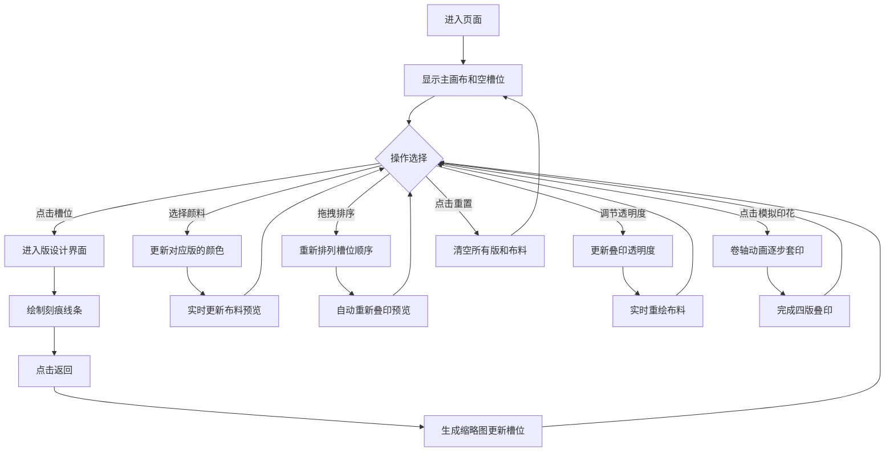

## 1. 产品概述

本产品是一款基于Canvas的交互式套色印花设计与模拟Web应用，面向古代印花艺人、设计师和传统工艺爱好者，提供在浏览器中模拟木制雕版套色印花的完整体验。用户可以设计多个雕版、选择传统颜料、调整印刷顺序，并实时观察布料上的叠印效果与颜色渗透变化。

- 核心价值：数字化还原传统套色印花工艺，降低学习门槛，激发创意设计
- 目标用户：印花艺人、手工艺爱好者、教育工作者、学生

## 2. 核心特性

### 2.1 功能模块

1. **主画布区域**：棉布纹理画布，展示套色模拟结果
2. **左侧工具栏**：雕版槽位管理、颜料选择器、印刷顺序拖拽
3. **版设计界面**：独立的雕版绘制画布，支持不同粗细笔刷
4. **右侧信息面板**：操作提示、透明度滑块、模拟控制按钮
5. **动画模拟系统**：卷轴式逐步套印动画

### 2.2 页面详情

| 页面名称 | 模块名称 | 功能描述 |
|---------|---------|---------|
| 主界面 | 棉布画布 | 1200x800px米白色棉布，0.5px布纹噪点，实时预览叠印效果 |
| 主界面 | 雕版槽位 | 4个深木色边框槽位，展示雕版缩略图，支持点击进入设计和拖拽排序 |
| 主界面 | 颜料选择器 | 4种传统颜料（朱砂红、石绿、靛蓝、藤黄），每版独立选择 |
| 主界面 | 透明度滑块 | 0%-100%透明度调节，实时影响叠印效果 |
| 主界面 | 操作按钮 | 开始模拟印花、重置，带回弹动画 |
| 主界面 | 信息提示 | 显示当前操作状态和选中颜料 |
| 版设计界面 | 雕刻画布 | 400x600px版面，鼠标绘制黑色刻痕线条 |
| 版设计界面 | 笔刷切换 | 支持2px细线、5px标准、8px粗线三种笔刷 |
| 版设计界面 | 返回按钮 | 完成绘制返回主界面，自动生成缩略图 |

## 3. 核心流程

### 3.1 主要用户流程

用户进入页面后看到棉布画布和4个空白雕版槽位。点击槽位进入版设计界面绘制刻痕，完成后返回主界面选择颜料颜色。可拖拽槽位调整印刷顺序，通过滑块调节透明度。点击"开始模拟印花"后，布料以卷轴形式从右到左逐步显示各版套印结果。用户可随时点击"重置"清空所有内容重新开始。

### 3.2 流程图

## 4. 用户界面设计

### 4.1 设计风格

- **主色调**：浅麻布色#E8DCC4背景，木纹边框#8B5A2B，深木色槽位边框#6B4226
- **强调色**：石青色按钮#5B8C5A，悬停深青色#3E6B3E
- **颜料色**：朱砂红#D4322E、石绿#2E8B57、靛蓝#4169E1、藤黄#DAA520
- **字体**：标题楷体（KaiTi），正文系统衬线字体
- **按钮样式**：圆角矩形，点击缩放0.95回弹效果，悬停0.3秒淡入过渡
- **视觉质感**：棉布噪点纹理、木纹边框阴影、半透明叠印效果

### 4.2 页面布局

| 区域 | 模块 | 布局说明 |
|-----|-----|---------|
| 整体 | 三栏布局 | 左侧工具栏15%，中央画布70%，右侧信息面板15% |
| 左侧工具栏 | 竖排槽位 | 4个80x120px槽位垂直排列，下方颜料选择器 |
| 中央画布 | 棉布画布 | 1200x800px居中显示，带布纹纹理 |
| 右侧面板 | 信息与控制 | 操作提示文字、透明度滑块、控制按钮组 |
| 响应式 | <900px适配 | 左侧工具栏折叠为顶部80px高横条，槽位水平排列 |

### 4.3 响应式设计

- **桌面端（>900px）**：三栏布局，左/中/右比例15%/70%/15%
- **移动端/窄屏（≤900px）**：左侧工具栏移至顶部，高度80px，槽位水平排列；画布高度自适应窗口；右侧面板移至画布下方
- **触摸优化**：增大触摸目标区域，支持触摸滑动绘制和触摸拖拽

### 4.4 动画与交互

- **按钮悬停**：0.3秒颜色淡入过渡，从#5B8C5A变为#3E6B3E
- **按钮点击**：按下scale(0.95)，松开回弹，150ms缓动
- **模拟印花**：卷轴式从右到左展开，每版2秒，版间0.5秒间隔，总约9.5秒
- **拖拽槽位**：半透明拖影跟随鼠标，松手后平滑重排
- **笔刷绘制**：实时黑色线条，无延迟感（≤100ms响应）
