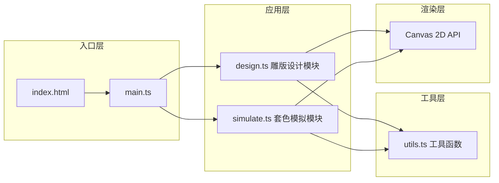

## 1. 架构设计



**模块职责与数据流向：**

- `main.ts`：应用入口，初始化全局状态，协调design模块和simulate模块之间的数据传递，管理UI事件绑定和响应式布局
- `design.ts`：雕版设计模块，接收鼠标/触摸输入→生成版图层数据（含像素矩阵）→输出版图层对象数组给simulate模块；负责版设计界面的渲染和缩略图生成
- `simulate.ts`：套色模拟模块，接收design模块的版图层数组+颜色配置+印刷顺序+透明度参数→在布料画布上执行正片叠底混合绘制→输出最终/动画帧画面
- `utils.ts`：提供颜色混合算法（正片叠底multiply）、布纹噪点生成、拖拽排序辅助等纯函数工具

## 2. 技术描述

- **前端框架**：原生TypeScript + 原生JavaScript（无框架依赖），采用模块化文件组织
- **构建工具**：Vite 5.x，配置端口3000，入口index.html
- **语言**：TypeScript严格模式（strict: true），target ES2020
- **渲染技术**：HTML5 Canvas 2D API，离屏Canvas预渲染布料纹理和各版图层以提升性能
- **状态管理**：main.ts中维护集中式应用状态对象，通过函数参数和返回值在模块间传递
- **动画系统**：requestAnimationFrame实现卷轴动画和过渡效果，帧率目标≥30FPS

## 3. 文件结构

| 文件路径 | 职责说明 | 依赖关系 |
|---------|---------|---------|
| `package.json` | 项目依赖（typescript、vite）与脚本配置 | - |
| `vite.config.js` | Vite构建配置，端口3000，入口index.html | - |
| `tsconfig.json` | TypeScript编译配置，严格模式，ES2020 | - |
| `index.html` | 应用入口页面，页面结构与CSS样式 | - |
| `src/main.ts` | 应用入口，初始化画布、状态、UI事件绑定 | 引用design.ts, simulate.ts, utils.ts |
| `src/design.ts` | 雕版设计与编辑，版图层管理，缩略图生成 | 引用utils.ts |
| `src/simulate.ts` | 套色叠印渲染，卷轴动画，布料纹理绘制 | 引用utils.ts |
| `src/utils.ts` | 颜色混合、噪点生成、拖拽等工具函数 | 无内部依赖 |

## 4. 数据模型定义

### 4.1 核心类型定义

```typescript
// 雕版图层对象 - 存储单个雕版的刻痕像素数据
interface BlockLayer {
  id: number;              // 版槽原始索引(0-3)
  width: number;           // 版宽度 400
  height: number;          // 版高度 600
  pixelData: Uint8Array;   // 1维数组，0=空白 1=刻痕(每行width个像素)
  imageData: ImageData;    // Canvas ImageData副本用于快速绘制
}

// 应用状态 - main.ts集中管理
interface AppState {
  // 雕版数据
  layers: BlockLayer[];              // 4个雕版(原始顺序)
  printOrder: number[];              // 印刷顺序，存储layers的id索引，如[0,2,1,3]
  layerColors: Record<number, string>; // 每个版的颜料颜色 hex值
  layerOpacities: Record<number, number>; // 每个版的透明度 0-1

  // UI状态
  activeView: 'main' | 'design';     // 当前视图
  editingLayerId: number | null;     // 当前编辑的版id
  selectedBrushSize: 2 | 5 | 8;      // 当前笔刷大小
  isSimulating: boolean;             // 是否正在模拟动画
  simulationProgress: number;        // 模拟进度 0-1

  // 画布引用
  mainCanvas: HTMLCanvasElement | null;
  designCanvas: HTMLCanvasElement | null;
}
```

## 5. 性能优化策略

### 5.1 渲染性能

- **布料纹理预渲染**：应用启动时用离屏Canvas一次性生成1200x800px带布纹噪点的棉布底图，模拟时直接drawImage而非逐帧重绘噪点
- **雕版离屏缓存**：每个版的彩色填充结果缓存到独立的离屏Canvas，叠印时直接drawImage+globalCompositeOperation，避免逐像素计算
- **卷轴动画优化**：动画过程中仅重绘当前展开区域（使用clip区域裁剪），而非整幅画布重绘

### 5.2 绘制性能

- **笔刷批量绘制**：版设计中连续mousemove事件使用Path2D批量累积路径，节流到每16ms绘制一次，降低Canvas调用开销
- **缩略图缓存**：版绘制完成后一次性生成80x120px缩略图缓存到离屏Canvas，槽位刷新时直接使用无需重采样

### 5.3 帧率保证

- **requestAnimationFrame调度**：所有动画使用RAF，避免setTimeout造成的卡顿
- **帧预算控制**：单帧渲染耗时目标<16ms（60FPS），最低保证<33ms（30FPS），超出时自动降级渲染精度（如减少布纹噪点重绘频率）
